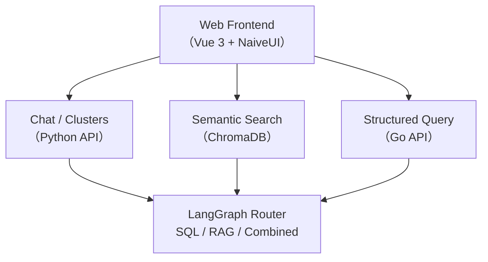

# Photo Agent

English | [中文](./README.md)

> Search your photo library with natural language — "that cat at the bathroom door with its mouth wide open" finds the exact photo.


---

## 🎯 Who Is This For?

- **Photography Enthusiasts**: Want to search your photo library with natural language → Jump to [Quick Start](#-quick-start)
- **AI Developers**: Want to learn LangGraph + ChromaDB + Go three-stack practice → See [Architecture Overview](#-architecture-overview) and [`docs/tech.md`](docs/tech.md)

---

## 🚀 Quick Start

### 0. Prerequisites

- Go 1.23+
- Python 3.12 (recommended with `uv`)
- Node.js + pnpm

### 1. Clone & Configure

```bash
git clone https://github.com/yourname/photo-agent.git
cd photo-agent
cp ./configs/config.yaml .local/my-config.yaml
# Edit .local/my-config.yaml, fill in your API Key and photo path
```

### 2. Start Services

```bash
# One-command start (Go Backend + Python Agent + Web Frontend)
make start
# Stop: make stop
```

Or start manually in three terminals:

```bash
# Terminal 1: Go Backend
cd backend && make build && ./bin/server -c ../.local/my-config.yaml

# Terminal 2: Python AI Agent
cd agent && source .venv/bin/activate && python chain/photo_agent.py -c ../.local/my-config.yaml --serve

# Terminal 3: Web Frontend
cd web && pnpm dev
```

Visit `http://localhost:10006` to start using.

> All service ports are configured in `config.yaml` — no hardcoding required.

---

## 🧭 Architecture Overview



**Core Decision**: User queries are automatically routed by LangGraph —

- **SQL Branch**: Statistics, EXIF filtering ("how many shots at 50mm in 2023")
- **RAG Branch**: Semantic descriptions ("atmospheric sunset by the sea")
- **Combined Branch**: Composite conditions ("cat photos from last year with 85mm lens")

See [`docs/tech.md`](docs/tech.md) for detailed architecture.

---

## ✨ Core Features

### 1. Natural Language Search

- **Semantic Search**: VLM-generated visual descriptions enable vector matching for fuzzy queries like "snow-capped mountains at golden hour"
- **Structured Queries**: EXIF metadata (focal length, ISO, lens, time) via Text-to-SQL for precise filtering
- **Hybrid Routing**: LangGraph automatically decides between SQL, RAG, or a combination

### 2. Smart Albums (Unsupervised Clustering)

- HDBSCAN + UMAP dimensionality reduction to automatically discover thematic groups in your library
- LLM-generated topic names for each cluster (e.g., "Urban Blue Hour," "Yunnan Snow Mountain Series")
- Web UI sorted by visual coherence

### 3. Photo Archive Q&A

- Multi-turn conversations with follow-up and condition refinement
- Style analysis and composition preference insights based on actual work
- Automatic timeline association with travel and activity tags

### 4. Retrieval Quality Evaluation

- Built-in "Golden Cases" test set — run evaluations in real-time on the web page, displaying P@10 / R@10 / MRR
- Baseline records in `docs/eval/baseline.md`

---

## 🏗️ Three-Stack Architecture, Best of Both Worlds

- **Web Frontend**: Vue 3 + NaiveUI — photo management, chat interface, cluster browsing, golden case management
- **Python Inference**: FastAPI + LangChain/LangGraph + ChromaDB — agent orchestration, vector search, Text-to-SQL, cluster analysis
- **Go Backend**: Gin + GORM + SQLite — photo metadata management, file serving, VLM preprocessing, Embedding proxy

**Why Not a Single Framework?**

- **Go**: Stable, fast concurrency and metadata processing, familiar to you
- **Python**: Richest AI ecosystem, LangGraph provides fine-grained routing control
- **Each layer can be replaced independently** — no need to rewrite the backend when swapping frontend frameworks

---

## 📁 Project Structure

```
photo-agent/
├── backend/              # Go Business Backend (HTTP entry in internal/defaultService)
├── agent/                # Python AI Service Layer
│   ├── chain/            # LangGraph Orchestration + FastAPI Service
│   ├── vectorstore/      # ChromaDB Wrapper
│   ├── tools/            # OpenAPI Tool Parsing & Execution
│   └── scripts/          # Indexing Scripts, Evaluation Scripts
├── web/                  # Vue 3 Frontend
├── client/               # Wails Windows Import Client
├── tools/                # Playwright Regression Test Scripts
├── configs/              # Configuration Templates
├── data/                 # Runtime Data (Photos/SQLite/ChromaDB)
├── dify/                 # Early Dify Validation, Reference Only (Non-Core)
└── docs/                 # Project Documentation
```

---

## 📚 Documentation Index

- [docs/prd.md](docs/prd.md) — Product requirements, user stories
- [docs/tech.md](docs/tech.md) — Architecture design, API contracts, data models
- [docs/backlog.md](docs/backlog.md) — Roadmap, rejected items
- [docs/deploy.md](docs/deploy.md) — Deployment guide
- [docs/harness.md](docs/harness.md) — Harness engineering architecture overview
- [docs/note.md](docs/note.md) — Decision memos, lessons learned
- [docs/handbook/work-modes.md](docs/handbook/work-modes.md) — AI work mode workflows
- [docs/handbook/coding-conventions.md](docs/handbook/coding-conventions.md) — Coding conventions
- [docs/handbook/doc-review.md](docs/handbook/doc-review.md) — Document review guidelines
- [docs/eval/baseline.md](docs/eval/baseline.md) — Evaluation baseline metrics

---

## 📊 Current Status

- ✅ Natural Language Search (RAG + SQL)
- ✅ Smart Albums (HDBSCAN + UMAP)
- ✅ Topic Suggestions (AI-powered push + review & rating)
- ✅ Post Studio (prompt generation + draft refinement)
- ✅ Burst Grouping (fine/coarse tiers)
- ✅ Import Workflow (Windows client)
- ✅ Golden Case Evaluation
- ✅ Web UI
- ✅ Text-to-SQL Hybrid Routing
- 🚧 Multi-turn Context Awareness (coreference resolution, condition stacking)

---

## 🤝 Contributing

Issues and PRs are welcome. Please read [docs/backlog.md](docs/backlog.md) first to understand current priorities and avoid duplicate work.

---

## 📄 License

MIT
