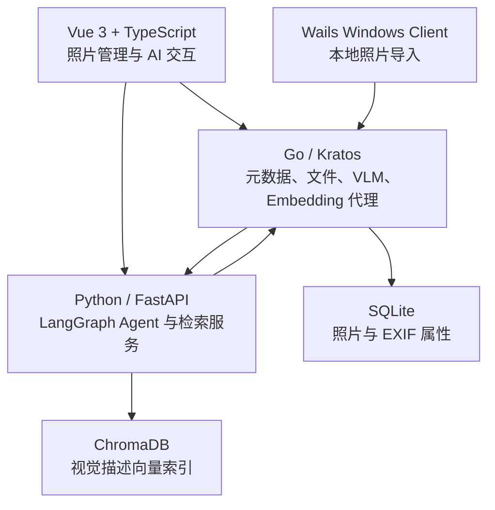

# Photo Agent

[English](./README.en.md) | 中文

> 让照片库能够被自然语言理解、检索与再创作的本地优先 AI 摄影助手。
>
> 例如，输入「去年用 85mm 拍的、有氛围感的猫」，即可从视觉语义与 EXIF 元数据中找回对应照片。

<p align="center">
  
  
</p>

## 项目亮点

- **混合检索**：LangGraph 将请求路由至 Text-to-SQL、向量检索或两者交集，在精确筛选与视觉语义之间取得平衡。
- **多模态照片索引**：导入时提取 EXIF，VLM 生成自然语言描述与场景、光线、构图等结构化属性，再写入 SQLite 和 ChromaDB。
- **可控 Agent Runtime**：面向「选片并生成文案」等开放目标，提供显式状态、能力注册、确定性护栏、重试预算、无进展检测与局部续跑。
- **摄影工作流**：覆盖照片管理、连拍分组、主题聚类、时间线、选题建议、图文草稿与 Windows 导入客户端。
- **可评估、可追踪**：以黄金用例持续衡量 P@10、R@10、MRR；请求通过 trace_id 串联路由、工具调用、耗时、Token 与成本。
- **边界清晰的三栈协作**：Go 负责数据与多媒体服务，Python 承担 AI 编排，Vue 提供交互界面，服务间通过 HTTP/OpenAPI 解耦。

## 架构



### 技术实现

- **前端**：Vue 3、TypeScript、Vite、Naive UI、Vitest。提供流式对话、照片分段浏览、筛选、任务队列与结果工作台。
- **AI 服务**：Python、FastAPI、LangChain、LangGraph、ChromaDB、HDBSCAN、UMAP。支持 SQL / RAG / Combined 路由、Function Calling 和多轮上下文压缩。
- **业务后端**：Go、Kratos v2、GORM、SQLite、OpenAPI/Protobuf、ImageMagick。负责照片 CRUD、文件传输、EXIF、缩略图、VLM 描述、只读 SQL 安全校验与 Embedding 兼容代理。
- **桌面导入**：Wails 2 Windows 客户端，支持照片扫描、导入进度与单实例控制。
- **工程保障**：前后端单元测试、检索黄金用例、可回放 Trace、统一配置与 `make start / stop / status` 生命周期管理。

## 核心流程

```text
照片导入 → EXIF / 缩略图 → VLM 描述与属性提取 → Embedding → ChromaDB
自然语言问题 → Agent 路由 → SQL 筛选 / 语义召回 / 结果交集 → 照片与回答
开放创作目标 → 能力编排 → 护栏与质量检查 → 选片结果与文案草稿
```

## 功能一览

- 自然语言检索：支持时间、器材等结构化条件与画面语义的组合查询。
- 智能相册：基于向量聚类自动发现主题，并生成可读的主题名称。
- 摄影档案问答：围绕历史作品、拍摄偏好与时间线进行多轮追问。
- 选片与图文工坊：按目标筛选候选照片，生成发布标题、文案和提示词草稿。
- 连拍与导入：对连拍序列分组，并通过 Windows 客户端管理本地导入流程。

<p align="center">
  
  
</p>

## 快速开始

环境要求：Go 1.24+、Python 3.12+、Node.js 与 pnpm，以及 ImageMagick。

```bash
git clone https://github.com/yourname/photo-agent.git
cd photo-agent
cp configs/config.yaml .local/my-config.yaml
# 编辑 .local/my-config.yaml，填入模型 API Key 与照片路径

make start
```

访问 `http://localhost:10006`。使用 `make status` 查看健康状态，使用 `make stop` 停止全部服务。

完整的环境准备与手动启动方式见 [部署指南](docs/deploy.md)。

## 项目结构

```text
photo-agent/
├── backend/     # Go API、照片与元数据服务
├── agent/       # Python Agent、检索、评估与追踪
├── web/         # Vue 3 Web 应用
├── client/      # Wails Windows 导入客户端
├── configs/     # 配置模板与模型提示词
├── tools/       # 跨模块验证工具
└── docs/        # 产品、架构、评估与部署文档
```

## 延伸阅读

- [技术架构与数据流](docs/tech.md)
- [产品能力与验收标准](docs/prd.md)
- [检索评估基线](docs/eval/baseline.md)
- [部署指南](docs/deploy.md)
- [开发与验证工具](tools/README.md)

## License

MIT
