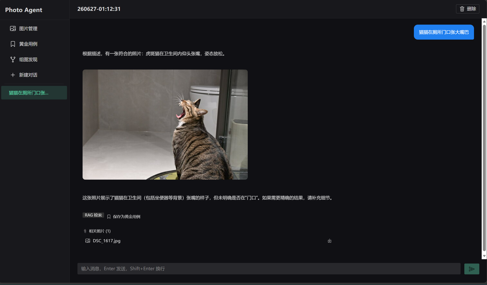
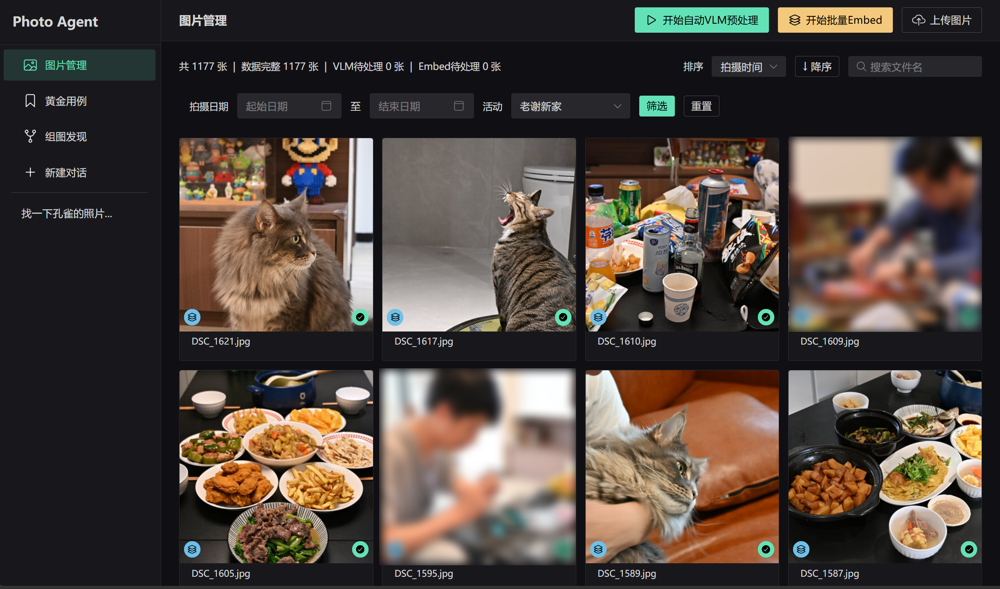
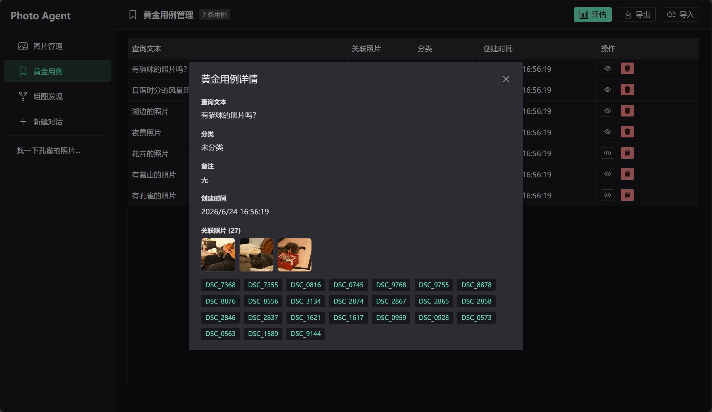
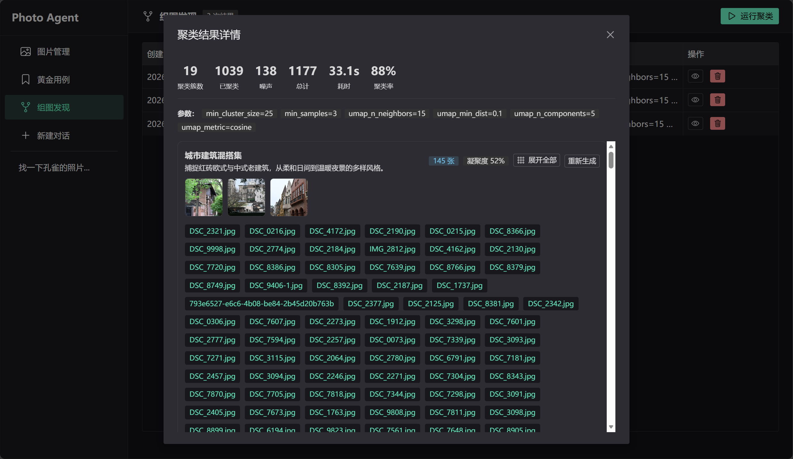

# Photo Agent

[English](./README.en.md) | 中文

> 用自然语言搜索你的照片库 —— “猫猫在厕所门口张大嘴巴” 就能找到那张照片。






---

## 🎯 谁适合用这个项目？

- **摄影爱好者**：想用自然语言检索自己的照片库 → 看「快速开始」直接部署
- **AI 开发者**：想学习 LangGraph + ChromaDB + Go 三栈实践 → 看「架构概览」和 `docs/tech.md`

---

## 🚀 快速开始

### 0. 环境要求

- Go 1.23+
- Python 3.12（推荐用 `uv` 管理）
- Node.js + pnpm

### 1. 克隆与配置

```bash
git clone https://github.com/yourname/photo-agent.git
cd photo-agent
cp ./configs/config.yaml .local/my-config.yaml
# 编辑 .local/my-config.yaml，填入你的 API Key 和照片路径
```

### 2. 预处理照片（VLM 生成描述）

```bash
make backend
./bin/batch_vlm -c .local/my-config.yaml -input /path/to/your/photos
```

### 3. 启动服务（三个终端）

```bash
# 终端 1: Go 后端
./bin/server -c .local/my-config.yaml

# 终端 2: Python AI Agent
cd agent && source .venv/bin/activate
python chain/photo_agent.py -c ../.local/my-config.yaml --serve

# 终端 3: Web 前端
cd web && pnpm dev
```

访问 `http://localhost:5173` 开始使用。

> 所有服务端口统一在 `config.yaml` 中配置，无需硬编码。

---

## 🧭 架构概览

```
┌─────────────────────────────────────────────────────────────┐
│  Web 前端 (Vue 3 + NaiveUI)                               │
└─────────────────────────────────────────────────────────────┘
                              │
         ┌────────────────────┼────────────────────┐
         │                    │                    │
         ▼                    ▼                    ▼
┌─────────────────┐  ┌─────────────────┐  ┌─────────────────┐
│  对话 / 聚类     │  │  语义检索 (RAG)  │  │  结构化查询     │
│  (Python API)   │  │  (ChromaDB)     │  │  (Go API)       │
└─────────────────┘  └─────────────────┘  └─────────────────┘
         │                    │                    │
         └────────────────────┼────────────────────┘
                              ▼
                    ┌─────────────────────┐
                    │  LangGraph 路由      │
                    │  SQL / RAG / Combined│
                    └─────────────────────┘
```

**核心决策**：用户查询由 LangGraph 自动判断走哪条路——

- **SQL 分支**：统计、EXIF 筛选（"2023 年用 50mm 拍了多少张"）
- **RAG 分支**：语义描述（"有氛围感的海边日落"）
- **Combined 分支**：复合条件（"去年拍的猫片，用 85mm 镜头"）

详细架构见 [`docs/tech.md`](docs/tech.md)。

---

## ✨ 核心能力

### 1. 自然语言检索

- **语义检索**：用 VLM 生成的视觉描述做向量匹配，理解“雪山日照金山”这类模糊描述
- **结构化查询**：EXIF 元数据（焦距、ISO、镜头、时间）通过 Text-to-SQL 精确筛选
- **混合路由**：LangGraph 自动判断用 SQL 还是 RAG，或两者组合

### 2. 智能相册（无监督聚类）

- HDBSCAN + UMAP 降维，自动发现照片库中的主题组合
- LLM 为每个聚类生成主题名（如“城市蓝调时刻”“云南雪山系列”）
- Web 界面按视觉连贯性排序浏览

### 3. 摄影档案问答

- 多轮对话，支持追问和条件细化
- 基于历史作品分析风格特点、构图偏好
- 时间线自动匹配，关联旅游等活动标签

### 4. 检索质量评估

- 内置“黄金用例”测试集，持续监控 Precision@K / Recall / MRR
- 当前基线：`Precision@10 = 0.93`，`MRR = 1.0`

---

## 🏗️ 三栈架构，各取所长

- **Web 前端**：Vue 3 + NaiveUI — 照片管理、对话界面、聚类浏览、黄金用例管理
- **Python 推理层**：FastAPI + LangChain/LangGraph + ChromaDB — Agent 编排、向量检索、Text-to-SQL、聚类分析
- **Go 后端**：Gin + GORM + SQLite — 照片元数据管理、文件服务、VLM 预处理、Embedding 代理

**为什么不用单一框架？**

- **Go**：稳，处理并发和元数据快，你熟悉
- **Python**：AI 生态最丰富，LangGraph 能精细控制路由
- **各层可独立替换**，不会因为换前端框架就重写后端

---

## 📁 项目结构

```
photo-agent/
├── backend/              # Go 业务后端
│   ├── cmd/server/       # HTTP 服务 + AutoSync
│   └── cmd/batch_vlm/    # 批量 VLM 预处理 CLI
├── agent/                # Python AI 服务层
│   ├── chain/            # LangGraph 编排 + FastAPI 服务
│   ├── vectorstore/      # ChromaDB 封装
│   ├── tools/            # OpenAPI 工具解析与执行
│   └── scripts/          # 索引脚本、评估脚本
├── web/                  # Vue 3 前端
├── configs/              # 配置模板
├── data/                 # 运行时数据（照片/SQLite/ChromaDB/descriptions.json）
├── dify/                 # 早期 Dify 验证，保留参考（非核心方案）
└── docs/                 # 项目文档
```

---

## 📚 文档索引

- [docs/prd.md](docs/prd.md) — 产品需求、用户故事、验收标准
- [docs/tech.md](docs/tech.md) — 架构设计、API 契约、数据模型
- [docs/backlog.md](docs/backlog.md) — 需求池、演进路线图、拒绝清单
- [docs/note.md](docs/note.md) — 决策备忘、否决记录、踩坑记录
- [docs/deploy.md](docs/deploy.md) — 部署指南
- [docs/handbook/work-modes.md](docs/handbook/work-modes.md) — AI 工作模式完整流程
- [docs/handbook/coding-conventions.md](docs/handbook/coding-conventions.md) — 各语言编码规范
- [docs/handbook/doc-review.md](docs/handbook/doc-review.md) — 文档审阅规范
- [docs/eval/baseline.md](docs/eval/baseline.md) — 评估基线指标

---

## 📊 当前状态

- ✅ 自然语言检索（RAG + SQL）
- ✅ 聚类相册（HDBSCAN + UMAP）
- ✅ 黄金用例评估
- ✅ Web 交互界面
- ✅ Text-to-SQL 混合路由
- 🚧 多轮对话记忆

---

## 🤝 贡献

欢迎 Issue / PR。请先阅读 [docs/backlog.md](docs/backlog.md) 了解当前优先级，避免重复工作。

---

## 📄 License

MIT
