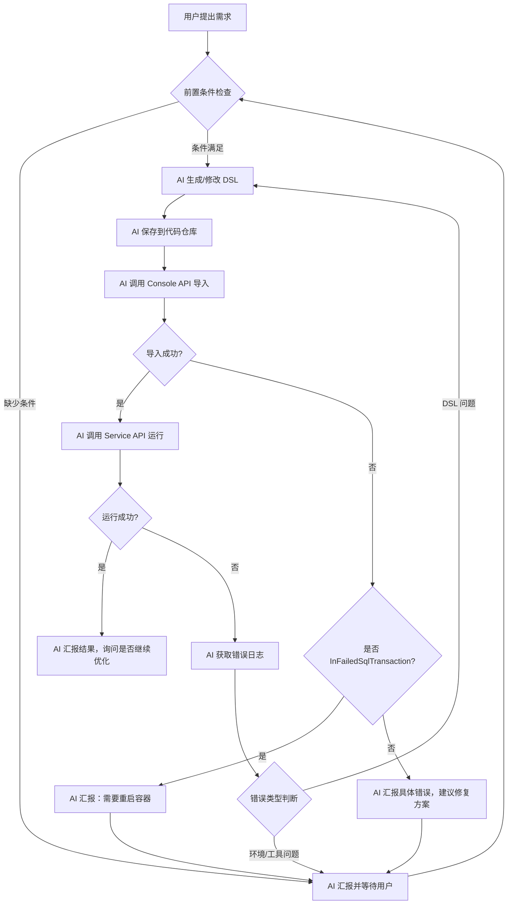

# Dify 工作流自动化开发技能

## 核心原则

- **AI 自主执行**：DSL 生成、通过 API 导入、运行测试、解析错误日志、迭代修复
- **必须人工介入**：API 密钥配置、环境准备（模型插件/自定义工具）、有副作用的操作（重启容器）、结果验证
- **遇到不确定时**：停下来汇报当前状态、已尝试的操作、下一步建议，让用户决策

---

## 前置条件检查（AI 必须主动汇报）

当用户要求启动自动化闭环时，AI 先检查以下条件，**缺少任何一项都要停下来汇报**：

### 1. API 密钥

**检查**：是否已配置 `DIFY_CONSOLE_API_KEY` 和 `DIFY_SERVICE_API_KEY`？

**AI 汇报话术**：
> "启动自动化闭环需要两个 API Key：
> - `DIFY_CONSOLE_API_KEY`：用于导入/导出应用（控制台 API）
> - `DIFY_SERVICE_API_KEY`：用于运行工作流（服务 API）
>
> 请从 Dify 设置 → API 密钥 中获取并配置到环境变量，然后告诉我已就绪。"

**等待用户确认**，不要尝试无密钥的 API 调用。

### 2. 目标 Dify 环境状态

**检查**：目标 Dify 实例是否运行？地址是否可达？

**AI 汇报话术**：
> "请确认目标 Dify 实例的状态：
> - 访问地址：`{DIFY_API_URL}`（如 http://192.168.3.159 ）
> - 容器状态：`docker compose ps` 是否全部 healthy？
>
> 如果地址不同或容器未启动，请先调整，然后告诉我。"

### 3. 模型插件与自定义工具

**检查**：DSL 中声明的模型 provider 和自定义工具是否在目标 Dify 中已配置？

**AI 汇报话术**（如果 DSL 使用自定义 API 工具）：
> "当前 DSL 包含自定义 API 工具 `photo_agent`。根据 `dify/dsl/SKILL.md` 的规则，自定义工具需要基准 DSL（含正确 UUID）。
>
> 请确认：
> 1. 是否已在 Dify '工具 → 自定义' 中导入 `docs/dify_tools_openapi.yaml`？
> 2. 当前 `dify/dsl/photo-agent.yml` 是否是从 Dify 最新导出的基准版本（含 UUID）？
>
> 如果任一答案为'否'，我需要指导您先完成人工配置步骤。"

**AI 汇报话术**（如果 DSL 使用 marketplace 模型）：
> "当前 DSL 配置的模型是 `{model_name}`，provider 是 `{model_provider}`。
>
> 请确认您的 Dify 实例是否已安装并配置了对应的模型供应商插件。如未安装，请先安装并配置 API Key，然后告诉我已就绪。"

---

## 自动化闭环流程



### 关键节点详解

#### 节点：导入 DSL（Console API）

AI 执行导入，但需处理以下情况：

**情况 A：导入成功**
- AI 记录应用 ID，继续下一步

**情况 B：导入报错（InFailedSqlTransaction）**
- AI 操作：
  > "导入失败，检测到数据库事务错误（`InFailedSqlTransaction`）。这通常是因为之前失败的导入尝试损坏了 PostgreSQL session。
  >
  > **需要您执行**：`cd dify && docker compose down && docker compose up -d`
  >
  > 重启完成后请告诉我，我会重新尝试导入。"
- **等待用户确认重启完成**

**情况 C：导入报错（其他错误）**
- AI 汇报具体错误信息，分析可能原因（DSL 格式、依赖缺失等），给出修复建议
- **等待用户确认下一步操作**

#### 节点：运行工作流（Service API）

AI 调用 Service API 运行工作流，传入测试参数。

**运行成功**：AI 汇报输出结果，询问用户是否满意或需要进一步优化。

**运行失败**：AI 获取完整错误日志，分析错误类型：

| 错误类型 | 判断依据 | AI 行动 |
|---|---|---|
| DSL 逻辑问题 | 输出不符合预期、节点执行异常 | 自动修复 DSL，迭代 |
| 工具调用失败 | `ToolProviderNotFoundError`、超时 | 汇报用户，检查工具配置 |
| 模型问题 | 配额不足、模型不可用 | 汇报用户，建议更换模型 |
| 环境问题 | 网络超时、服务未响应 | 汇报用户，检查容器状态 |

**必须汇报给用户的错误**：涉及工具 provider、模型配额、环境状态的，AI 不能自动修复，必须停下来汇报。

---

## 人工介入节点汇总

| 节点 | 触发条件 | AI 行动 | 继续条件 |
|---|---|---|---|
| **API 密钥缺失** | 环境变量未配置 | 汇报所需 Key 及获取方式 | 用户配置完成并告知 |
| **环境不可达** | Dify 未启动或地址错误 | 汇报检查命令及预期状态 | 用户确认服务正常 |
| **模型插件未安装** | DSL 使用未安装的模型 | 汇报所需插件及安装位置 | 用户安装配置完成 |
| **自定义工具无基准** | 需要自定义 API 工具但无 UUID | 指导用户完成 4 步人工操作 | 用户返回基准 DSL |
| **事务卡住** | `InFailedSqlTransaction` | 汇报原因及重启命令 | 用户确认重启完成 |
| **工具运行时失败** | `ToolProviderNotFoundError` 等 | 汇报错误及检查建议 | 用户确认工具状态 |
| **结果验证** | 工作流运行完成 | 汇报结果，询问是否满意 | 用户确认或提出优化需求 |

---

## AI 汇报标准格式

当需要人工介入时，AI 使用以下格式汇报：

```
【状态】当前进展
【阻塞原因】为什么停下来
【需要您做】具体操作步骤（带命令/路径）
【完成后】告诉我什么，我会继续做什么
```

示例：
> 【状态】已生成无 tools 的 DSL 并保存到 `dify/dsl/photo-agent.yml`
> 【阻塞原因】自定义 API 工具 `photo_agent` 的 `provider_id` 是 Dify 内部 UUID，我无法手写
> 【需要您做】
> 1. 确保 Dify 中已创建 `photo_agent` 自定义工具 Provider（导入 `docs/dify_tools_openapi.yaml`）
> 2. 在 Dify Studio 中导入 `dify/dsl/photo-agent.yml`
> 3. 在 Agent 编排中绑定 `photo_agent` 的所有工具
> 4. 导出完整 DSL，将内容发给我
> 【完成后】我会将您提供的基准 DSL 保存为后续修改的基础
