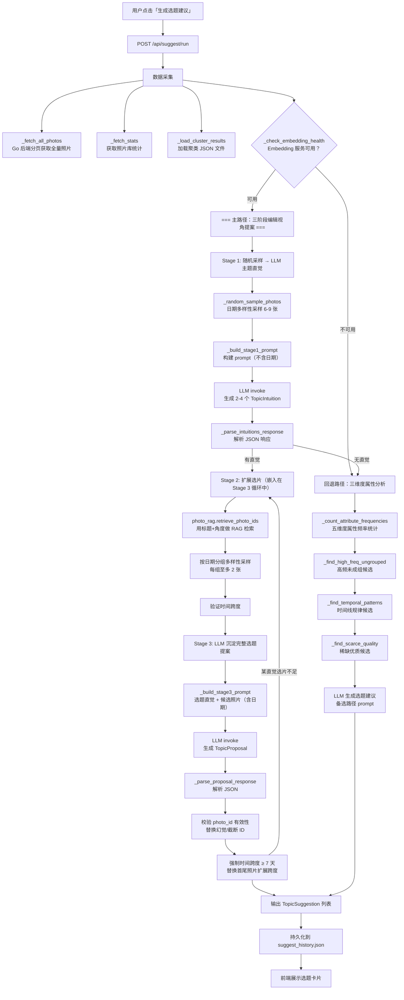

# 选题建议全链路可观测性 — 人工评估操作手册 + 开发规划

> 本文档面向「用户希望亲自参与选题建议全链路质量评估」的需求。
> 第一部分梳理当前链路中每个环节**已可查看**的数据及查看方式，
> 第二部分识别**当前缺失**但对评估必要的过程数据，
> 第三部分规划补齐这些缺失的开发工作。
>
> 关联中枢：[3.4 主题发现专题](2026-07-27-5-topic-discovery-hub.md)

---

## 1. 链路全景图



---

## 2. 各环节「已可查看」的过程数据

按链路顺序，列出每个环节目前**已经产出**的数据、存放位置、以及如何查看。

### 2.1 数据采集阶段

| 环节 | 已有数据 | 位置 | 查看方式 |
| ---- | -------- | ---- | -------- |
| 照片总数 | `total_photos` 字段 | `suggest_history.json` 每条记录 | 前端卡片直接展示，或 `cat data/suggest_history.json \| jq` |
| 聚类数量 | `cluster_count` 字段 | 同上 | 同上 |
| 聚类详情 | 各簇的 label / theme_description / 照片列表 | `data/agent/topic-discovery/clusters/*.json` | `cat data/agent/topic-discovery/clusters/<id>.json \| jq '.clusters[] \| {cluster_id, label, theme_description, size}'` |
| 生成路径 | `pipeline` 字段（`editorial_three_stage` 或 `legacy_three_dimension`） | `suggest_history.json` 每条记录 | 前端卡片展示 |
| Embedding 健康状态 | agent 日志中的检查结果 | `logs/agent.log` | `grep "Embedding 服务" logs/agent.log` |

### 2.2 Stage 1：随机采样 → LLM 主题直觉

| 环节 | 已有数据 | 位置 | 查看方式 |
| ---- | -------- | ---- | -------- |
| 采样照片数量 | 日志 `Stage 1 随机采样: N 张照片（M 个不同日期）` | `logs/agent.log` | `grep "Stage 1 随机采样" logs/agent.log` |
| 生成的直觉数量 | 日志 `Stage 1 生成 N 个主题直觉` | `logs/agent.log` | `grep "Stage 1 生成" logs/agent.log` |
| 采样照片多样性 | 日志 `随机采样第一轮: N 个日期 → M 张` | `logs/agent.log` | 同上 |

**⚠️ 当前缺失的关键数据（见 §3）**：
- 采样到的具体照片 ID 和描述内容
- LLM 的原始 prompt 全文
- LLM 的原始 JSON 响应
- 每个直觉启发自哪些具体照片

### 2.3 Stage 2：RAG 扩展选片

| 环节 | 已有数据 | 位置 | 查看方式 |
| ---- | -------- | ---- | -------- |
| RAG 查询文本 | 日志 `Stage 2 RAG 检索: <query>` | `logs/agent.log` | `grep "Stage 2 RAG" logs/agent.log` |
| RAG 匹配数量 | 日志 `Stage 2: RAG 匹配 N/M 张照片` | `logs/agent.log` | 同上 |
| 扩展后数量 | 日志 `Stage 2 扩展选片: N 张（M 个日期）, 时间跨度 X 天` | `logs/agent.log` | 同上 |

**⚠️ 当前缺失的关键数据（见 §3）**：
- RAG 检索到的具体 photo_id 列表及相似度距离
- 多样性过滤前后对比（哪些照片被过滤了）
- 相邻距离比值序列（用于判断 RAG 质量）

### 2.4 Stage 3：LLM 沉淀选题提案

| 环节 | 已有数据 | 位置 | 查看方式 |
| ---- | -------- | ---- | -------- |
| 最终标题/角度/理由 | `title` / `angle` / `rationale` 字段 | `suggest_history.json` | 前端卡片直接展示 |
| 最终推荐照片 | `photo_ids` 字段 | 同上 | 前端缩略图展示 |
| 分类标签 | `category` 字段（`editorial_proposal`） | 同上 | 前端卡片标签 |
| 幻觉 ID 告警 | 日志 `Stage 3: photo_id 'X' 无效` | `logs/agent.log` | `grep "Stage 3: photo_id" logs/agent.log` |
| 时间跨度告警 | 日志 `Stage 3: 选题 'X' 时间跨度仅 N 天` | `logs/agent.log` | `grep "Stage 3: 选题.*时间跨度" logs/agent.log` |
| 跳过选题 | 日志 `Stage 3: 选题 'X' 扩展后仅 N 张，跳过` | `logs/agent.log` | `grep "Stage 3: 选题.*跳过" logs/agent.log` |

**⚠️ 当前缺失的关键数据（见 §3）**：
- LLM 的原始 prompt 全文（选题直觉 + 候选照片列表 + 日期）
- LLM 的原始 JSON 响应（含 `photo_sequence` + `role_in_narrative`）
- `role_in_narrative` 字段（叙事角色）——当前**完全没有保存**，前端不展示，日志不记录
- photo_id 校验详情（哪些被替换、替换成了什么）

### 2.5 回退路径：三维度属性分析

| 环节 | 已有数据 | 位置 | 查看方式 |
| ---- | -------- | ---- | -------- |
| 各维度候选数 | 日志 `高频未成组候选: N 个` / `时间线规律候选: N 个` / `稀缺优质候选: N 个` | `logs/agent.log` | `grep "候选:" logs/agent.log` |
| 属性频率 Top3 | 日志 `属性维度 [objects]: N 个不同值, top3=...` | `logs/agent.log` | `grep "属性维度" logs/agent.log` |
| 各维度空候选告警 | 日志 `高频未成组: 无候选` 等 | `logs/agent.log` | 同上 |

**⚠️ 当前缺失的关键数据（见 §3）**：
- 每个维度的具体候选组详情（属性值、照片数、依据）
- LLM 的原始 prompt（候选组列表 + 聚类摘要）

---

## 3. 缺失但必要的过程数据 — 开发规划

以下数据对人工评估链路质量至关重要，但当前**完全没有暴露**。

### 3.1 缺失清单（按优先级排序）

#### P0：Stage 1 采样与直觉的完整记录

**为什么必要**：你想判断「LLM 基于什么照片产生了什么直觉」，从而评估直觉质量和采样策略。

**缺失内容**：
- 采样到的具体照片 ID 列表 + 各自的 VLM 描述 + 文件名
- Stage 1 LLM 的完整 prompt（含每张照片的描述）
- Stage 1 LLM 的原始 JSON 响应

**当前状态**：只有数量日志，没有任何内容日志。

#### P0：Stage 3 的 `role_in_narrative` 字段

**为什么必要**：这是 LLM 判断每张照片在叙事中扮演什么角色的关键输出，也是判断选题质量的核心依据。当前 LLM 生成了这个字段但**被完全丢弃**——最终 `TopicSuggestion` 只有 `photo_ids` 列表，没有叙事角色。

**当前状态**：`photo_sequence` 中的 `role_in_narrative` 在解析后被丢弃，前端只展示照片列表。

#### P0：Stage 3 的 LLM prompt 和原始响应

**为什么必要**：你需要审查「LLM 看到了什么候选照片（含日期）」和「LLM 返回了什么完整提案」，才能判断质量瓶颈在 prompt 还是在 LLM 能力。

**缺失内容**：
- Stage 3 LLM 的完整 prompt（含候选照片描述 + 日期）
- Stage 3 LLM 的原始 JSON 响应（含 `photo_sequence` + `role_in_narrative`）

#### P1：Stage 2 RAG 检索详情

**为什么必要**：你想判断「RAG 检索出来的照片是否真的与选题相关」，以及「多样性过滤是否合理」。

**缺失内容**：
- RAG 检索到的 top-N photo_id 及对应的余弦距离
- 相邻距离比值序列（判断 RAG 质量断层）
- 多样性过滤前后的照片列表对比

#### P1：Stage 3 photo_id 校验和替换详情

**为什么必要**：你想知道「LLM 幻觉有多严重」，以及「替换逻辑是否合理」。

**当前状态**：只有 warning 日志，没有结构化的校验报告。

#### P2：各阶段耗时和 Token 消耗

**为什么必要**：判断性价比，是否有阶段耗时过长或 Token 浪费。

**当前状态**：完全无记录。Token 追踪系统（`token_tracker`）只在聊天路由中使用，suggest 模块没有接入。

#### P2：决策点记录

**为什么必要**：理解「为什么走了主路径/回退路径」以及「为什么某些直觉被跳过」。

**当前状态**：部分有日志，但分散且不完整。

### 3.2 开发方案

有两种方式补齐缺失数据：

**方案 A：Tracer 集成方式**

在 `suggest.py` 各阶段关键节点调用 Tracer（`agent/chain/tracer.py`）写入结构化 trace 事件，payload 大文本存入独立文件。

- 优点：复用现有 Trace 基础设施，与聚类主题生成的 trace 格式统一，自动按天分文件
- 缺点：需要在 suggest.py 中新增 tracer 参数，改动面中等

**方案 B：独立 suggest_traces 目录方式**

在 `data/suggest_traces/` 下按 `{timestamp}-{trace_id}/` 建子目录，每个子目录内含各阶段的 JSON 摘要 + prompt/response 文本文件。

- 优点：自包含，不污染现有 trace 流的语义；目录结构便于人工浏览
- 缺点：引入新的数据格式和存储路径，与现有 Trace 体系不一致

**推荐方案 A**。理由：
1. `tracer.py` 已经提供了 `emit()` + `save_payload()` 的完整 API
2. 聚类主题生成已经使用 Tracer 输出 trace，格式经实战验证
3. suggest 的 trace 事件与 cluster theme 事件共享同一 JSONL 文件，方便跨模块关联查询
4. 改动范围可控：只需在 `run_suggest()` 创建 Tracer 实例并传入各阶段函数

### 3.3 方案 A 具体设计

#### 新增 trace 事件定义

```text
事件命名规范：suggest.<stage>.<action>

Stage 1:
  suggest.stage1.sample        → data: {sample_size, date_count, photo_ids[], photo_descs[]}
  suggest.stage1.llm.start     → data: {model, temperature, prompt_chars, payload_ref}
  suggest.stage1.llm.end       → data: {model, duration_ms, token_usage, response_chars, payload_ref}
  suggest.stage1.intuitions    → data: {count, intuitions: [{title, angle, rationale, inspired_indices}]}

Stage 2:
  suggest.stage2.rag.start     → data: {query, intuition_title, n_results}
  suggest.stage2.rag.end       → data: {matched_count, total_retrieved, photo_ids[], distances[], ratio_gaps[]}
  suggest.stage2.diversity     → data: {before_count, after_count, date_count, removed_photo_ids[]}

Stage 3:
  suggest.stage3.llm.start     → data: {intuition_title, candidate_count, prompt_chars, payload_ref}
  suggest.stage3.llm.end       → data: {model, duration_ms, token_usage, response_chars, payload_ref}
  suggest.stage3.proposal      → data: {title, angle, rationale, photo_sequence: [{photo_id, role_in_narrative}]}
  suggest.stage3.validation    → data: {hallucinated_count, replaced: [{from_id, to_id, reason}], final_photo_count}
  suggest.stage3.time_span     → data: {before_span_days, after_span_days, replaced: [{from_id, to_id}]}

决策点:
  suggest.decision.pipeline    → data: {pipeline, reason}
  suggest.decision.skip        → data: {intuition_title, reason, expanded_count, min_required}

汇总:
  suggest.complete             → data: {pipeline, total_suggestions, total_duration_ms, stage1_count, stage3_count}
```

#### Payload 保存策略

- Stage 1 LLM prompt → `{trace_id}-s1-prompt.txt`
- Stage 1 LLM response → `{trace_id}-s1-response.txt`
- Stage 3 LLM prompt（每个直觉一个）→ `{trace_id}-s3-prompt-{idx}.txt`
- Stage 3 LLM response（每个直觉一个）→ `{trace_id}-s3-response-{idx}.txt`

#### 需要持久化到 suggest_history.json 的字段扩展

当前每条记录只有 `photo_ids`（字符串数组）。需要新增：

- `photo_sequence`：替代/补充 `photo_ids`，包含 `[{photo_id, role_in_narrative}]`
- `trace_id`：关联到 trace 日志
- `intuition_source`：Stage 1 启发该选题的采样照片 ID

#### 前端展示扩展

- 选题卡片中照片列表增加每张照片的「叙事角色」标注
- 可选：每条选题增加「查看生成详情」入口，展开/跳转到 trace 详情

---

## 4. 人工评估操作步骤（当前即可执行）

在 §3 的开发工作完成之前，你**现在就可以**通过以下步骤手动审查链路质量。

### 4.1 前置准备

```bash
# 确认 agent 服务运行中
make status

# 如果未运行
make start
```

### 4.2 触发一次生成

在前端点击「生成选题建议」，等待完成。或通过 API：

```bash
curl -sX POST http://localhost:10005/api/suggest/run | python3 -m json.tool
```

### 4.3 查看最终输出

```bash
# 查看最新生成的选题（最新在最前面）
cat data/suggest_history.json | python3 -m json.tool | head -80

# 或者用 jq 只看关键字段
cat data/suggest_history.json | python3 -c "
import json, sys
items = json.load(sys.stdin)
for it in items[:3]:
    print(f\"标题: {it['title']}\")
    print(f\"角度: {it['angle']}\")
    print(f\"理由: {it['rationale']}\")
    print(f\"路径: {it['pipeline']}\")
    print(f\"分类: {it['category']}\")
    print(f\"照片: {it['photo_ids']}\")
    print(f\"评分: {it['rating']}\")
    print('---')
"
```

### 4.4 查看 Stage 1 相关日志

```bash
# 采样信息
grep "Stage 1 随机采样\|随机采样第一轮" logs/agent.log | tail -5

# 直觉数量
grep "Stage 1 生成" logs/agent.log | tail -3
```

**此时你能判断的**：采样了多少张照片、覆盖了多少个日期。但**看不到具体是哪些照片**。

### 4.5 查看 Stage 2 RAG 相关日志

```bash
grep "Stage 2" logs/agent.log | tail -10
```

**此时你能判断的**：RAG 查询关键词、匹配率。但**看不到检索到的具体照片及其距离**。

### 4.6 查看 Stage 3 相关日志

```bash
# 选题生成成功
grep "Stage 3: 选题.*生成成功" logs/agent.log | tail -10

# 幻觉 ID
grep "Stage 3: photo_id.*无效" logs/agent.log | tail -10

# 时间跨度
grep "Stage 3: 选题.*时间跨度" logs/agent.log | tail -10
```

### 4.7 查看 pipeline 决策

```bash
# 走了哪个路径
grep "主路径\|回退路径\|Embedding 服务" logs/agent.log | tail -5

# 是否跳过某些直觉
grep "Stage 3: 选题.*跳过\|Stage 1 未产出\|Stage 3 未产出" logs/agent.log | tail -5
```

### 4.8 审查聚类输入质量

```bash
# 查看最新聚类结果的簇标签（选题建议使用这些作为上下文）
ls -t data/agent/topic-discovery/clusters/*.json | head -1 | xargs cat | python3 -c "
import json, sys
d = json.load(sys.stdin)
for c in d.get('clusters', []):
    print(f\"簇 {c['cluster_id']}: {c.get('label', '未命名')} | {c.get('theme_description', '')} | {c['size']}张\")
"
```

### 4.9 审查原始照片属性（判断回退路径候选质量）

```bash
# 查看属性覆盖率
sqlite3 data/backend/sqlite/photo_agent.db \
  "SELECT COUNT(*) AS total,
    ROUND(100.0*SUM(CASE WHEN objects!='' THEN 1 END)/COUNT(*),1) AS objects_pct,
    ROUND(100.0*SUM(CASE WHEN colors!='' THEN 1 END)/COUNT(*),1) AS colors_pct,
    ROUND(100.0*SUM(CASE WHEN scene!='' THEN 1 END)/COUNT(*),1) AS scene_pct,
    ROUND(100.0*SUM(CASE WHEN lighting!='' THEN 1 END)/COUNT(*),1) AS lighting_pct,
    ROUND(100.0*SUM(CASE WHEN mood!='' THEN 1 END)/COUNT(*),1) AS mood_pct
   FROM photos;"
```

### 4.10 审查照片 VLM 描述质量

```bash
# 随机抽样 5 张有描述的照片，看描述是否准确
sqlite3 data/backend/sqlite/photo_agent.db \
  "SELECT id, description FROM photos WHERE description != '' ORDER BY RANDOM() LIMIT 5;"
```

---

## 5. 后续工作优先级建议

| 优先级 | 工作项 | 说明 |
| ------ | ------ | ---- |
| **P0** | Stage 1/3 LLM prompt + response 落盘 | 这是理解 LLM「看到了什么、输出了什么」的最核心数据，没有这个根本无法评估 prompt 质量和 LLM 能力。实现成本低（保存字符串到文件） |
| **P0** | `role_in_narrative` 保存 + 前端展示 | LLM 已经返回了这个字段，只是被丢弃了。属于低成本高收益 |
| **P1** | Stage 2 RAG 检索详情 trace | 帮助判断 embedding 质量、RAG 检索是否靠谱 |
| **P1** | Stage 3 photo_id 校验结构化报告 | 帮助判断 LLM 幻觉严重程度和替换逻辑是否合理 |
| **P2** | Token 消耗 + 耗时统计 | 帮助判断性价比 |
| **P2** | 前端「查看生成详情」入口 | 方便以后不用 SSH 就能看 trace |

---

## 6. 关联文档

- [3.4 主题发现专题中枢](2026-07-27-5-topic-discovery-hub.md) — 本专题的完整改进链
- [2026-07-27-2-suggest.md](2026-07-27-2-suggest.md) — 三阶段方案原始设计
- [docs/harness.md](../harness.md) — Harness 工程架构索引
- [docs/handbook/eval-guide.md](../handbook/eval-guide.md) — 评估模式操作指南
