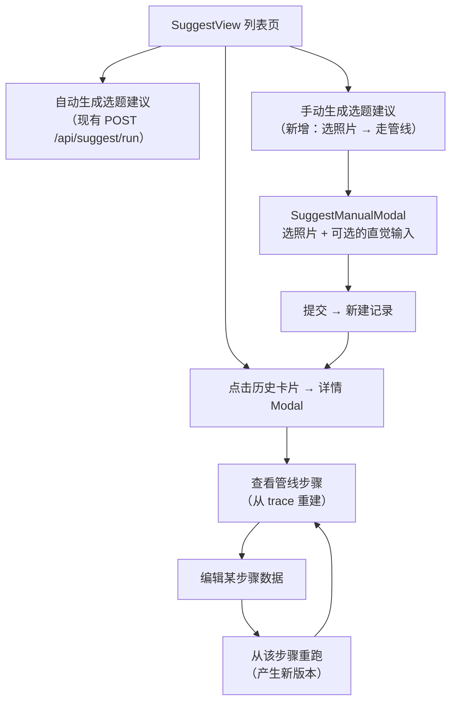

# 主题发现交互式管线 — 方案设计

> 中枢文档：[2026-07-27-5-topic-discovery-hub.md](2026-07-27-5-topic-discovery-hub.md) — 本专题全部关联产物的汇总入口

## 1. 问题/需求描述

当前主题发现是一个"黑盒"自动流程：用户点击按钮 → 等待几十秒 → 得到结果列表。存在两个体验缺口：

1. **不可见**：用户看不到 AI 的内部处理步骤（采样了哪些照片、RAG 检索了什么、LLM 输出了什么），无法理解选题是怎么来的
2. **不可控**：用户无法微调中间结果。如果对某个选题的照片组合或角度不满意，只能整体重跑，无法局部调整

用户希望：
- 点击一条选题记录 → 看到每个处理步骤的输入输出
- 修改某个步骤的数据（替换采样照片、调整 prompt、增删照片序列），从该步骤重新运行下游
- 每次修改重跑产生一个新版本，可切换对比
- 从零开始手动选题：自己选照片（或点"随机选取"），逐步走完管线

## 2. 方案设计

### 2.1 整体思路

**两条新增路径，复用同一套管线编辑 UI**：

核心设计决策：
- **管线步骤从 trace 数据重建**：`data/agent/execution-traces/YYYY-MM-DD.jsonl` 已包含完整的处理过程记录，按 `trace_id` 过滤即可还原每一步的输入输出
- **版本采用线性历史**：每次重跑产生新版本，`parent_version_id` 指向上一版本。预留树形分支的数据结构，初始实现只展示线性链
- **详情用全屏 Modal**：复用现有 SuggestView 的卡片风格，不引入新路由

### 2.2 管线步骤展示

从 trace 重建的步骤列表，按直觉分组展示：

| 步骤 | 来源 trace 事件 | 可编辑字段 |
|------|----------------|-----------|
| Stage 1 随机采样 | `suggest.stage1.sample` | 采样照片列表 |
| Stage 1 LLM 输入 | `suggest.stage1.llm.start` (含 payload_ref) | prompt 文本 |
| Stage 1 LLM 输出 | `suggest.stage1.llm.end` (含 payload_ref) | 直觉 JSON |
| Stage 2 RAG 查询 | `suggest.stage2.rag.start` | 查询文本 |
| Stage 2 RAG 结果 | `suggest.stage2.rag.end` | 匹配照片列表 |
| Stage 2 多样性过滤 | `suggest.stage2.diversity` | 过滤后照片列表 |
| Stage 3 LLM 输入 | `suggest.stage3.llm.start` | prompt 文本 |
| Stage 3 LLM 输出 | `suggest.stage3.llm.end` | 提案 JSON |
| Stage 3 校验 | `suggest.stage3.proposal` + `suggest.stage3.validation` | 最终照片序列 |

每个步骤展示为可折叠卡片：折叠态显示一行摘要（如"随机采样：8 张照片，覆盖 5 个日期"），展开态显示完整数据（prompt 文本、照片缩略图网格、JSON 结构化数据）。

### 2.3 编辑与重跑

用户在步骤编辑态修改数据后，点击"从此步重跑"。后端根据步骤入口点决定执行范围：

- 修改了 Stage 1 的数据：从头跑完整管线（采样 → RAG → LLM 提案）
- 修改了 Stage 2 的数据：跳过 Stage 1，从 RAG 扩展开始
- 修改了 Stage 3 的数据：跳过 Stage 1+2，仅重新生成提案

重跑时用新 `Tracer`（新 `trace_id`）记录，结束后从新 trace 重建步骤，作为新版本追加。

**管线函数改造**：`_stage1_generate_intuitions` 和 `_stage3_generate_proposals` 增加可选的 override 参数（`photo_ids_override`、`intuitions_override`、`prompt_override` 等），允许跳过或替换某些内部步骤。核心逻辑不变。

### 2.4 版本管理

**存储**：新建 `data/agent/topic-discovery/history.json`，每条记录增加 `versions` 数组和 `current_version_id`。旧 `suggest_history.json` 保持兼容（列表接口继续可用）。

**迁移**：懒迁移。用户首次打开某条记录的详情时，自动升级为 v2 格式（创建 v0 版本，步骤从 trace 按需重建）。

**trace 过期处理**：trace 文件保留 7 天。过期后步骤重建失败，详情页显示"追踪数据已过期"，仅展示最终结果。

### 2.5 手动选题

新增端点 `POST /api/suggest/manual-run`，接收可选参数：
- `photo_ids`：用户自选照片列表（为空则自动随机采样）
- `intuition`：用户自行填写的直觉（标题、角度、理由）

若提供了直觉，跳过 Stage 1 LLM，直接进入 Stage 2+3。若只提供了照片，用指定照片代替随机采样，后续流程不变。

前端：`SuggestManualModal` 两步向导。第一步用照片选择器（缩略图网格 + 搜索 + 多选 + "随机选取"按钮）选定照片，第二步可选填直觉，提交后新建记录并打开详情 Modal。

### 2.6 按钮改造

头部的"生成选题建议"按钮改为下拉菜单：
- **自动生成选题建议**：现有行为，`POST /api/suggest/run`
- **手动生成选题建议**：打开 `SuggestManualModal`

## 3. 关键决策

### 3.1 Trace 按需重建 + 懒缓存

首次打开详情时从 trace 文件重建步骤并写入 v0 版本缓存。后续 rerun 时即时生成。Trace 过期后降级为"仅展示结果"。

**理由**：trace 是已有的数据源，不重复存储。懒缓存避免为所有历史记录预计算步骤。

### 3.2 线性版本历史

数据结构预留 `parent_version_id`，初始 UI 只展示线性链（按创建时间排序）。树形分支展示留待后续。

**理由**：用户描述"每次修改产生新版本"，线性链满足需求。树形分支的 UI 复杂度高，先做简单版本。

### 3.3 全屏 Modal 而非独立路由

**理由**：复用现有 SuggestView 的上下文和列表数据，避免路由参数管理。Modal 足够大（95vw）展示双栏布局。与现有的聚类详情等页面模式一致。

### 3.4 新旧存储并存

列表接口从旧文件读取（兼容），详情接口从 v2 文件读取。后续可统一迁移。

**理由**：最小化对现有接口的改动，渐进升级。

## 4. 实现任务列表

### Phase 1：后端基础（存储 + trace 重建）

- [ ] **1.1** 新建 `agent/chain/trace_replay.py`：实现按 trace_id 扫描 `data/agent/execution-traces/*.jsonl`、加载 payload 文件、重建有序步骤列表
- [ ] **1.2** 在 `server.py` 新增 v2 存储层：`_load_suggest_history_v2` / `_save_suggest_history_v2` + 线程锁 + 懒迁移函数
- [ ] **1.3** 在 `server.py` 新增 Pydantic 模型：`PipelineStepSnapshot`、`SuggestVersion`、`SuggestHistoryDetail`
- [ ] **1.4** 实现 `GET /api/suggest/history/{id}/detail`：懒迁移 + 步骤重建 + 返回完整 detail
- [ ] **1.5** 实现 `PATCH /api/suggest/history/{id}/version/{vid}/switch`：切换当前活跃版本

### Phase 2：管线可重入改造

- [ ] **2.1** 修改 `suggest.py` 中 `_stage1_generate_intuitions`：增加 `photo_ids_override`、`prompt_override`、`intuitions_override` 参数
- [ ] **2.2** 修改 `suggest.py` 中 `_stage3_generate_proposals`：增加 `expanded_photos_override`、`prompt_overrides`、`proposal_overrides` 参数
- [ ] **2.3** 实现 `POST /api/suggest/history/{id}/rerun`：根据 `from_step` 确定入口点 → 构造 override → 运行部分管线 → 产生新版本 → 返回更新后的 detail
- [ ] **2.4** 新增轻量端点 `POST /api/suggest/random-sample`：独立暴露随机采样逻辑，供前端"随机选取"按钮调用

### Phase 3：手动选题

- [ ] **3.1** 实现 `POST /api/suggest/manual-run`：接收 `photo_ids` + 可选的 `intuition` → 走管线 → 新建 v2 记录 → 返回 detail
- [ ] **3.2** 修改 `POST /api/suggest/run`：结果同步写入 v2 文件（创建 v0 版本，无步骤快照，等首次打开详情时按需重建）

### Phase 4：前端类型与状态管理

- [ ] **4.1** 新建 `web/src/types/suggest.ts`：迁移 `HistoryItem` 并新增 `PipelineStep`、`SuggestVersion`、`SuggestHistoryDetail` 等类型 + 步骤标签常量
- [ ] **4.2** 新建 `web/src/composables/useSuggestDetail.ts`：封装详情加载、步骤编辑、重跑、版本切换、手动选题的状态和 API 调用

### Phase 5：前端详情视图

- [ ] **5.1** 新建 `SuggestStepCard.vue`：折叠/展开/编辑三态，prompt 文本用 `<pre>` 块，照片用缩略图网格，JSON 数据用格式化展示
- [ ] **5.2** 新建 `SuggestStepEditor.vue`：根据步骤类型渲染不同编辑器（照片选择器 / 文本输入区 / JSON 编辑器 / 照片序列拖拽排序）
- [ ] **5.3** 新建 `SuggestPhotoSelector.vue`：缩略图网格 + 描述搜索 + 多选 + 分页 + "随机选取"按钮 + 已选计数
- [ ] **5.4** 新建 `SuggestVersionTimeline.vue`：纵向时间线，版本号/时间/修改字段标签，当前版本高亮，点击切换
- [ ] **5.5** 新建 `SuggestDetailModal.vue`：全屏 card Modal，左侧版本时间线 + 右侧步骤列表（按直觉分组），顶栏含标题/版本选择器/关闭按钮
- [ ] **5.6** 新建 `SuggestManualModal.vue`：两步向导（选照片 → 可选填直觉），提交后自动打开详情 Modal

### Phase 6：集成改造

- [ ] **6.1** 修改 `SuggestView.vue`：按钮改为 `NDropdown`（自动/手动），卡片增加点击打开详情的处理，导入重构后的类型
- [ ] **6.2** 各组件补全状态：加载中、空数据、错误、trace 过期的降级提示

## 5. 涉及的关键文件

| 文件 | 变更类型 |
|------|---------|
| `agent/chain/trace_replay.py` | **新建** |
| `agent/chain/suggest.py` | 修改（管线函数增加 override 参数） |
| `agent/chain/server.py` | 修改（新端点 + v2 存储 + Pydantic 模型 + 手动选题） |
| `web/src/types/suggest.ts` | **新建** |
| `web/src/composables/useSuggestDetail.ts` | **新建** |
| `web/src/views/SuggestView.vue` | 修改（按钮改为下拉、卡片点击接入详情） |
| `web/src/components/SuggestDetailModal.vue` | **新建** |
| `web/src/components/SuggestStepCard.vue` | **新建** |
| `web/src/components/SuggestStepEditor.vue` | **新建** |
| `web/src/components/SuggestVersionTimeline.vue` | **新建** |
| `web/src/components/SuggestPhotoSelector.vue` | **新建** |
| `web/src/components/SuggestManualModal.vue` | **新建** |
