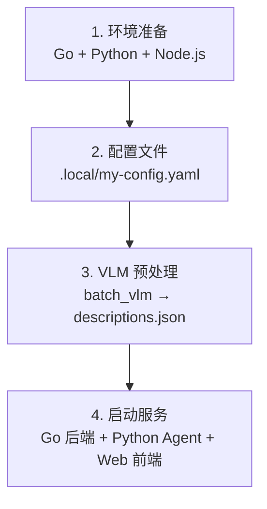

# Photo Agent — 部署指南

> 本文档描述在新环境中从零部署 Photo Agent 的最简流程。
> 部署完成后，通过 Web 前端（`http://localhost:10006`）使用全部功能。

---

## 部署全景



---

## 1. 环境准备

- **Go** ≥ 1.23
- **Python** 3.12（推荐用 `uv` 管理）
- **Node.js** + pnpm

```bash
cd /root/code/photo-agent

# 编译 Go 后端
make backend
# 产物: bin/server, bin/batch_vlm

# Python 环境
cd agent
uv python install 3.12
uv venv .venv --python 3.12
source .venv/bin/activate
uv sync

# Web 前端
cd ../web
pnpm install
```

---

## 2. 配置文件

```bash
cp configs/config.yaml .local/my-config.yaml
```

编辑 `.local/my-config.yaml`，填写以下必填段：

```yaml
llm:
  base_url: "https://api.openai.com/v1"
  api_key: "sk-xxxxxxxx"
  model: "gpt-4o-mini"

vlm:
  api_key: "sk-xxxxxxxx"
  model: "gpt-4o-mini"              # 需支持视觉能力
  base_url: "https://api.openai.com/v1"

embedding:
  api_key: "sk-xxxxxxxx"
  model: "text-embedding-3-small"
  base_url: "https://api.openai.com/v1"

storage:
  photo_src: "./data/photos"        # 照片源目录
  photo_path: "./data/photos"
```

> Go 和 Python 共用此配置文件。Dify 配置段无需填写，保持默认即可。

---

## 3. VLM 预处理

将照片放入 `data/photos/` 目录（支持 `.jpg` `.jpeg` `.png` `.webp`），然后：

```bash
./bin/batch_vlm -c .local/my-config.yaml
```

- 并发调用 VLM，每张照片生成结构化视觉描述
- 每 10 张自动保存中间结果，支持断点续传
- 输出 `data/descriptions.json`

---

## 4. 启动服务

三个进程，各占一个终端：

```bash
# 终端 1: Go 后端（:10004）
./bin/server -c .local/my-config.yaml

# 终端 2: Python Agent（:10005）
cd agent && source .venv/bin/activate
python chain/photo_agent.py -c ../.local/my-config.yaml --serve

# 终端 3: Web 前端（:10006）
cd web && pnpm dev
```

访问 `http://localhost:10006` 开始使用。Go 后端启动时自动执行 AutoSync（增量导入照片 + 解析结构化属性 + 提取 EXIF）。

---

## 5. 验证清单

- [ ] `make backend` 编译通过
- [ ] `.local/my-config.yaml` 中 API Key 有效
- [ ] `./bin/server -c .local/my-config.yaml` 启动，`/api/v1/health` 返回 OK
- [ ] Python Agent `--serve` 启动，`/api/chat/health` 返回 `{"status":"ok"}`
- [ ] Web 前端 `pnpm dev` 正常启动，页面可访问
- [ ] 照片管理页可见已导入的照片
- [ ] AI 对话可正常问答

---

## 常见问题

### Q: batch_vlm 中断后如何恢复？

直接重新运行，已处理的照片自动跳过。如需强制重新生成，加`--force`参数：

```bash
./bin/batch_vlm -c .local/my-config.yaml --force
```

### Q: 新增照片后如何更新？

```bash
# 1. VLM 预处理新照片
./bin/batch_vlm -c .local/my-config.yaml

# 2. 重启 Go 后端触发 AutoSync（自动解析 EXIF + 入库）

# 3. Web 界面点击"开始批量 Embed"触发向量索引
```

### Q: 如何重建 ChromaDB 索引？

```bash
rm -rf ./data/chroma/
# 然后通过 Web 界面或 CLI 重新执行批量 Embedding
```

### Q: 如何更换 LLM 供应商？

修改 `.local/my-config.yaml` 中对应段的 `base_url` 和 `model`。项目通过 OpenAI 兼容 API 调用，支持火山引擎、通义千问、DeepSeek 等。

### Q: 端口冲突？

Go 后端默认 `:10004`，Python Agent 默认 `:10005`，Web 前端默认 `:10006`。可在配置文件中修改。Python Agent 也可通过 `--serve <port>` 指定端口。

### Q: 会话数据存储在哪里？

`data/chat_sessions.db`（SQLite），可在配置文件中自定义 `chat.db_path`。
