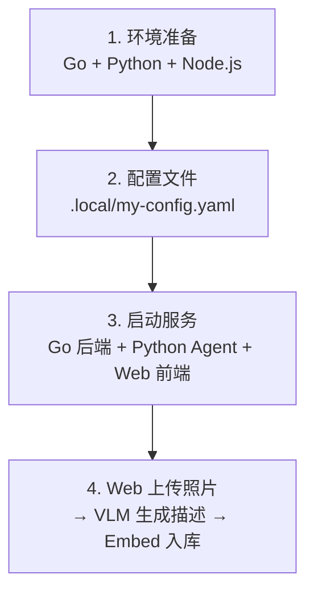

# Photo Agent — 部署指南

> 本文档描述在新环境中从零部署 Photo Agent 的最简流程。
> 部署完成后，通过 Web 前端（`http://localhost:10006`）使用全部功能。

---

## 部署全景



---

## 1. 环境准备

- **Go** ≥ 1.23
- **Python** 3.12（推荐用 `uv` 管理）
- **Node.js** + pnpm

```bash
cd /root/code/photo-agent

# 编译 Go 后端（产物: backend/bin/server）
cd backend && make build
cd ..

# Python 环境
cd agent
uv python install 3.12
uv venv .venv --python 3.12
source .venv/bin/activate
uv sync

# Web 前端
cd ../web
pnpm install
```

---

## 2. 配置文件

```bash
cp configs/config.yaml .local/my-config.yaml
```

编辑 `.local/my-config.yaml`，填写以下必填段：

```yaml
LLM:
  BaseURL: "https://api.openai.com/v1"
  APIKey: "sk-xxxxxxxx"
  Model: "gpt-4o-mini"

VLM:
  APIKey: "sk-xxxxxxxx"
  Model: "gpt-4o-mini"              # 需支持视觉能力
  BaseURL: "https://api.openai.com/v1"

Embedding:
  APIKey: "sk-xxxxxxxx"
  Model: "text-embedding-3-small"
  BaseURL: "https://api.openai.com/v1"

Storage:
  PhotoSrc: "./data/photos/src"        # 照片源目录
  PhotoPath: "./data/photos/compressed"  # 压缩后图片存储路径

Agent:
  Addr: "0.0.0.0:10005"
  # Agent Runtime 开放目标执行的预算（可选，缺省 12 步 / 300 秒 / 2 元）
  # RuntimeMaxSteps: 12
  # RuntimeTimeoutSeconds: 300
  # RuntimeCostLimit: 2.0

Web:
  Addr: "0.0.0.0:10006"
```

> Go、Python 和 Vite 开发服务器共用此配置文件。`Http`、`Sqlite` 暂为 pgo 兼容段；`Agent.Addr`、`Web.Addr` 分别控制 Agent 与 Web 的监听地址。连拍阈值不再写入 YAML，数据库无记录时使用后端代码默认，后续修改由 Web 设置页写入数据库。`Agent.Runtime*` 三个键控制对话中开放目标（选片 + 创作）多步执行的步数/时长/成本上限，缺省即用内置默认值。

---

## 3. 启动服务

三个进程，各占一个终端：

```bash
# 终端 1: Go 后端（:10004）
cd backend && ./bin/server -c ../.local/my-config.yaml

# 终端 2: Python Agent（:10005）
cd agent && source .venv/bin/activate
python chain/photo_agent.py -c ../.local/my-config.yaml --serve

# 终端 3: Web 前端（:10006）
cd web && pnpm dev
```

访问 `http://localhost:10006` 开始使用。通过 Web 前端上传照片，在详情页点击"生成描述"实时调用 VLM，再通过"Embed"按钮将描述嵌入向量库。

---

## 4. 验证清单

- [ ] `cd backend && make build` 编译通过
- [ ] `.local/my-config.yaml` 中 API Key 有效
- [ ] `cd backend && ./bin/server -c ../.local/my-config.yaml` 启动，`/api/v1/health` 返回 OK
- [ ] Python Agent `--serve` 启动，`/api/chat/health` 返回 `{"status":"ok"}`
- [ ] Web 前端 `pnpm dev` 正常启动，页面可访问
- [ ] 照片管理页可见已导入的照片
- [ ] AI 对话可正常问答

---

## 常见问题

### Q: 新增照片后如何处理？

通过 Web 前端上传照片，然后在图片管理页：
1. 点击照片详情页的"生成描述"实时调用 VLM
2. 或点击顶栏"VLM"按钮批量处理所有无描述照片
3. 处理完成后点击"Embed"按钮将描述嵌入向量库

### Q: 如何重建 ChromaDB 索引？

```bash
rm -rf ./data/agent/chroma/
# 然后通过 Web 界面或 CLI 重新执行批量 Embedding
```

### Q: 如何更换 LLM 供应商？

修改 `.local/my-config.yaml` 中 `LLM`、`VLM` 或 `Embedding` 段的 `BaseURL` 和 `Model`。项目通过 OpenAI 兼容 API 调用，支持火山引擎、通义千问、DeepSeek 等。

### Q: 端口冲突？

Go 后端监听 `Http.Addr`，Python Agent 监听 `Agent.Addr`，Web 前端监听 `Web.Addr`（模板默认分别为 `:10004`、`:10005`、`:10006`）。Python Agent 也可通过 `--serve <port>` 临时覆盖监听端口。

### Q: 会话数据存储在哪里？

`data/agent/sqlite/chat_sessions.db`（SQLite），可在配置文件中通过 `Agent.ChatDBPath` 调整。
