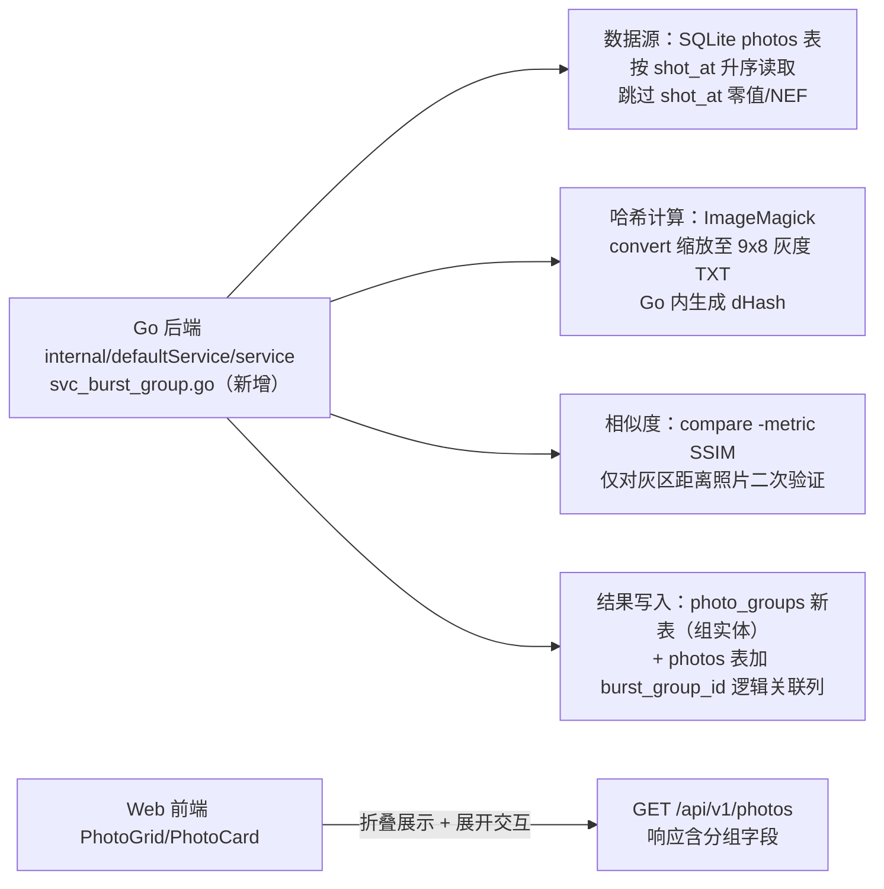

# 连拍分组功能设计文档

> 状态：已规划（backlog BG1，2026-08-20 确认实施拆解）
> 日期：2026-08-19（初稿修订）/ 2026-08-20（规划定稿）
> 本文档由外部 AI 对话产出的初稿修订而来，已结合 photo-agent 当前代码库（Go 后端 Kratos+GORM 架构、SQLite photos 表、ImageMagick 图片处理）校准落地方案。

## 1. 需求背景

摄影过程中连拍是常见操作，同一场景下人物不同表情、动作的连续拍摄，或同一地点短时间内的多次快门。这些照片在存储层面是独立文件，但在浏览层面属于**同一组**。

当前问题：

- 浏览照片时（`#/photos` PhotoGrid），同一场景的连拍照片占据大量视觉空间，干扰整体叙事节奏
- 用户难以快速判断哪些照片属于同一组、哪些是独立场景
- 手动分组耗时且主观

目标：自动识别照片库中的连拍组，在前端以"组"为单位折叠展示，同时保留查看单张照片的能力。

**库内数据佐证**（2026-08-19 对 `data/sqlite/photo_agent.db` 1436 张照片实测）：按 shot_at 排序后相邻间隔分布为 ≤2s 共 190 对、2~5s 共 55 对、5~10s 共 67 对。连拍数据真实存在且量级可观，5 秒默认窗口约覆盖 245 对相邻照片。

## 2. 功能定义

**连拍组识别**：将一批在**时间上连续、内容上高度相似**的照片自动归并为一个"连拍组"。同一场景、连续按快门产生的多张照片（即使表情/动作略有不同）视为一组。跨场景的相似照片（不同地点、不同时间的同一人物）不属于连拍组。

**输出**：每个连拍组包含组内照片列表、时间范围、封面图，以及"是否为连拍组"的标记。

非目标：

- 不做照片内容的语义理解（识别"人像还是风景"由 VLM 预处理承担，本功能不依赖它）
- 不做跨天、跨场景的相似照片合并
- 不做组内"最佳一张"推荐（可作为后续 backlog 条目）

## 3. 设计原则

- **无大模型依赖**：全程传统算法，零 token 消耗（区别于项目内 VLM/Embedding 管线，本功能刻意走轻量路线）
- **确定性**：相同输入产生相同输出，不依赖外部 API，结果可复现、可单测
- **可解释**：分组结果可追溯到判断依据（时间间隔、哈希距离），入库保存判定参数
- **可调参**：阈值进 `config.yaml`，适应不同拍摄习惯
- **贴合现有架构**：分组逻辑放 Go 后端（Python 层不直接访问 DB/文件，见 tech.md 职责边界）；图片处理复用 ImageMagick（项目已依赖，`file_util.go` 中已有 `convert` 调用先例）

## 4. 算法选型对比

### 4.1 候选算法

- **感知哈希（dHash/pHash）**
  原理：缩放到固定小尺寸（如 9x8 灰度），比较相邻像素梯度生成哈希，汉明距离判断相似度
  计算量极低（~1ms/图），对构图微调（平移、轻微裁切）不敏感，适合连拍场景
  实现复杂度低
- **SSIM（结构相似性）**
  原理：计算两张图在亮度、对比度、结构三方面的相似度，输出 0-1 值
  计算量中等（~5ms/对），能精细区分"同一场景微调"与"完全不同场景"
  实现复杂度中
- **ORB 特征匹配**
  原理：提取关键点描述子，匹配数量判断相似性
  对旋转、视角变化鲁棒，但连拍场景几乎无视角变化，且计算量高（~20ms/图），属过度设计
- **EXIF 时间戳分组**
  原理：按拍摄时间间隔分组
  计算量极低，保证时间连续性，但无法判断内容相似性（同一时间窗拍的不同物体也会被归组）

### 4.2 方案对比与决策

- **纯时间分组（不可行）**：用户在 5 秒内先拍路牌再拍行人也会被归组，误报高。只能作辅助约束
- **纯感知哈希分组（不可行）**：无法保证时间连续性，2025 年 5 月和 2026 年 2 月拍的同一座高架桥视觉高度相似但不是连拍
- **方案 A：时间窗 + 内容相似度（推荐）**：先按时间窗口划分候选组，再对组内做视觉相似度验证。既保证时间连续性，又排除同窗口不同内容的误归组
- **方案 B：滑动窗口 + 哈希变化率**：按顺序用滑动窗口判断相邻哈希距离变化率切分新组。计算量更低，但对非均匀时间间隔（隔 3 秒拍 5 张、隔 2 秒又拍 5 张）适应性不如方案 A

### 4.3 最终决策

采用**方案 A（时间窗 + 内容相似度）**：

- 符合连拍定义：时间窗口保证连续拍摄，内容相似度保证同一场景/人物
- 资源可控：dHash + SSIM 均轻量，无 GPU、无模型
- 可调优：时间窗口和相似度阈值均可配置

> 初稿中"准确率 > 92%"无实测出处，删除。真实准确率待第 8 节验收标准的人工标注测试集验证。

## 5. 落地架构

### 5.1 模块归属



关键决策与项目现状的对应关系：

- **数据源用 SQLite 而非重读 EXIF**：`shot_at` 在导入时已由 `exif.go` 提取入库（1436 张中仅 1~2 张零值异常），分组时直接查库
- **哈希计算复用 ImageMagick**（用户已确认）：`convert <thumb> -resize 9x8! -colorspace gray txt:` 输出像素矩阵，Go 解析后计算 dHash。缩略图走 `conf.C.Storage.PhotoPath` 下已压缩的 JPG（MaxImageSizeMB=0.2），不碰 photo_src 原图。零新 Go 依赖；代价是每张 spawn 一个 convert 进程（实测约 15ms/张），全量 1436 张约 20~30 秒，一次性离线任务可接受
- **分组结果新建 photo_groups 表**（用户已确认）：照片和连拍组是两个维度的实体，1:N 关系按关系建模。组实体独立建表（组元数据单份存储），photos 表只加一个 `burst_group_id` 列做逻辑关联（不建数据库外键约束，见 5.3）。曾考虑过"photos 表加 3 列"方案，否决原因：burst_meta JSON 在组内每张照片上冗余一份；组没有独立身份，未来组级演进（组内最佳一张、手动调整组成员、组级标签）只能持续往 photos 表塞字段。封面图约定为组内 shot_at 最早的一张

### 5.2 处理流程

1. **读取候选**：`SELECT id, file_path, filename, shot_at FROM photos WHERE shot_at > '2000-01-01' AND file_type = 'jpg' ORDER BY shot_at`。NEF 记录（无缩略图）与 shot_at 零值记录跳过，不参与分组
2. **时间窗口分割**：遍历排序照片，相邻间隔 ≤ T_time（默认 5s）进同一候选组，否则切分
3. **哈希验证**：候选组内计算相邻照片 dHash 汉明距离；任一相邻距离 > T_hash（默认 10）则在该处切分（比初稿"整组不成立"更合理：10 连拍中第 5 张构图突变不应否定前后两段）
4. **SSIM 二次验证**：对哈希距离落在灰区（8~12）的相邻对，用 `compare -metric SSIM <a> <b> null:` 二次确认；SSIM ≥ T_ssim（默认 0.85）判同组，否则切分
5. **写库**：组内照片数 ≥ 2 才成为连拍组；photo_groups 插入组记录（id 为 `burst_<首照片id前8位>`、封面为组内 shot_at 最早一张），组内照片的 burst_group_id 指向该组。rebuild 时先清空 photos.burst_group_id 并整表重建 photo_groups

### 5.3 数据模型变更

新建 photo_groups 表 + photos 表加 1 列 burst_group_id（**逻辑关联，不建数据库外键约束**）。

**建表走项目 SQL-first 链路**（与 photos/abandon_code 表一致）：

1. `backend/sql/photo_groups.sql` 新增 DDL（photos.sql 同步追加 burst_group_id 列）
2. `make initDB` 重建 ORM 模板库 → `make gorm` 重新生成 model/query → `make curd` 生成 PhotoGroup 标准 CRUD
3. 生产库（`data/sqlite/photo_agent.db`）由 `db.Migrate()` 幂等迁移：HasTable/HasColumn 判断后 CreateTable/AddColumn（现有 migrate.go 已有 file_type 先例，扩展为处理 photo_groups 建表 + photos 加列）

```sql
-- backend/sql/photo_groups.sql
CREATE TABLE photo_groups (
  id TEXT NOT NULL PRIMARY KEY,           -- burst_<首照片id前8位>
  cover_photo_id TEXT NOT NULL DEFAULT '', -- 逻辑指向 photos.id，无外键约束
  photo_count INTEGER NOT NULL DEFAULT 0,
  time_start DATETIME,
  time_end DATETIME,
  hash_max INTEGER NOT NULL DEFAULT 0,     -- 组内最大相邻哈希距离
  created_at DATETIME NOT NULL DEFAULT CURRENT_TIMESTAMP
);
-- photos.sql 追加：burst_group_id TEXT NOT NULL DEFAULT ''
```

**不建数据库外键**：表间关联只体现在列名与代码逻辑（service 层负责写入/清理的一致性）。外键的强制性约束虽安全，但会带来删除顺序限制、迁移负担，与本项目"表不约束、代码写完整、宽容度高，有 BUG 修 BUG"的倾向相悖。此为项目级数据建模规则，见 CLAUDE.md 全局行为约束。

**展示字段的拼装**：`burst_cover`（是否封面）、`burst_count`（组内数量）不落库，由 `GET /api/v1/photos` 查询时 LEFT JOIN photo_groups 推导（DTO 层冗余，不是表冗余），前端拿到的 PhotoItem 仍是一次请求带全。

### 5.4 API 与触发时机

**异步 rebuild + 状态轮询**（与 VLM/Embed 队列一致的模式，用户已确认）：

- `POST /api/v1/burst-groups/rebuild` — 触发全量重算，后台 goroutine 执行，立即返回 `{status: "running"}`。已在跑则返回 `{status: "already_running"}`
- `GET /api/v1/burst-groups/status` — 轮询进度：`{running, processed, total, group_count}`，跑完 `running=false` 并带上最终组数
- 幂等：rebuild 开始时清空 photos.burst_group_id、重建 photo_groups，再重算
- `GET /api/v1/photos` 响应的 `PhotoItem` 带 burst_group_id / burst_cover / burst_count（后两个由 LEFT JOIN 推导），前端无需额外请求
- **组内取数**：`SearchPhotosRequest` 增加 `burst_group_id` 过滤参数（与现有 timeline/tag 过滤同模式），前端展开一个组时用它拉取该组全部成员，避免组分页跨页取不全
- 触发时机：**仅手动**，入口放设置页（新增"连拍分组"卡片：rebuild 按钮 + 进度条 + 当前组数）。不挂入 AutoSync（分组是全局重算型任务，与单张导入增量不匹配）。后续若需要可加"导入后自动重算"开关

proto 定义：photo_service.proto 新增 rebuild/status 两个 rpc 与消息、PhotoItem 加 3 个 burst 字段、SearchPhotosRequest 加 1 个过滤参数，走 `make api` 重新生成。

### 5.5 前端交互

- `PhotoGrid.vue`：封面照片（burst_cover=true）正常渲染 PhotoCard，角标显示组内数量（如 `×5`）；点击封面展开组内缩略横条（PhotoThumbList 复用），再点击收起。组内非封面照片默认不占网格位，展开横条中可见
- `PhotoDetail` 查看单张不受影响

### 5.6 配置项

`configs/config.yaml` 新增 burst 段：

```yaml
burst:
  TimeWindowSec: 5    # T_time：相邻两张拍摄间隔阈值
  HashThreshold: 10   # T_hash：dHash 汉明距离阈值（64bit，0-64）
  SsimThreshold: 0.85 # T_ssim：灰区二次验证阈值
  SsimGrayZone: [8, 12] # 触发 SSIM 验证的哈希距离区间
```

## 6. 阈值调优建议

- **T_time=5s**：分组过散增大到 8s，分组过密减小到 3s。库内实测 ≤2s 间隔 190 对、2~5s 55 对，5s 是合理起点
- **T_hash=10**（64bit dHash）：漏判多（同组被拆）增大到 12，误判多（不同组被合）减小到 8
- **T_ssim=0.85**：表情/动作差异大的同组被排除时，降低到 0.80

## 7. 边界情况

- **照片缺失 EXIF 时间**：导入链路（`createPhotoRecord` → `getExifInfo`）对无 EXIF 时间的照片不做兜底，shot_at 为零值（`0001-01-01`，库内现存 1~2 条）。分组时直接过滤零值记录，不做运行时 fallback
- **跨天/跨场景**：时间窗口天然断组（间隔远超 5s），无需特判
- **NEF 文件**：file_type=nef 无缩略图且 shot_at 为空，直接跳过；待 NEF 转码能力落地后再纳入
- **单张不成组**：组内 ≥2 张才建组记录，其余照片 burst_group_id 为空
- **删除组内照片**：不实时重算。封面被删时，下次 rebuild 修正；日常浏览由前端按 burst_group_id 分桶，桶内照片顺序按 shot_at

## 8. 验收标准

- [ ] 人工标注 50~100 组（从库内 ≤5s 间隔的 245 对采样），识别准确率 ≥ 90%
- [ ] 全量 1436 张照片 rebuild 总耗时 < 60 秒（含 ImageMagick 进程开销）
- [ ] 误归组率（不同连拍被合并）< 5%
- [ ] 漏归组率（同一连拍被拆散）< 8%
- [ ] 单测覆盖：时间窗分割、哈希切分、灰区 SSIM 判定、单张不成组、零值 shot_at 过滤
- [ ] rebuild 异步执行不阻塞其他 API；重复触发返回 already_running 不产生并发写

## 9. 实施拆解（已按规划确认）

> 代码生成链路：photo_groups 走 `make gorm + make curd` 全套（与 photos 表同路，用户已确认）；rebuild 异步 + 状态轮询（用户已确认）

1. **P1 数据层**：`sql/photo_groups.sql` + photos.sql 加列 → `make initDB/gorm/curd` → `db/migrate.go` 扩展（建表 + 加列）→ `conf.go` 加 Burst 配置段 + `configs/config.yaml` 模板同步
2. **P2 proto 与 DAO**：photo_service.proto 加 rpc（rebuild/status）+ PhotoItem 3 字段 + SearchPhotosRequest 过滤参数 → `make api` → dao_photo_group.go 基础查询 + GetPhotoList 支持 burst_group_id 过滤 + 列表响应拼装 burst 字段
3. **P3 算法主体**：`svc_burst_group.go` — 时间窗分割/哈希切分/SSIM 灰区判定为纯函数 + 单测；ImageMagick dHash 生成 + compare SSIM 封装（真实缩略图验证）；异步 rebuild goroutine + 进度状态
4. **P4 前端**：设置页"连拍分组"卡片（rebuild 按钮 + 轮询进度条 + 当前组数）；PhotoGrid 折叠（封面角标 ×N、展开组内横条按 burst_group_id 拉取成员）；types/composable 扩展
5. **P5 实测调优**：真实库全量 rebuild，按第 8 节验收标准人工抽检，必要时调阈值

## 9. 实施拆解（建议顺序）

1. proto + 数据模型（photo_groups 新表 + photos 加逻辑关联列 + PhotoItem 扩展 + rebuild 接口定义）
2. `svc_burst_group.go`：算法主体 + 单测（时间窗/哈希切分/SSIM 灰区为纯函数，用构造数据测，不依赖真实图片）
3. ImageMagick 集成：dHash 生成 + compare SSIM 封装（用 `data/photos` 下真实缩略图验证）
4. 前端 PhotoGrid 折叠交互 + 角标
5. 真实库全量跑一遍，按验收标准人工抽检，调阈值
