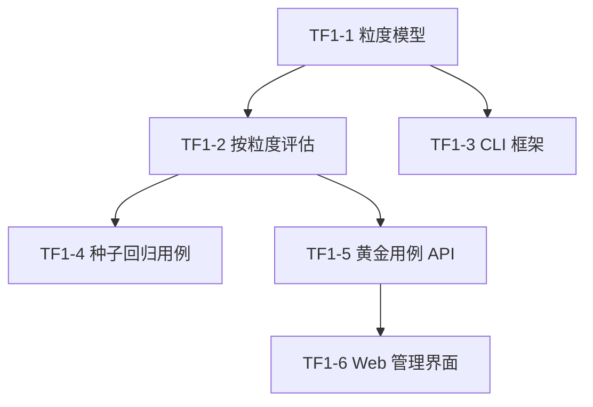

# 评估测试脚本框架与黄金用例维护 — 分步设计

> Backlog 总览：[docs/backlog.md](../backlog.md#评估基建)
> 关联背景：GR1 三 Collection 向量库改造、[评估基线](../eval/baseline.md)
> 状态：TF1-1 至 TF1-10 全部完成

## 一、背景与目标

一次真实查询“佛像和人的合照”返回未找到，暴露出当前评估链路无法快速区分数据缺失、检索逻辑错误和标注过期。现有黄金用例还只能全量运行，维护时难以区分漏检与图库新增造成的多余命中。

本专题的目标是建立一个低成本、可重复的评估闭环：先用无 LLM 的脚本验证数据态与检索结果，再用黄金用例维护和单条评估支持图库持续变化。所有工作拆成可独立开发、独立验收的 backlog 任务。

## 二、范围与非目标

范围包括：

- 黄金照片引用能够表达 photo、fine、coarse 三种检索粒度，并兼容已有 JSON。
- 评估逻辑按照片粒度选择对应向量集合，支持单条黄金用例评估。
- 提供 L0 数据态、L1 函数级、L2 HTTP 级三层断言的命令行测试入口。
- 沉淀检索闭环与连拍粒度闭环两类回归用例。
- Web 端支持手动新建、单条评估，以及把确认后的多余命中加入用例。

不包括：

- L0/L1 不调用 LLM；L2 对标用户实际操作，创建临时会话发送指定对话并在结束后删除，用于少量关键用例的端到端回归。
- 不在本专题内修复具体的三 Collection 检索算法问题；该问题由回归用例定位后另行处理。
- 不引入数据库表或外键；黄金用例继续使用现有本地 JSON 存储。
- 不以 Playwright 作为脚本框架入口；页面视觉和交互仍在后续评估阶段验证。

## 三、分步任务与交接关系

### TF1-1 黄金用例粒度模型

状态：✅ 已完成

目标：让每条期望照片声明所属检索粒度，旧用例读取后默认按 photo 解释。

涉及范围：黄金用例模型、JSON 读写、导入导出和现有保存入口的数据一致性。

完成标志：三种粒度值可被保存和读取；旧 JSON 无需迁移即可继续展示、导出和评估。

### TF1-2 按粒度评估与单条运行能力

状态：✅ 已完成

目标：让评估结果真实反映三个向量集合，并提供只评估指定用例的能力。

涉及范围：评估模块、指标计算、命中/未命中/多余命中结果，以及与照片展示所需标识的转换。

完成标志：同一查询可按粒度分别计算；单条评估和全量评估共用同一套结果语义；没有相关照片的边界行为明确。

### TF1-3 三层 CLI 测试框架

状态：✅ 已完成

目标：提供几行结论即可判断失败层级的命令行入口。

三层职责：

- L0：核对目标照片、连拍封面和对应集合的数据状态。
- L1：直接调用检索函数，核对命中顺序、粒度切换和组级结果。
- L2：通过 HTTP 接口验证服务契约；标有对话期望的种子用例会真实发送消息并核对返回照片。

完成标志：可选择层级或运行默认全套；失败信息包含用例和断言；成功输出保持简短；配置缺失或服务未启动时直接给出可定位错误。

### TF1-4 两类种子回归用例

状态：✅ 已完成

目标：把真实问题沉淀为可反复执行的最小闭环。

用例至少包括：

- 检索闭环：问题、目标照片、检索结果和排序断言。
- 连拍粒度闭环：同一问题在 photo、fine、coarse 下分别核对目标封面及不串粒度。

完成标志：用例不依赖临时人工输入；在当前数据态下可运行；失败结果能指向 L0、L1 或 L2 的具体层级。

### TF1-5 黄金用例 API 能力

状态：✅ 已完成

目标：为前端提供单条评估和追加期望照片的稳定操作能力。

涉及范围：单条评估请求、向已有用例追加照片、粒度字段校验、用例不存在和照片信息不完整等错误反馈。

完成标志：追加结果持久化后立即可被再次评估读取；接口返回结构能表达三类结果；既有全量评估接口行为不被破坏。

### TF1-6 黄金用例管理界面

状态：✅ 已完成

目标：让用户无需手改 JSON 即可维护和校准黄金用例。

交互包括：

- 新建查询并选择期望照片及粒度。
- 列表行单独运行评估，显示该条的命中、未命中和多余命中。
- 在评估明细中把确认的多余命中加入当前用例，并刷新结果。

完成标志：操作状态、失败反馈和保存后的即时结果清晰；旧用例仍可查看；全量评估入口继续可用。

## 四、依赖与建议执行顺序

建议按 TF1-1 → TF1-2 → TF1-3 → TF1-4 → TF1-5 → TF1-6 顺序执行。TF1-2 与 TF1-3 在 TF1-1 完成后可并行；TF1-4 依赖 CLI 框架，TF1-5 依赖评估结果模型，TF1-6 依赖 API。

每个子任务完成后都应：

- 只运行本任务范围内的测试和必要回归；
- 更新对应 backlog 条目的状态与验收项；
- 将新增行为作为后续任务的明确输入，而不是继续扩大当前任务范围。

## 五、统一验收标准

- 可从命令行运行 L0/L1/L2 断言，并以简短结论报告通过或失败层级。
- 至少有一条检索闭环和一条连拍粒度闭环可直接用于回归。
- 旧黄金 JSON 无需手工迁移即可继续工作。
- 单条黄金用例可评估，结果能区分命中、未命中和多余命中。
- 多余命中经确认后可加入用例，并在下一次评估中生效。
- “佛像和人的合照”问题能通过脚本定位到数据态、函数级或 HTTP 级中的具体失败层。

## 六、用户需要提供或确认的事项

- （用户）在执行 TF1-4 前确认当前图库中用于“佛像和人的合照”的目标照片及对应连拍组封面。
- （用户）在执行 TF1-6 前确认黄金用例管理页采用现有页面继续扩展，不单独拆新页面。该轮曾将选片部分抽为 `GoldenPhotoPicker`；后续已由 `PhotoPickOverlay` 统一替代并清理旧组件。

## 七、后续衔接

本专题完成后，使用回归脚本重新检查 GR1 的三 Collection 问题。若脚本定位出具体根因，再建立独立修复任务，避免把评估基建与检索算法修复混在同一任务中。
