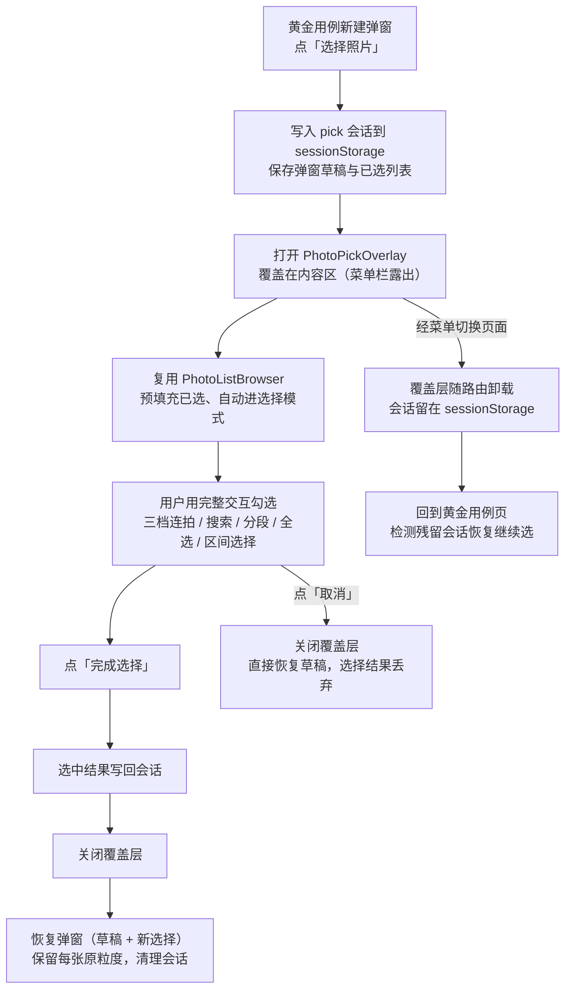

# 跨页面选图流程（PhotoPick 覆盖层）设计

> 需求：黄金用例新建弹窗选期望照片时，不再使用内嵌的简化选图列表，而是复用图片管理的完整交互（三档连拍折叠、搜索、分段、全选、区间选择），选完再回到原工作流。
> 用户决策（2026-08-26）：
> - 状态载体用 sessionStorage（刷新可恢复）
> - 复用图片管理大部分内容，但改写顶栏文案、隐藏 VLM/Embed/图文工坊/连拍等按钮，增加「完成选择」按钮；选图层覆盖在原页面内容区上，左侧菜单栏露出不遮挡，完成后返回原页面
> - 已选照片预填充（进入选图层时自动勾选）

---

## 1. 背景与思路

当前黄金用例的期望照片选择由 `GoldenPhotoPicker.vue` 承担：一个自包含的简化列表（拉全量照片 + 文件名搜索 + 平铺网格多选）。它缺少图片管理已有的三档连拍展示、时间分段、全选、区间选择等能力。若继续在弹窗里堆功能，就是第三套重复的图片列表（图片管理、图文工坊之后）。

新思路：**不在各处复制图片列表，而是需要选图时覆盖式借用图片管理页面**。用户在熟悉的完整交互里勾选，完成后自动回到原工作流，且原页面已填的数据不丢。

## 2. 核心流程



## 3. 关键设计决策

### 3.1 覆盖层而非路由跳转

- 选图层 `position: fixed`，锚定在左侧菜单右侧（SideMenu 固定 220px 宽、不可折叠，覆盖层 `left: 220px`），z-index 1000
- **左侧菜单保持可见且可点击**：菜单切换页面时覆盖层随路由卸载，选图会话留在 sessionStorage；回到黄金用例页 onMounted 检测残留会话即恢复继续选
- **不走路由**：原页面（黄金用例管理页）不卸载，只被盖住。弹窗草稿天然保存在父组件 ref 里，不依赖任何恢复逻辑
- 唯一的跨组件状态是「选中的照片列表」，走 sessionStorage，防 F5 刷新丢失

### 3.2 复用 PhotoListBrowser 而非整个 PhotoManagement

- `PhotoManagement.vue` 承载 VLM/Embed/上传/连拍重算/详情抽屉等大量页面级职责，直接复用会把不相关的状态和轮询一起搬进选图流程
- 拆出新组件 `PhotoPickOverlay.vue`：复用 `PhotoListBrowser`（含 PhotoGrid 三档折叠、双向滚动、分段导航）+ `usePhotos()` 列表能力，顶栏只保留「选择照片」标题、已选计数、三档连拍切换、搜索/筛选、排序，以及「完成选择 / 取消」按钮
- `usePhotos` 是模块级全局单例：选图层与图片管理页不共存（选图层打开时图片管理页被覆盖，关闭后释放），不会互相污染
- **注意**：`usePhotos` 的 `applyFilters()` 会复用上次的关键词等状态；选图层有自己的搜索框（`searchFilename` 是 usePhotos 内部状态，两侧共用），符合「挪用图片管理」的语义，可接受
- 区间选择/全选需要选中照片的完整信息（filename/uuid），PhotoListBrowser 的 toggle 事件只传 id；选图层内维护 id → photo 映射，勾选时补全信息

### 3.3 sessionStorage 会话协议

单键 `photo-pick-session`，JSON 结构：

```jsonc
{
  "source": "golden-create",     // 发起方标识，便于将来 ChatView 等复用
  "returnTo": null,              // 预留：路由恢复点，覆盖层方案暂不用
  "selected": [                  // 已选照片（含粒度），预填充与回传都靠它
    { "photo_id": "DSC_2215", "filename": "DSC_2215", "uuid": "…", "granularity": "photo" }
  ],
  "draft": { ... }               // 可选：发起方自定义草稿（弹窗表单内容）
}
```

- 打开覆盖层前写入；完成选择后读取、合并、清理；取消时直接清理
- 刷新后页面重建：黄金用例页 onMounted 检测到残留会话（`source` 匹配且带 `done` 标记）可恢复弹窗，无标记则丢弃

### 3.4 z-index 与弹窗层叠

- 覆盖层 z-index 取 1000（项目内目前最高的是 NaiveUI modal 默认 ~2000+，但选图层内的连拍组弹窗、图片预览都 `:to="false"` 或传送到覆盖层内部，不会被压住）
- 打开选图层时父页面新建弹窗先 `v-if` 隐藏（状态保留在 ref），避免两个层叠弹窗抢焦点
- 覆盖层内 `BurstGroupModal`、`PhotoPreviewModal` 传送位置需确认（实现时验证，压住则 `:to="false"`）

### 3.5 预填充与粒度保留

- 进入选图层：`session.selected` 的 photo_id 集合设为初始 `selectedIds`
- 完成选择：以窗口内照片为准解析出完整信息；粒度沿用旧的（旧照片有 granularity 用旧值，新勾选默认 `photo`）
- 窗口外照片：图片管理的勾选本来就限于已加载窗口（全选=当前窗口可见），选完后滚动加载会保留勾选状态。若旧已选照片不在当前加载窗口，仍在右侧「已选」清单展示并参与回传，不因未加载而丢失

## 4. 实现清单

### 新增

- `web/src/utils/photoPickSession.ts` — sessionStorage 读写工具（create/read/clear/merge）
- `web/src/components/PhotoPickOverlay.vue` — 全屏选图覆盖层组件

### 修改

- `web/src/views/GoldenQueryManagement.vue`
  - 删除 GoldenPhotoPicker 引用；「选择期望照片」改为「选择照片」按钮 → 打开覆盖层
  - 打开覆盖层时隐藏新建弹窗，完成后恢复弹窗并合并新选择（保留粒度）
  - onMounted 检测残留会话（刷新恢复场景）
- 删除 `web/src/components/GoldenPhotoPicker.vue`

### 不动

- `PhotoManagement.vue`、`PhotoGrid.vue`、`PhotoCard.vue`、`usePhotos.ts`、路由

## 5. 验收标准

- [ ] 新建黄金用例 → 点「选择照片」→ 覆盖层打开，左侧菜单露出且可点；菜单切走再回来，选图会话恢复继续
- [ ] 覆盖层内可用三档连拍折叠、搜索、分段浏览、全选、区间选择
- [ ] 已选照片预填充（再次进入自动勾选）
- [ ] 「完成选择」→ 覆盖层关闭 → 新建弹窗恢复，查询文本/分类/备注不丢，已选照片按新勾选更新且旧照片保留原粒度
- [ ] 「取消」→ 覆盖层关闭 → 弹窗恢复，选择结果丢弃
- [ ] 选图过程中 F5 刷新 → 黄金用例页恢复弹窗草稿（可继续选图）
- [ ] 图片管理页自身行为不变（选择模式、图文工坊跳转等）

## 6. 复用展望

`photoPickSession` 的 `source` 字段为将来留了扩展位：ChatView 选参考图、PostStudio 追加照片等场景可按同一协议发起选图，覆盖层只关心「预填什么、选完写回哪」，不关心发起方是谁。
