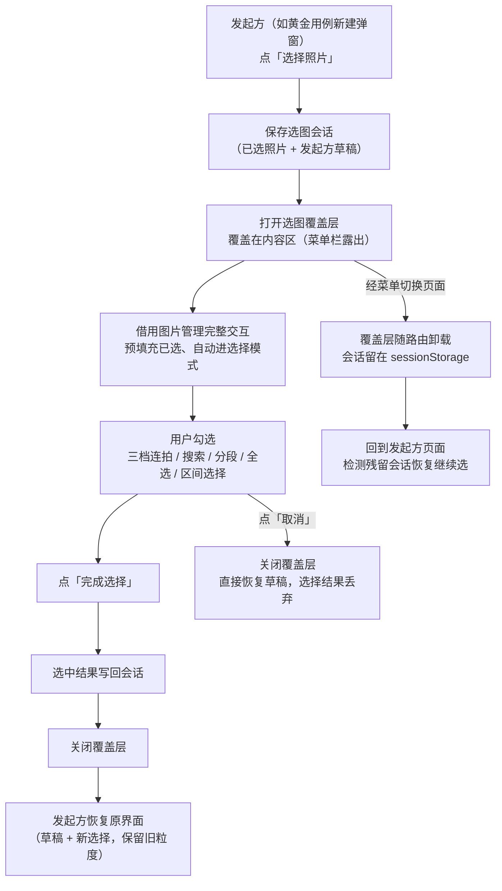

# 跨页面选图流程（选图覆盖层）设计

> 中枢文档：[2026-08-26-3-photo-selection-controls-hub.md](2026-08-26-3-photo-selection-controls-hub.md) — 本专题全部关联产物的汇总入口
> 本控件已升格为全应用标准「控件1 PhotoPicker」

## 1. 需求背景

黄金用例新建弹窗选期望照片时，用的是内嵌的简化选图列表：全量拉取 + 文件名搜索 + 平铺网格多选。
它缺少图片管理已有的三档连拍折叠、时间分段、全选、区间选择等能力。若继续在弹窗里堆功能，
就是第三套重复的图片列表（图片管理、图文工坊之后）。

需求：不再使用内嵌简化列表，选图时借用图片管理的完整交互，选完再回到原工作流，原页面已填数据不丢。

用户决策（2026-08-26）：

- 状态载体用 sessionStorage（刷新可恢复）
- 复用图片管理大部分内容，但改写顶栏文案、隐藏 VLM/Embed/图文工坊/连拍等管理按钮，增加「完成选择」按钮；选图层覆盖在原页面内容区上，左侧菜单栏露出不遮挡，完成后返回原页面
- 已选照片预填充（进入选图层时自动勾选）

## 2. 核心思路

**不在各处复制图片列表，而是需要选图时覆盖式借用图片管理页面**。用户在熟悉的完整交互里勾选，
完成后自动回到原工作流，且原页面已填的数据不丢。

## 3. 功能行为

- **覆盖层交互**：全屏覆盖内容区，左侧菜单保持可见可点（切走视为暂离，会话保留）；
  顶栏只保留「选择照片」标题、已选计数、三档连拍切换、搜索/筛选、排序、全选/清空/区间选择、
  「完成选择 / 取消」；图片管理的管理类操作（VLM/Embed/上传/删除等）全部隐藏
- **已选预填充**：再次进入时按会话中的已选自动勾选；未加载进窗口的旧已选不丢失，完成时原样带回
- **粒度自动推导**：折叠视图下勾选的连拍组封面按当前展示级别得到组粒度（细/粗），
  普通照片为单张粒度；预选照片保留发起方已设粒度
- **会话持久化**：选图过程刷新页面后会话仍在，回到发起方页面可恢复继续选

## 4. 关键设计决策

- **覆盖层而非路由跳转**：原页面不卸载只被盖住，弹窗草稿天然保留；唯一跨页面状态是
  「选中的照片列表」，走 sessionStorage 防 F5 丢失
- **复用照片列表浏览层而非整个图片管理页**：图片管理页承载 VLM/Embed/上传等大量页面级职责，
  直接复用会把不相关的状态一起搬进选图流程；只借用列表浏览与勾选能力
- **发起方中立**：会话带发起方标识与自定义草稿区，覆盖层只关心「预填什么、选完写回哪」，
  不关心发起方是谁；新发起方（对话页选参考图、工坊追加照片、主题发现选图）可按同一方式接入，
  发起方特有操作（如主题发现「随机选取」）保留在发起方界面

## 5. 验收标准

- [ ] 新建黄金用例 → 点「选择照片」→ 覆盖层打开，左侧菜单露出且可点；菜单切走再回来，选图会话恢复继续
- [ ] 覆盖层内可用三档连拍折叠、搜索、分段浏览、全选、区间选择
- [ ] 已选照片预填充（再次进入自动勾选）
- [ ] 「完成选择」→ 覆盖层关闭 → 新建弹窗恢复，查询文本/分类/备注不丢，已选照片按新勾选更新且旧照片保留原粒度
- [ ] 「取消」→ 覆盖层关闭 → 弹窗恢复，选择结果丢弃
- [ ] 选图过程中 F5 刷新 → 黄金用例页恢复弹窗草稿（可继续选图）
- [ ] 图片管理页自身行为不变（选择模式、图文工坊跳转等）
