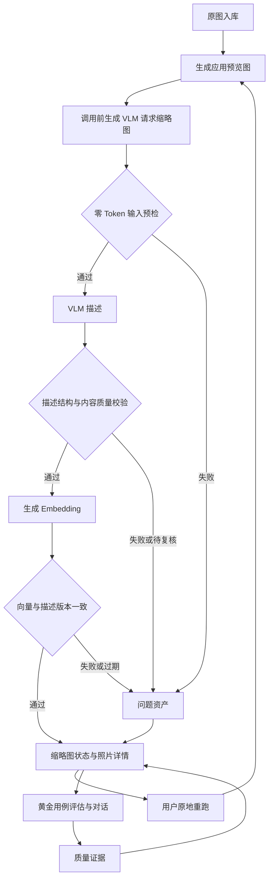

# AI 照片资产质量闭环设计

> 状态：AQL1-1 至 AQL1-7 已实现，待运行时验收。
> 专题中枢：[AI 照片资产质量闭环中枢](2026-08-26-4-ai-asset-quality-loop-hub.md)。
>
> 本文只定义需求、体验和设计决策，不包含接口、表结构、代码改动或实施排期。

## 1. 背景与问题界定

“佛像和人的合照1”是当前黄金用例。其期望照片 `DSC_1813.jpg` 的原图实际为佛像与人物合照，但已保存的 AI 描述把它识别为“多色水平条纹组、底部纯黑色块”。它因此不但没有帮助检索，还作为错误语义进入向量库，拉低黄金用例和对话回复质量。

本轮核查确认这不是单张图片或单次模型幻觉：

- 原始 JPG 可正常读取，内容与黄金用例相符；VLM 实际使用的请求缩略图却是彩条故障画面。
- 应用已有的预览图与 VLM 请求缩略图是两种不同东西：预览图用于网页展示，VLM 请求缩略图只为满足接口尺寸限制而在调用前生成。当前请求缩略图的落盘路径只使用基础文件名，并且会复用已有文件，导致不同目录或同名 JPG/NEF 的请求缩略图互相覆盖或误用。
- 上传流程虽然约定 NEF 不生成预览、不参与 VLM/Embedding，但当前批量 VLM 查询“无描述照片”未排除 NEF，存在把 NEF 误送入 VLM 的路径。
- 当前成功判定只覆盖“调用是否返回文本、是否写库”。业务上明显无效的描述同样被计为成功，随后可嵌入、可检索。
- 当前共有 1,436 张已描述照片，其中至少 121 张命中“故障 / 干扰条纹 / 错乱条纹”描述特征。这是已知最小问题集，不能将其等同于全部问题集。
- 处理失败仅存在于运行时队列计数和日志中，单张异步任务结束后没有可查的失败原因；用户也无法从照片库定位所有异常资产。
- 照片详情的重生成能力在图片管理入口已有组件实现，但在复用详情的部分入口被关闭；用户面对任一异常照片时，不能获得一致的诊断与修复入口。

核心矛盾是：系统把“技术调用完成”当成“照片资产可用于 AI”的完成标准，而产品需要的是可验证、可发现、可修复、可回归的资产质量闭环。

## 2. 设计目标

- 每张照片都能回答：原图是否可用、VLM 描述是否可信、向量是否与当前可信描述一致、最近一次异常是什么。
- 任何一个阶段的失败或质量拒绝都必须对用户可见、可筛选、可追溯，而非只留在瞬时日志。
- 有问题的描述不得进入新向量索引；已发现问题一旦确认，应立即退出检索候选集。
- 用户可从既有缩略图状态发现异常，并从任意照片详情完成“诊断 → 重跑 → 验证”。
- 修复结果必须反映到黄金用例和对话质量；不能只显示队列“完成”。
- 保持单机、Go + Python + SQLite + Chroma 的架构边界；不引入外键约束、外部监控平台或后台常驻同步。

## 3. 非目标

- 不以自动重试掩盖源文件、转换产物或描述质量问题。
- 不尝试判断所有摄影审美优劣，也不将低置信度模型判断伪装成确定错误。
- 不修改黄金用例的人工相关性定义；本专题只保证其关联照片的 AI 资产可信、评估结果可解释。
- 不在本轮定义模型、提示词或检索参数的调优结论。它们应在可信数据恢复后，依据新的评估证据单独决策。

## 4. 用户需求

### 4.1 资产健康状态

系统为每张照片展示统一的 AI 资产健康结论，而不是只展示“有无描述 / 有无向量”。结论包括：

- 健康：原图、描述和向量均对应当前版本，可参与检索。
- 待处理：尚未生成、已被源文件或描述变更作废，或正等待后续阶段。
- 处理中：明确显示当前阶段，避免用户重复提交。
- 失败：技术处理未完成；显示阶段、原因摘要、最近尝试时间和可采取动作。
- 待复核：技术调用成功但质量校验发现异常信号；不参与检索，等待用户查看或重新生成。
- 已排除：用户确认该照片或本次产物不应参与 AI 检索；保留原图与诊断记录。

状态以“当前照片能否安全参与 AI 检索”为准。VLM 与 Embedding 的细分状态及其最近处理记录可展开查看。

### 4.2 既有状态提示与批量发现

照片缩略图复用现有 VLM 与 Embedding 状态位置：调用失败、描述校验异常、向量缺失或过期时显示感叹号和简短原因提示。点击照片仍进入原有详情，不创建额外问题入口。

历史数据审查复用图片管理顶部的批量 VLM 与批量 Embedding 操作：点击后先用本地规则汇总候选数量和最多一行缩略图，再由用户确认开始处理。批量 VLM 处理无描述和描述疑似异常的照片；批量 Embedding 处理描述可信但向量缺失或过期的照片。

### 4.3 单张诊断和修复

所有可打开照片详情的产品入口统一提供 AI 资产区域。它至少呈现：

- 原图、应用预览图、供 VLM 使用的请求缩略图及其一致性结论；
- 完整 AI 描述、模型与生成时间；
- Embedding 的存在性、来源描述版本和生成时间；
- 最近一次成功、失败或质量拒绝的原因；
- 与当前照片状态匹配的操作：重新生成 AI 描述，或仅重新生成 Embedding。

“重新生成 AI 描述”会使旧向量变为过期；描述通过本地校验后系统自动生成 Embedding，用户不需要猜测是否还需单独操作。详情页在完成后刷新最终健康结论。

### 4.4 队列与结果反馈

VLM 和 Embedding 队列的完成反馈必须区分成功、失败、待复核、跳过和取消；不能用“completed”覆盖无效产物。批量操作确认框在调用前展示本次候选汇总，队列结束展示本次成功、失败和仍待复核数量。

队列结束时应提供明确收口：全部健康，或提示仍待复核/失败的照片可从现有缩略图感叹号进入详情重新处理。

### 4.5 检索、对话和黄金用例的保护

- 只有“健康且向量与当前描述一致”的照片可进入默认 RAG、组图集合和对话上下文。
- 照片从健康变为待复核、失败、过期或已排除时，应立即失去检索资格，不等待下一次全库重建。
- 黄金用例评估在运行前显示关联照片的资产健康摘要；若期望照片异常，结果标为“数据不可信”，不能与检索质量回归混为一谈。
- 对话结果需要可追溯到命中的照片和当时的资产版本，便于区分“检索策略不好”与“源描述被污染”。

## 5. 整体设计

### 5.1 预览图与 VLM 请求缩略图的边界

原图是用户的输入资产；同文件夹下的 NEF 是独立文件，但按产品规则不参与预览、VLM 或 Embedding。预览图是应用上传时为网页展示而生成并保存的图片，路径与照片相对路径一致。VLM 请求缩略图则是每次请求前从原图或预览图实时生成的、更小的临时发送材料，两者不能共用“副本”这一名称，也不能用展示缓存代替来源校验。

VLM 请求缩略图可以不落盘；若因性能需要缓存，缓存必须按照片逻辑 ID、源文件版本和转换规格隔离，并在使用前验证。它必须能回指本次 VLM 请求对应的 JPG 原图或预览图，不能读取同名 NEF，也不能读取另一目录的文件。

在把任何字节发送给 VLM API 前，系统执行不调用 LLM 的输入预检：

- 解码并校验待发送缩略图，确认文件可读、格式正确、尺寸和比例处于合理范围；
- 比对请求材料登记的照片 ID、JPG 源版本指纹、转换版本和缩略图内容指纹，确认没有被另一张照片覆盖或被过期缓存替代；
- 对选定 JPG 原图或已有预览图生成本地规范化预览，并与待发送缩略图做本地视觉一致性比对，捕捉“元信息看似正确、实际画面却不是同一张”的错配；
- 任一检查失败即停止在本地，写入“VLM 输入缩略图异常”，不调用 VLM、不消耗 VLM Token，并使下游描述/向量保持不可检索。

这项设计直接消除本次 JPG/NEF 同名冲突和跨目录冲突，也为以后定位“模型看到的究竟是哪张图”提供证据。它不改变预览图的展示职责。

### 5.2 双层质量闸门

质量闸门分为确定性校验与语义异常检测：

- 确定性校验先在 VLM 调用前检查 JPG 请求缩略图的可读性、尺寸/格式合理性、来源身份和本地视觉一致性；只有通过后才检查 VLM 输出非空且满足结构约定，以及向量与描述版本一致。
- 语义异常检测检查高风险模式。首批规则覆盖本次已证实的故障彩条、明确测试图/故障画面及高风险组合；普通纯色、颜色、条纹和色块作为照片元素时不单独判异常。规则命中进入“待复核”，而不是擅自删除照片或把模型调用算作失败。

规则命中应给出具体证据，并允许用户标注误报。用户确认的误报成为后续规则评估样本，但不会暗中改变检索结果。

### 5.3 当前状态与处理履历

每张照片维护一份面向产品的当前 AI 资产状态，以及按阶段追加的处理履历。当前状态服务于列表、详情和检索准入；处理履历服务于错误报告、重启后追踪、审计和定位根因。

履历记录操作来源（上传自动处理、批量修复、单张修复等）、阶段结论、问题分类、可读原因、产物/描述/向量的版本关联和时间。照片与履历只用逻辑 ID 关联，不建立数据库外键。

### 5.4 版本失效规则

AI 资产遵从单向依赖：JPG 原图/预览图 → VLM 请求缩略图 → 描述 → 向量。

- 上游变化、身份不一致或质量拒绝，自动使全部下游资产失效。
- 描述被重新生成后，旧向量不能继续参加检索。
- 修复成功只有在所有必要下游阶段通过后才恢复“健康”。
- 历史向量可以为审计保留必要元信息，但不得与当前检索候选混淆。

### 5.5 检索准入与可解释性

向量集合只容纳当前可检索资产，或在查询层以统一健康条件排除不可检索资产；两者最终必须给出同一结果。组图集合同样继承封面照片的健康状态，避免坏封面污染组检索。

黄金用例评估和对话 Trace 记录命中照片的资产版本与健康结论。这样，`DSC_1813.jpg` 被修复后，可以清晰观察其重新进入候选、排名变化以及回答变化。

## 6. 关键决策与取舍

### 6.1 采用“持久化状态 + 处理履历”，不只扩充队列计数

仅扩充队列的失败数改动小，但页面刷新、服务重启和单张异步操作后仍无法定位历史问题，也无法表达“调用成功但质量不合格”。本设计采用当前状态与履历的组合，代价是需要维护状态一致性，换来真正可查可修的闭环。

### 6.2 采用“自动隔离 + 重跑”，不自动删除异常照片

自动删除风险高，纯人工排查又无法阻止污染扩散。异常资产先退出检索并显示在既有状态图标和详情中，用户可直接重新生成描述；本设计不增加人工放行或排除流程。这符合照片库的资产安全性，也避免新增额外维护入口。

### 6.3 采用“产物可追溯身份”，不继续依赖文件名缓存

本次问题说明文件名不是照片的唯一身份。以 JPG 照片身份和源版本管理 VLM 请求缩略图，能彻底阻断同名冲突；请求缩略图可以采用请求级临时文件，不必成为用户可见的第二套照片资产。

### 6.4 采用“健康状态保护评估”，不把脏数据当检索回归

黄金用例的目标是衡量检索能力。若期望照片本身描述错误，低分没有诊断价值。评估先暴露数据可信度，再报告检索指标，避免把数据修复误判为检索算法优化。

## 7. 历史数据治理需求

发布该闭环时必须进行一次可重复的历史审计，而不是仅保护新上传图片：

- 建立全库资产清单，核对 JPG 原图、应用预览图、VLM 请求缩略图、描述和向量的关联完整性，并确认 NEF 未进入 AI 管道。
- 基于确定性校验和首批高风险语义规则，在批量 VLM 确认前汇总疑似异常候选；命中规则的记录显示待复核状态。
- 对已确认受本次请求缩略图错配影响的照片，从可信 JPG 原图重新完成描述与向量链路，并保留修复前后履历。
- 修复 `DSC_1813.jpg` 及黄金用例关联照片后，重新运行该黄金用例和对话种子问题，记录修复前后证据。
- 审计结束后报告健康、失败、待复核、已排除和未覆盖的数量，不能再用“描述非空率 100%”代表质量完成。

## 8. 验收标准

- `DSC_1813.jpg` 的 VLM 请求缩略图可追溯到正确 JPG 原图；描述明确体现佛像、人物和场景，向量由该描述生成，并恢复为可检索状态。
- 任意同名但不同目录或不同格式的照片都不会复用错误 VLM 请求缩略图；NEF 不会进入 VLM/Embedding；系统能够说明请求材料来源。
- VLM 请求缩略图被覆盖、不可读、源版本不一致或与 JPG 原图本地预览不一致时，系统在 VLM 调用前拒绝处理，记录可见原因，且不产生 VLM API 请求。
- 人为制造调用失败、空响应、无效预览/请求缩略图和高风险描述时，均能在现有状态图标、队列结果和照片详情中看到一致原因。
- 质量异常照片不进入或立即退出默认照片检索、组图检索和对话上下文。
- 用户可从任一照片详情查看 AI 描述和向量状态，并执行与当前状态匹配的重新生成或完整修复操作；各入口行为一致。
- 批量 VLM 确认框能汇总未描述和疑似异常资产并展示一行缩略图；用户可从既有缩略图状态进入详情查看原因并原地重新生成。
- 黄金用例运行会揭示关联照片的资产健康；在 `DSC_1813.jpg` 修复后，能保存该用例和对应对话的前后对比证据。
- 队列完成反馈包含成功、失败、待复核、跳过/取消数量；异常照片保留既有状态图标和详情重试入口。

## 9. 后续边界

本设计完成后，才具备以可信数据继续讨论 VLM 提示词、模型选择、Embedding 模型与检索参数的前提。若黄金用例和对话质量仍不达标，应以修复后的评估记录另开专题，避免把数据管道问题与检索策略问题混合处理。
