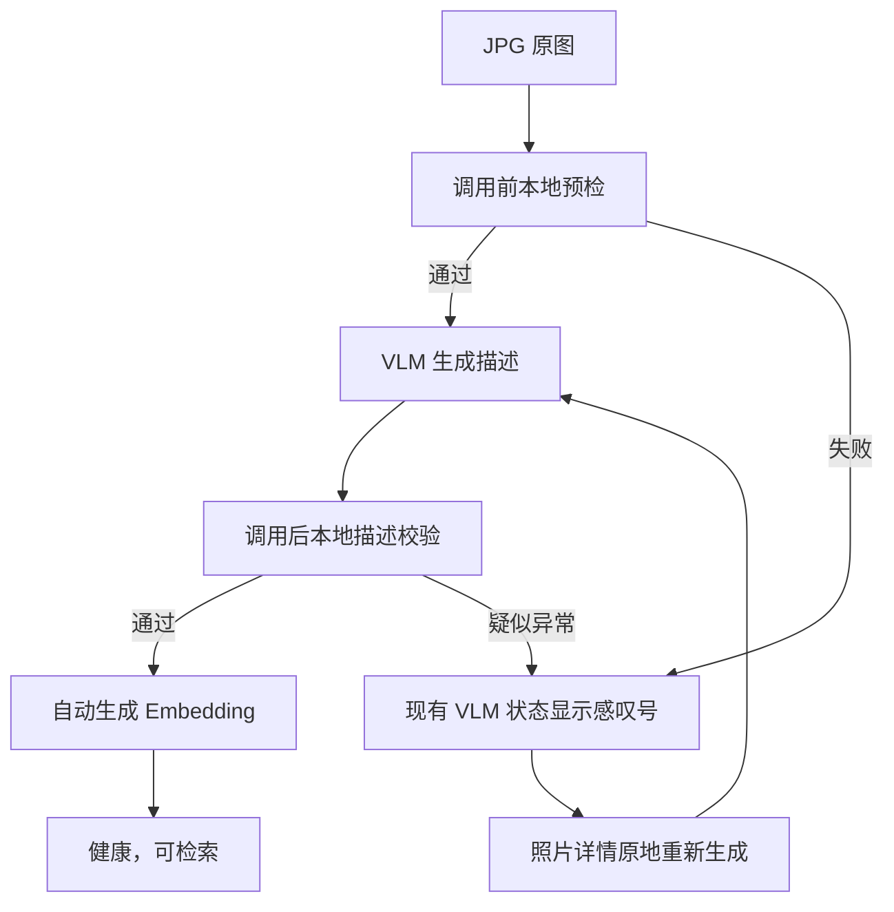

# AI 资产轻量修复交互设计

> 状态：已规划，等待进入生成模式。
> 专题中枢：[AI 照片资产质量闭环中枢](2026-08-26-4-ai-asset-quality-loop-hub.md)。

## 1. 设计目标

本轮只解决一个问题：错误 VLM 描述和由它产生的错误 Embedding，必须能被发现并重新执行既有的 VLM + Embedding 流程修复。

不增加独立的“AI 问题”页面、问题工作区、修复任务中心或额外的人工审批流。用户继续在已经使用的照片缩略图、照片详情和图片管理顶部批量按钮中完成全部操作。

## 2. 数据质量闭环

- 调用前：仅以本地、零 Token 检查确认发给 VLM 的 JPG 请求材料可读、格式正确且对应当前照片；失败时不调用 VLM。
- 调用后：仅以本地规则检查描述是否为空、结构不完整或命中已知的彩条/纯色/测试图等高风险特征；命中时标记异常并隔离旧向量。
- 当前历史数据：批量 VLM 操作打开时，对已有描述运行同一套本地校验，找出“未描述”和“疑似异常”两类候选；审查本身不调用模型、不消耗 Token。

## 3. 用户交互

### 3.1 照片列表：只增强已有状态图标

缩略图已有 VLM 和 Embedding 状态位置，不新增问题入口或弹窗按钮：

- 正常完成继续显示原有成功状态。
- VLM 描述校验失败、VLM 调用失败时，VLM 状态显示感叹号；悬停说明原因。
- 描述可信但 Embedding 缺失、失败或过期时，Embedding 状态显示感叹号；悬停说明原因。
- 点击缩略图照旧打开照片详情，不绕行到新的问题列表。

### 3.2 照片详情：原地修复

照片详情中的 AI 描述与 Embedding 区直接给出原因和下一步：

- VLM 有异常：显示异常原因，主按钮为“重新生成 AI 描述”。点击后从正确 JPG 重跑 VLM；新描述通过本地校验后，系统自动执行 Embedding。用户无需再点击第二个按钮。
- 只有 Embedding 有异常：显示原因，主按钮为“重新生成 Embedding”；不重复调用 VLM。
- 处理中：在同一按钮显示当前阶段，防止重复点击。
- 完成：详情自动刷新，明确显示“健康，可参与检索”；失败或再次命中描述校验时显示新原因和同一重试按钮。

图文工坊等复用详情的入口与图片管理保持完全相同的修复行为。

### 3.3 顶部批量 VLM：发现并修复描述问题

用户点击现有“批量 VLM”按钮后，先出现一个二次确认弹窗，而不是立即开始调用。弹窗展示：

- 没有 AI 描述的照片数量；
- 描述疑似异常的照片数量；
- 每一类最多一行缩略图；超过一行时展示“还有 N 张文件”；
- 明确说明：确认后仅对这些照片重新执行 VLM，描述通过后自动重建 Embedding，原始照片不变。

确认后继续使用现有 VLM 队列进度和停止按钮。完成提示分别说明描述成功、描述仍异常、调用失败的数量；描述成功的照片由系统自动进入已有 Embedding 队列。

### 3.4 顶部批量 Embedding：只修复向量问题

用户点击现有“批量 Embedding”按钮后，同样先确认：

- 统计描述可信但没有 Embedding 或 Embedding 已过期的照片数量；
- 展示最多一行缩略图和其余数量；
- 明确说明：本次不会调用 VLM，只重建这些描述对应的向量。

确认后复用现有 Embedding 队列进度和停止按钮。完成提示显示向量成功和失败数量。

## 4. 边界与取舍

- 不实现人工“确认描述可用”放行。描述疑似异常的正常处理就是重新调用 VLM；重复异常继续保留感叹号和重试入口。
- 不实现独立问题列表、批量选中、持久化修复任务、停止后续跑或治理报告。现有批量队列已经承担批量进度与停止，新增功能只负责候选发现、确认和自动串接。
- 不改写或删除 JPG 原图；描述重建时先隔离旧向量，只有新描述通过后才写入新向量。
- 仍保留已有健康状态与履历作为系统内部记录，但不把它们扩展成额外的用户管理功能。

## 5. 可见验收标准

- 有问题的照片在既有缩略图 VLM 或 Embedding 状态处显示感叹号，详情显示可读原因。
- 用户在照片详情点击一次“重新生成 AI 描述”后，描述通过时自动完成 Embedding，最终显示“健康，可参与检索”。
- 用户点击顶部“批量 VLM”时，先看到未描述和疑似异常数量及各一行缩略图；确认后只处理这两类照片并自动接续 Embedding。
- 用户点击顶部“批量 Embedding”时，先看到只需向量修复的数量及一行缩略图；确认后不调用 VLM。
- 所有审查和错误判断都由本地算法完成；VLM 只对确认要处理的候选消耗 Token，原始 JPG 不变。
