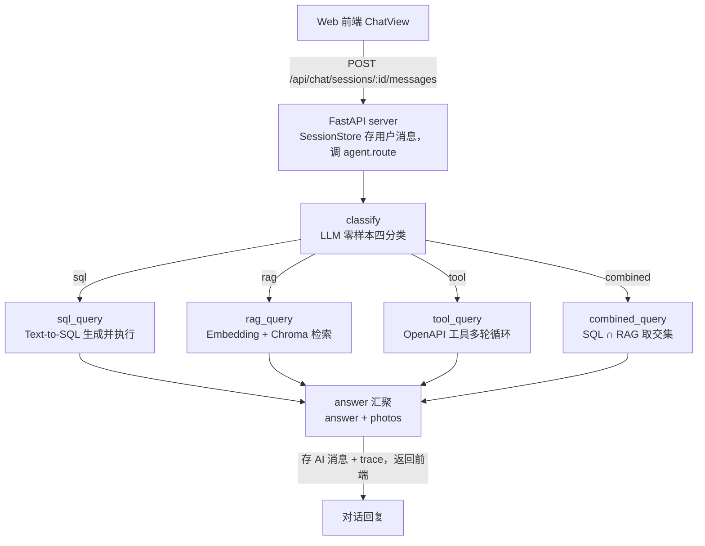
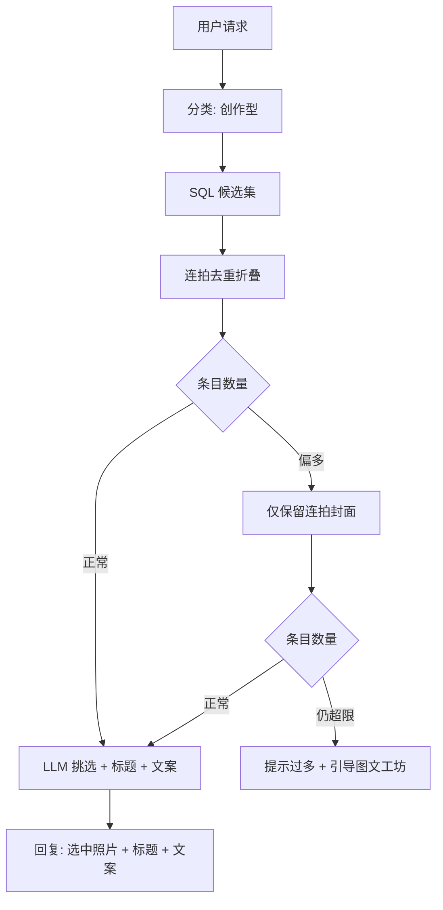

# 创作型查询（Compose Query）设计

> 状态：已实现，待用户验收。
> 关联：backlog CQ4；前置修复 CQ3（属性值获取崩溃）。

## 背景

### 系统分层与 Agent 编排载体

系统由三个服务组成（详见 `docs/tech.md`）：

- **Web 前端**（Vue 3 + NaiveUI，:10006）：照片管理、AI 对话、聚类、图文工坊等页面，不承担 AI 推理
- **Go 后端**（:10004）：照片元数据 CRUD、文件服务、VLM 描述生成、Embedding 代理、SQL 执行、OpenAPI 自描述；不承担 Agent 编排
- **Python Agent**（FastAPI，:10005）：LangGraph 编排、Chroma 向量检索、Text-to-SQL、工具调用、会话管理；不直接访问数据库，所有数据操作走 Go API

Python Agent 单进程内（`agent/chain/server.py` 的 `create_app`）挂载了对话所需的全部组件：

- `PhotoAgent`：LangGraph 查询路由图（编译后的图单例）
- `SessionStore`：会话与消息持久化（SQLite）
- `ChromaPhotoStore`：向量库句柄，含 photos、photos_burst_fine、photos_burst_coarse 三个集合
- `EmbedQueue`：批量嵌入异步队列，服务启动时后台同步一次连拍组封面集合
- 非对话能力同进程暴露：黄金用例评估、聚类分析、选题建议、图文工坊

### 对话 Agent 链路（LangGraph 查询路由）

代码入口 `agent/chain/photo_agent.py`。核心是一张 LangGraph StateGraph：共享状态 `RouterState`，`classify` 节点用 LLM 零样本四分类（temperature=0，提示词内置类别定义与示例），条件边按 `query_type` 分发到四个查询节点之一，最终 `answer` 节点汇聚为 `answer + photos`：

四个查询节点的内部结构：

- **sql_query**（`text_to_sql.answer_with_sql`）：拉取 photos 表 Schema 与数据库实际属性值拼入 System Prompt，加 few-shot 示例，LLM 生成 SQL（temperature=0），仅 SELECT 安全校验后交 Go `/api/v1/query/sql` 执行，结果集格式化为自然语言回答
- **rag_query**（`photo_rag.answer_question`）：问题 Embedding → Chroma Top-K 向量检索 → 按 photo_id 聚合去重 → 距离阈值与比值断层过滤 → 拼接照片描述上下文 → LLM 生成回答（Markdown 图片语法引用照片）
- **tool_query**（`_tool_node`）：`OpenAPIClient` 首次进入节点时从 Go `/v1/openapi.json` 解析出全部接口作为 Function Calling 工具集（按 base_url 缓存），`llm.bind_tools()` 进入多轮循环：模型每轮返回 tool_calls 就全部执行（单条结果截断 4000 字符）后继续，返回纯文本即结束；达到 `tool_max_rounds`（默认 20）仍不收敛时，追加一次无工具调用强制总结
- **combined_query**（`_combined_node`）：`generate_filter_sql` 生成结构化过滤 SQL 得 sql_ids，RAG 检索取 rag_ids（Top-20），两者取交集并保持 RAG 相似度排序，取前 5 张照片详情交 LLM 生成回答；SQL 为空、SQL 超过 50 条、交集为空或整体异常这四种情况均降级为纯 RAG

链路的结构性事实：

- **单问独立路由**：`agent.route(question, granularity)` 每条消息独立走一遍完整图，不携带会话历史；多轮上下文只存在于会话存储与前端展示层，不进入任何节点的 Prompt
- **检索粒度**：granularity 参数（photo/fine/coarse）由前端随消息传入并记录在会话上，fine/coarse 检索连拍组封面集合（一组一条），影响 rag_query 与 combined_query
- **LLM 工程保障**：所有 LLM 实例经 `llm_factory.create_llm` 创建，带 with_retry 重试与可选 fallback_model 降级；TokenCallback 记录用量与成本；`Tracer` 输出结构化 trace（`data/agent/execution-traces/*.jsonl`），chat 链路在消息级 emit `chat.query` 与 `chat.answer`
- **回答协议**：`answer` 节点产出的 photos 列表（photo_id、filename、image_url，可选 burst_group_id/burst_count）由 server 序列化存入消息并随响应返回，前端据此渲染照片卡片

### 外围管线（对话路由之外）

Agent 进程内除对话路由外还有四条独立管线，均以 Go API + Chroma 为数据底座：

- **入库向量化**：上传照片（EXIF 解析写 SQLite）→ VLM 生成描述并解析出 6 个结构化属性 → EmbedQueue 拉取描述、分块、经 Go Embedding 代理向量化、写入 Chroma 三个集合；连拍组封面集合在批量嵌入、前端重建连拍组、服务启动对齐时刷新
- **聚类分析**（`chain/cluster.py`）：Chroma 向量 → UMAP 降维 + HDBSCAN 聚类 → 结果 JSON 落盘 → LLM 逐簇生成与评估主题标题
- **选题建议**（`chain/suggest.py`）：三阶段编辑视角提案，随机采样 → LLM 主题直觉 → RAG 加多样性约束扩展选片 → LLM 沉淀完整提案（标题、角度、照片序列、理由）；结果版本化存储，支持从指定步骤重跑（SSE 推进度）
- **图文工坊**（`chain/post_studio.py`）：用户自选照片 + 风格 + 要求，四层提示词（系统、风格、照片上下文、用户要求）交 LLM 生成或润色标题与正文；前端独立页面 `#/post-studio`，支持携带照片 ID 深链进入

### 创作型请求为何落不进现有路由

用户发送「找山西旅游第一天的照片并生成发布文案」这类请求时，现有四条路由都不匹配：

- 分类器不稳定：同一问题有时进 `tool`（自由 Function Calling，21:23 复测 6 轮未收敛），有时进 `combined`（23:55 复测）。
- `combined` 的语义是「结构化维度 ∩ 语义内容」，会强行叠加 RAG 交集；这类请求里 SQL 条件（时间线 + 日期）就是权威目标集，不需要语义检索参与。
- `tool` 循环虽然多轮可用，但流程不确定：模型可能绕路、幻觉参数名，连拍去重、数量控制这类确定性步骤靠提示词无法保证。

用户期望的处理方式：SQL 查出候选照片 → 连拍去重 → 照片与信息交给 LLM 挑选发布照片并生成标题文案；候选过多时逐级收缩，最终兜底是引导用户进入图文工坊自行选图。

## 设计目标

- 新增一条专用路由，确定性地完成「按条件选照片 + 连拍去重 + LLM 挑选与文案创作」。
- 候选数量可控：任何情况下进入 LLM 的条目数有上限，超限时不硬答，体面引导到图文工坊。
- 复用既有资产：照片库已有的连拍分组字段、图文工坊已有的带照片深链入口，都不新造。

## 用户交互流程

### 正常路径

1. 用户在对话中提出「找某条件的照片 + 写发布文案」类请求。
2. 系统 SQL 查询候选照片，连拍组折叠为代表条目。
3. 对话回复：LLM 挑选出的发布照片（照片卡片展示，连拍组以组卡片呈现）、标题、文案。

### 候选过多路径

1. 去重折叠后条目仍然过多时，先收缩为仅保留连拍封面（不带组内成员信息）。
2. 收缩后仍超上限：回复「照片太多无法一次处理」，并提供进入图文工坊的入口，候选照片作为预选带入，用户在图文工坊中增删后自行生成。

## 概念级数据关系

- 候选集：以照片为单位的 SQL 查询结果（时间线、日期等结构化条件）。
- 去重折叠：同一连拍组的多张照片折叠为一个条目，以封面为代表，保留组规模信息。
- 图文工坊深链：候选照片以 token 形式（单张为照片 ID，连拍组为组标记）带入工坊。

## 关键设计决策

1. **新增专用路由而非复用 combined / tool**。创作型请求的目标集由 SQL 条件唯一确定，RAG 交集会引入无关语义过滤；自由工具循环无法保证去重和数量控制这两个确定性步骤。分类器增加一个类别的成本低，且与现有四类的判据正交（其他四类回答「照片库有什么」，这一类是「帮我做发布内容」）。
2. **逐级收缩而不是直接截断**。直接取前 N 张会按数据库顺序丢弃照片；先折叠连拍（去掉近似重复），再收缩为封面，尽量保留信息多样性。两级阈值都可配置，后续按实际效果调整。
3. **超限兜底引导图文工坊而不是硬答**。LLM 在超大候选下挑选质量不可控，图文工坊已有成熟的选图与创作流程，把决策权交还用户更稳妥。图文工坊入口已支持携带照片深链，前端改动很小。
4. **第一天这类相对日期由 SQL 推导**。照片表含时间线与拍摄日期，「旅行第一天」可用「该时间线下最早的拍摄日期」这类子查询表达，不依赖时间线事件接口的二次编排。

## 验收标准

- 山西原始请求路由到创作型节点，回复包含第一天照片、标题和文案，照片以卡片展示。
- 连拍组在候选中折叠，回复中不出现同组近似重复照片。
- 构造超大候选场景，验证收缩与兜底引导两个分支（单元测试覆盖）。
- 全程 `[compose]` 阶段日志可追踪每个阶段的条目数变化。
