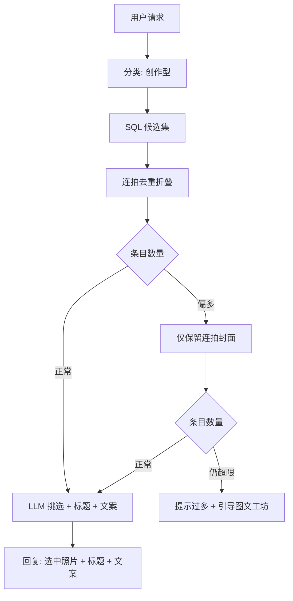

# 创作型查询（Compose Query）设计

> 状态：方案已定，待生成。
> 关联：backlog CQ4；前置修复 CQ3（属性值获取崩溃）。

## 背景

用户发送「找山西旅游第一天的照片并生成发布文案」这类请求时，现有四条路由都不匹配：

- 分类器不稳定：同一问题有时进 `tool`（自由 Function Calling，21:23 复测 6 轮未收敛），有时进 `combined`（23:55 复测）。
- `combined` 的语义是「结构化维度 ∩ 语义内容」，会强行叠加 RAG 交集；这类请求里 SQL 条件（时间线 + 日期）就是权威目标集，不需要语义检索参与。
- `tool` 循环虽然多轮可用，但流程不确定：模型可能绕路、幻觉参数名，连拍去重、数量控制这类确定性步骤靠提示词无法保证。

用户期望的处理方式：SQL 查出候选照片 → 连拍去重 → 照片与信息交给 LLM 挑选发布照片并生成标题文案；候选过多时逐级收缩，最终兜底是引导用户进入图文工坊自行选图。

## 设计目标

- 新增一条专用路由，确定性地完成「按条件选照片 + 连拍去重 + LLM 挑选与文案创作」。
- 候选数量可控：任何情况下进入 LLM 的条目数有上限，超限时不硬答，体面引导到图文工坊。
- 复用既有资产：照片库已有的连拍分组字段、图文工坊已有的带照片深链入口，都不新造。

## 用户交互流程

### 正常路径

1. 用户在对话中提出「找某条件的照片 + 写发布文案」类请求。
2. 系统 SQL 查询候选照片，连拍组折叠为代表条目。
3. 对话回复：LLM 挑选出的发布照片（照片卡片展示，连拍组以组卡片呈现）、标题、文案。

### 候选过多路径

1. 去重折叠后条目仍然过多时，先收缩为仅保留连拍封面（不带组内成员信息）。
2. 收缩后仍超上限：回复「照片太多无法一次处理」，并提供进入图文工坊的入口，候选照片作为预选带入，用户在图文工坊中增删后自行生成。

## 概念级数据关系

- 候选集：以照片为单位的 SQL 查询结果（时间线、日期等结构化条件）。
- 去重折叠：同一连拍组的多张照片折叠为一个条目，以封面为代表，保留组规模信息。
- 图文工坊深链：候选照片以 token 形式（单张为照片 ID，连拍组为组标记）带入工坊。

## 关键设计决策

1. **新增专用路由而非复用 combined / tool**。创作型请求的目标集由 SQL 条件唯一确定，RAG 交集会引入无关语义过滤；自由工具循环无法保证去重和数量控制这两个确定性步骤。分类器增加一个类别的成本低，且与现有四类的判据正交（其他四类回答「照片库有什么」，这一类是「帮我做发布内容」）。
2. **逐级收缩而不是直接截断**。直接取前 N 张会按数据库顺序丢弃照片；先折叠连拍（去掉近似重复），再收缩为封面，尽量保留信息多样性。两级阈值都可配置，后续按实际效果调整。
3. **超限兜底引导图文工坊而不是硬答**。LLM 在超大候选下挑选质量不可控，图文工坊已有成熟的选图与创作流程，把决策权交还用户更稳妥。图文工坊入口已支持携带照片深链，前端改动很小。
4. **第一天这类相对日期由 SQL 推导**。照片表含时间线与拍摄日期，「旅行第一天」可用「该时间线下最早的拍摄日期」这类子查询表达，不依赖时间线事件接口的二次编排。

## 验收标准

- 山西原始请求路由到创作型节点，回复包含第一天照片、标题和文案，照片以卡片展示。
- 连拍组在候选中折叠，回复中不出现同组近似重复照片。
- 构造超大候选场景，验证收缩与兜底引导两个分支（单元测试覆盖）。
- 全程 `[compose]` 阶段日志可追踪每个阶段的条目数变化。
