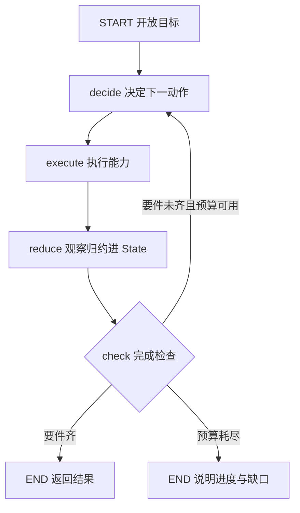

# Agent Runtime V1 — 状态化多步执行设计

> 需求条目：AR（见 backlog）。本文档只记录功能与架构决策，实施步骤与子任务拆分以 backlog 条目为准。

## 1. 需求背景

当前 Agent 是单发路由形态：入口一次性分类，请求进入单条管线（SQL / RAG / Tool / Combined / Compose）后直接产出回答，没有执行中的再决策。「找山西旅游第一天的照片并生成发布文案」这类开放目标的执行路径取决于每一步返回的事实（哪次旅行、第一天多少张、连拍规模、候选是否足以叙事），无法预先写死。CQ4 为此硬编码了一条专用管线，但每出现新的组合需求（对比两年春天、雨天专题）就要再加一条管线，重复的是组合逻辑，而不是底层能力。

V1 引入 Agent Runtime：一个目标可以跨越多次能力调用持续执行，每次动作的结果归约进任务状态，下一次决策基于更新后的事实进行，直到完成要件满足或预算耗尽。

## 2. 设计目标

- 开放目标（选片 + 创作类）由 Runtime 多步执行完成，不再为组合需求新增专用管线
- 单步查询不因 Runtime 引入而退化：入口直达原管线，延迟与检索质量不回退
- TaskState 是任务的事实源（区别于聊天记录），可被稳定读取、更新和检查
- 完成判定由程序确定性执行，不信任「模型说完成了」
- 预算（步数/时长/成本）作为停止条件兜底，防止失控
- 每步决策与执行可追踪，支撑任务成功率、平均步数、能力调用数等指标
- 核心语义（状态/更新/完成/预算/能力）与编排框架解耦，外壳可替换

## 3. 用户交互流程

1. 用户在对话界面输入开放目标请求（如「找山西旅游第一天的照片并生成发布文案」）
2. 入口分类判定为开放目标，进入 Runtime 执行。前端无新交互，等待体验与现状一致
3. Runtime 多步执行：解析旅行 → 定位日期 → 检索候选 → 折叠收缩 → 挑选 → 创作，每步结果归约进任务状态
4. 候选超限时，返回携带候选照片的图文工坊深链，引导用户自选（延续 Compose 管线的兜底体验）
5. 完成要件满足后返回入选照片引用 + 标题文案，回复标注查询类型 Runtime
6. 预算耗尽时明确说明已完成到哪一步、缺什么，不静默截断
7. 单步查询（统计/语义/工具/组合）照旧直达原管线，行为与现状一致

## 4. 概念级数据关系

### 4.1 Runtime 循环

模型只负责 decide（在语义不确定性中选择下一动作和参数）；执行工具、维护 State、计算预算、执行完成检查都是程序责任。

### 4.2 TaskState 的组成

- **goal**：目标类型 + 完成要件（如「社交帖子创作」= 入选照片 + 有照片依据的文案 + 完整输出结构）
- **constraints**：用户原始约束（地点、天数、张数、风格），与推断事实分开存放，避免把推断当成用户输入
- **resolved_facts**：执行中推断出的事实（旅行标识、日期范围）
- **artifacts**：产物引用（候选照片 ID 集合、入选照片 ID 集合、文案草稿），大对象只存引用按需读取
- **progress**：已完成/待办步骤、当前步数

每个字段有明确的生产者和消费者；没人读取的字段不加。状态更新通过显式归约完成，不允许任意节点整体覆盖。

### 4.3 能力层（V1 初始能力）

- 检索类：SQL 结构化检索、RAG 语义检索、混合检索（现有实现直接封装）
- 工具类：Go 后端 OpenAPI 工具（时间线解析、照片详情等）
- 创作类（临时能力）：照片挑选（吸收连拍折叠、两级收缩、超限深链逻辑）、文案创作（复用图文工坊提示词经验）

工具描述要让 Runtime 能回答「何时使用」，参数要让程序能校验「如何使用」。能力边界的正式划分（Tool/Skill/Workflow）留给 V3。

## 5. 关键设计决策

1. **LangGraph 只做编排外壳**：循环图（决策/执行/归约/检查 + 条件回环）用 LangGraph 表达，获得节点执行、条件路由与 checkpoint 就绪能力；TaskState 结构、状态归约、完成检查、预算、能力注册表全部是与框架无关的纯 Python。业务语义不绑定编排框架，可脱离框架直接单测，后续更换编排器不需要重写业务
2. **不把所有业务图化**：仅开放目标进 Runtime 循环图，四类单步查询保持现有单发管线直接调用。编排形式服务于执行结构，不为形式统一增加复杂度
3. **State 与聊天记录分离**：聊天消息是输入材料，TaskState 是 Runtime 稳定读写的任务模型；多轮对话上下文感知（指代消解、条件追加）不在 V1 范围
4. **完成与停止分离**：Completion 判目标要件是否齐备，全部由程序确定性检查；Stop 判预算（步数/时长/成本）。语义质量（如文案是否有叙事感）不作为硬性要件，避免 V1 过早引入语义 Judge
5. **优雅恢复不在 V1 范围**：工具超时、空结果、歧义与死循环的系统化处理留给 V2；V1 仅用预算停止兜底
6. **CQ4 专用管线被取代**：连拍折叠、两级收缩、超限深链逻辑迁移为 Runtime 的挑选临时能力，其兜底体验作为 Runtime 的一种正常结束形态保留

## 6. 验收标准

- 单步照片查询经入口直达原管线，黄金用例 P@10 / R@10 / MRR 无回退
- SQL → RAG 两步任务能基于第一次结果继续选择
- 山西第一天帖子不在「找到照片」时提前结束
- 返回大量候选时，State 保存引用并继续压缩，不把全量结果塞进消息
- 缺少完成要件时，完成检查返回未完成并继续执行
- 预算耗尽时明确停止并说明进度
- 循环机制（归约规则/完成检查/预算停止）有确定性单测，不依赖真实 LLM
- （用户）真实环境发山西请求，回复含第一天照片、标题和文案，无同连拍组重复照片
