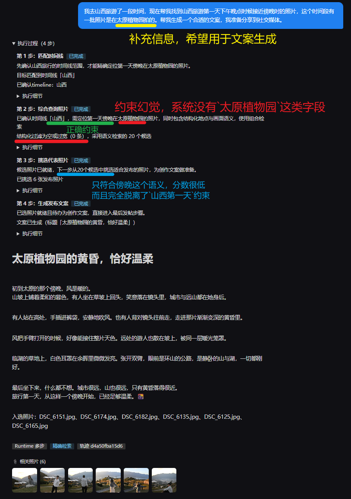

# Runtime 检索约束幻觉问题全记录

> 中枢文档：[Agent Runtime 专题中枢](2026-08-31-2-agent-runtime-hub.md)。
>
> 对应任务：[AR9](../backlog.md)。本文是这一问题的完整档案：问题本身、术语定性、讨论与决策、方案方向、实施与效果都在此记录，随 AR9 各轮次持续更新（生成轮补第 6 节，验收轮补第 7 节）。任务拆分与实施步骤以 backlog 为准，本文不重复。

## 1. 问题

### 1.1 现象

山西发帖请求（"找山西旅游第一天的照片并生成发布文案"）的真实执行中，时间线已在第 1 步解析为"山西"，但第 2 步 SQL 将"太原植物园、黄昏、植物"等仅用于叙事补充的信息混入筛选条件，得到 `rows=0`。第 3 步又在结构化过滤为空时回退到全库 RAG，候选不再受"山西旅游第一天傍晚"限制；最终仍选图并生成了带有"太原植物园"的确定性文案，Runtime 将这条错误路径判定为完成。

严重程度 P0：返回照片和文案均可能与用户明确要求不符，且没有任何环节阻止交付。

### 1.2 证据

2026-08-31 真实执行的日志轨迹：

- 第 1 步 `resolve_trip` 匹配时间线"山西"成功。
- 第 2 步 `sql_search` 的 query 为"时间线：山西；旅游第一天；时间接近傍晚；地点：太原植物园"，生成的 SQL 同时要求 `timeline='山西'`、最早日期、17–19 点或 lighting 含"黄昏"、scene 含"植物园/温室"或 objects 含"植物"或 description 含"太原植物园"，`rows=0`。
- 第 3 步 `hybrid_search` 生成同类过窄 SQL，返回 0 后触发"结构化过滤为空，回退语义结果"，全库 RAG 的 20 个候选直接成为任务候选。
- 第 4 步 `select_photos` 从无范围候选中挑出 6 张；第 5 步 `write_post` 生成标题"山西第一天，把黄昏留在太原植物园"。
- 完成检查只验证"有入选照片和文案"，全程无范围校验。

### 1.3 定性与术语

这是幻觉问题，但更精确的名称是**约束幻觉**，或说是一次事实落地（grounding）失败。

幻觉不只指"凭空编造一段不存在的话"。当模型把用户提供的补充背景误认为数据库中可验证的事实、把它升级为必须满足的筛选条件，或在没有证据时将它写成确定结论，同样属于幻觉。本次问题包含两层：

- **检索阶段**：模型假定"太原植物园、黄昏、植物"等提示应出现在 metadata 中，并将其并入 SQL 的硬过滤；这一假定没有数据库事实支撑。
- **生成阶段**：候选已脱离"山西第一天傍晚"的范围后，文案仍断言"太原植物园""黄昏"等具体事实；这些断言没有由入选照片或已确认范围支撑。

因此，SQL 本身不是语法幻觉：它是合法、看似合理的 SELECT。错误在于查询的**语义**无依据，随后错误回退和缺失的交付校验放大了影响。

### 1.4 根因链

1. decide 决策把软叙事提示写进检索 query（注入点）。
2. 过滤 SQL 生成把 query 中的全部内容变成 WHERE 硬条件（软提示被伪装为数据库事实，候选错误清零）。
3. hybrid 的通用"空结果回退纯 RAG"策略用无范围集合替代权威候选（丢弃已确认硬约束）。
4. 完成检查只验证产物存在、不验证范围归属（无环节阻止错误交付）。

## 2. 修复后的正确语义

Runtime 在检索前将用户输入拆分为两类：

- **硬约束**：可由库中事实验证且用户要求必须满足的条件。本例为已解析的"山西"时间线、该时间线最早一天和用户表达的傍晚时间段。它们共同构成唯一的权威候选范围。
- **软提示**：用于理解意图、范围内排序、照片说明和文案的补充信息。本例的太原植物园、植物、黄昏氛围均属此类；除非用户明确指定为必须条件，且系统有对应的可验证字段，否则不得令候选范围归零。

RAG 只能在权威候选范围内排序，不能在 SQL 为空、交集为空或自身失败时替换该范围。若硬范围为空，Runtime 必须明确说明没有符合条件的照片，不能调用全库 RAG 选图，也不能生成声称特定地点、时段或场景的文案。

完成检查要验证入选照片属于权威范围，并验证文案中的确定性事实有照片或已确认范围的依据。这样即使模型某一步的意图判断失误，最终交付仍会被程序拦截。

语义检索的距离/置信度可作为补充证据：Runtime 应在 Trace 中保留候选距离和"低置信"判断，让 Guardrail 能选择补充检索、询问或停止。但它不能用于放行范围外照片，也不能仅凭一个通用阈值断定照片是否适合当前任务；阈值必须由有标注的用例校准。

## 3. 框架升级定位

本问题必须在 V2 可靠 Runtime 阶段解决，不能等待 V3–V5：

- **V2 直接解决根因**：Structured Observation 要区分 `empty`、`low_confidence`、工具故障和成功；Guardrail 对可验证事实做确定性校验，包括"入选照片来自候选范围"。这正是本次缺失的语义。空结果后的 fallback 必须保持原子目标和硬范围；本例中它最多用于解析旅行等尚未确认的事实，不能用全库 RAG 替换已确认的首日/时段范围。
- **V3 只能封装，不能补救**：`resolve_photo_scope`、`select_representative_photos` 和 `compose_social_post` 这些 Skill 能将范围、来源合法性和文案依据固化为契约，但它们的输入 Observation 与 Guardrail 必须先可信。否则只是把同一错误藏进更高级的能力名。
- **V4 只能减少遗忘，不能证明正确**：Planning 与 Context Builder 能让长任务持续携带硬约束、在关键假设失效时 Replan，但不负责验证数据库返回的候选或范围外的入选照片。V2 的范围校验仍是前提。
- **V5 只能做后续质量优化**：Evaluator–Optimizer 可评估图文 Grounding、Adaptive Router 可选择更适合的执行结构，但它们是成本更高、带概率性的后置质量层，不能替代确定性的范围保护。

因此 AR9 的定位是 V2 的基础可靠性工作：先建立可追溯的范围、Observation 状态和确定性 Guardrail；之后才有资格把范围解析、选片和文案沉淀为 V3 Skill，并在真实多轮复杂度出现时再引入 V4/V5。

## 4. 讨论与决策记录

### 2026-09-01 规划讨论

代码事实确认：

- Runtime 的 `hybrid_search` 与聊天 combined 路由（`cli/photo_agent.py` 的 `_combined_node`）是两套独立实现，修改 Runtime 不影响聊天管线。
- 失败链条与日志证据逐条对上（见 1.2），根因不是单条 SQL 语法错误，是约束分层缺失。

决策点 1：硬约束抽取与权威范围物化放在哪里执行。

- 方案 A（循环内能力）：resolve_trip 扩展为约束解析能力，decide 第 1 步选中它，抽取、校验、范围 SQL 物化都在能力内完成。符合既有"能力+里程碑+归约"架构，locate 里程碑语义自然延伸为"确认范围"，时间线匹配失败沿用确定性终态。
- 方案 B（入口预处理）：进循环前由入口完成约束解析与范围物化，TaskState 初始即带范围。循环内无"范围未建立"中间态，但业务语义进入编排外壳，破坏"LangGraph 只做编排"的分层，locate 里程碑失去意义。
- **选定：方案 A**。

决策点 2：Runtime 注册表中的 hybrid_search 如何处理。

- 方案 A（保留并收紧）：保留能力，删除"SQL 为空/过宽/交集为空 → 全库 RAG"的替代语义，改为范围内语义排序，不命中时返回范围本身。改动集中在能力内部，测试迁移少，归约层交集使其天然安全。
- 方案 B（移除）：Runtime 删除该能力，范围内排序由 rag_search 承担、软条件收缩由 sql_search 承担。决策空间更小，但无硬约束的目标失去组合检索选项，相关测试需迁移。
- **选定：方案 A**。

## 5. 方案方向

详细技术方案与实施任务以 backlog AR9 条目为唯一执行载体，此处仅记录方向：

- 约束解析能力：一次 LLM 抽取（时间线/天序/时段/软提示）+ 程序校验（时间线确定性匹配、时段查固定映射表转小时窗）+ 程序拼装范围 SQL 物化权威范围，SQL 不经 LLM。
- 归约层统一交集：候选类观察与范围求交集；软提示命中为零时候选保留整个范围，软提示只能排序、不能清空或替换范围。
- 检索能力收紧：sql/rag/hybrid 的 query 只承载软提示；范围为空进入确定性终态并说明条件。
- 完成检查与交付阻断：入选 ⊆ 权威范围作为交付要件；范围外入选阻断文案交付。
- 过程与 Trace：范围条件、来源、数量、软提示用途、阻断原因全程可观测。

## 6. 实施记录

2026-09-01 生成轮完成，改动集中在 `agent/internal/runtime/`（state / capabilities / completion / graph / progress）：

- **约束解析能力**：resolve_trip 扩展完成。一次 LLM 调用抽取时间线、天序（first/last/ISO 日期）、时段词、软提示清单；程序校验沿用时间线确定性名称匹配，时段按固定映射表（清晨 5–8 / 上午 8–11 / 中午 11–13 / 下午 13–17 / 傍晚 17–19 / 夜晚 19–23）转小时窗，非法天序/时段一律按“无该约束”处理不终止。范围 SQL 由程序只按硬约束拼装（含时间线转义），不经 LLM。
- **时区修正（实施中发现）**：真实库 shot_at 混合 UTC(+00:00) 与本地(+08:00) 两种偏移，直接 `strftime('%H')` 取到的是字符串自身时区的小时，时段过滤会跨格式漂移。范围 SQL 的天序与小时窗统一经 `localtime` 修饰符换算本地时区；真实库对照：贵州第一天傍晚按 UTC 小时误判 0 张，修正后 10 张。现有 text_to_sql few-shot 与聊天 SQL 管线仍用裸 `DATE(shot_at)`，属聊天链路的既有约定，未在本任务内改动。
- **权威范围与归约**：TaskState 新增 scope（established/restricted/conditions/condition_summary/photo_ids/sql），OBS_SCOPE 归约物化范围、并入时间线与软提示事实并完成 locate 里程碑（标签改为“确认候选范围”）。候选类观察统一与范围求交集；软提示零命中的时候选回落整个范围；范围晚于检索建立时既有候选同样回到范围内；受限但 0 张进入 empty_scope 确定性终态。
- **检索收紧**：hybrid_search 删除“SQL 为空/过宽/交集为空 → 全库 RAG”的替代语义，交集为空时候选交由权威范围兜底；sql_search / rag_search 的交集约束由归约层统一承担。
- **交付阻断**：select_photos 增加范围归属校验（范围外入选 → selection_out_of_scope 可解释失败）；完成检查 selected_photos 要件在范围受限时要求“入选 ⊆ 权威范围”。
- **提示词与翻译**：decide 规则改写为“硬约束已由范围生效、检索 query 只写软提示”，删除了原“已确认事实（如时间线名称）要写进后续检索条件的 query 里”这一注入点；过程面板 resolve_trip 标题改为“确认候选范围”，观察事实展示范围条件、数量与软提示用途。
- **自动验证**：Agent 全量单测 206/206（新增 18 个确定性测试，覆盖山西循环级约束保护、空范围终态、交集过滤、范围外入选阻断等）；运行中的 Go 后端验证范围 SQL 真实可执行（山西第一天 80 张 / 傍晚 44 张 / 最后一天傍晚 0 张）。

## 7. 效果与验收记录

验收清单（对照检查）：

- 过程与 Trace 记录候选范围来源、范围数量、RAG 是否仅在范围内运行、范围校验结果和阻断原因。
- Trace 保留 RAG 候选距离及其低置信判断的证据，距离阈值通过标注用例校准；该信号只参与恢复或停止决策，不能覆盖硬范围。
- 山西请求的最终照片全部属于山西最早一天的傍晚范围；太原植物园信息只影响范围内的排序与表达。
- 硬范围为空时，返回明确未命中说明，不调用全库 RAG 选图，不生成虚构地点文案。
- RAG 即使返回范围外的高分照片，范围校验也会拒绝它们；仅范围内候选可进入选片。

（待验收轮补充：真实请求结果、过程面板表现、用户验收结论。）

### 验收记录（2026-09-01）

用户重启 Agent 后以真实请求验收确认通过：山西第一天傍晚请求的候选范围、入选照片与文案符合硬约束，最后一天傍晚请求按空范围确定性终止。AR9 关单，遗留事项见中枢文档下一轮建议（聊天 SQL 管线的 `DATE(shot_at)` 时区语义独立问题）。

## 8. 代码级前后对比图（2026-09-01）

为让本方案在代码层面可直观对照，用 archify skill 制作了两张同框架的 workflow 对比图，交付物在 `docs/capture/`：

- [ar9-before.html](../capture/ar9-before.html)
- [ar9-after.html](../capture/ar9-after.html)

两图共用框架：四条泳道（graph.py 编排决策 / capabilities.py 能力 / state.py+completion.py 确定性程序层 / 交付输出），六列阶段，节点即方法名（sublabel 标文件定位），边标签承载真实参数与 Observation 类型。HTML 内置明暗主题、缩放、搜索、聚焦与导览视图（前图：失败主链、注入与清零；后图：守护主链、空范围终态）。可编辑源文件为同目录 `ar9-before.workflow.json` 与 `ar9-after.workflow.json`（schema v2，修改后需重新 validate / deliver）。

交付状态：两图 deliver 均通过全部 9 项 artifact 检查（showcase 档，0 错误 0 警告）；自动浏览器检查 visual-check 在本机无头环境超时（skill 自带官方示例同样超时，属环境问题而非图本身的缺陷），改用 1440×900 截图读图核验，两图的标题、图、图例与结论卡片均完整呈现在首屏。

archify 使用情况：skill 安装于 `/root/.agents/skills/archify/`（`.agents/skills/` 路径，非 Claude Code 原生 skill 目录，直接以 CLI 调用）。本次两张图共消耗智谱 118 套餐的 5 小时额度、约 2000 积分。主要成本在布局收敛的多轮迭代：节点宽度与标签长度受桌面可读性约束（8px 文本投影不得低于 6px）、主链从能力层与归约层之字形改为单行主链加状态层侧链、泳道从 5 条压缩到 4 条并压低节点高度以满足 1440×900 首屏呈现。
