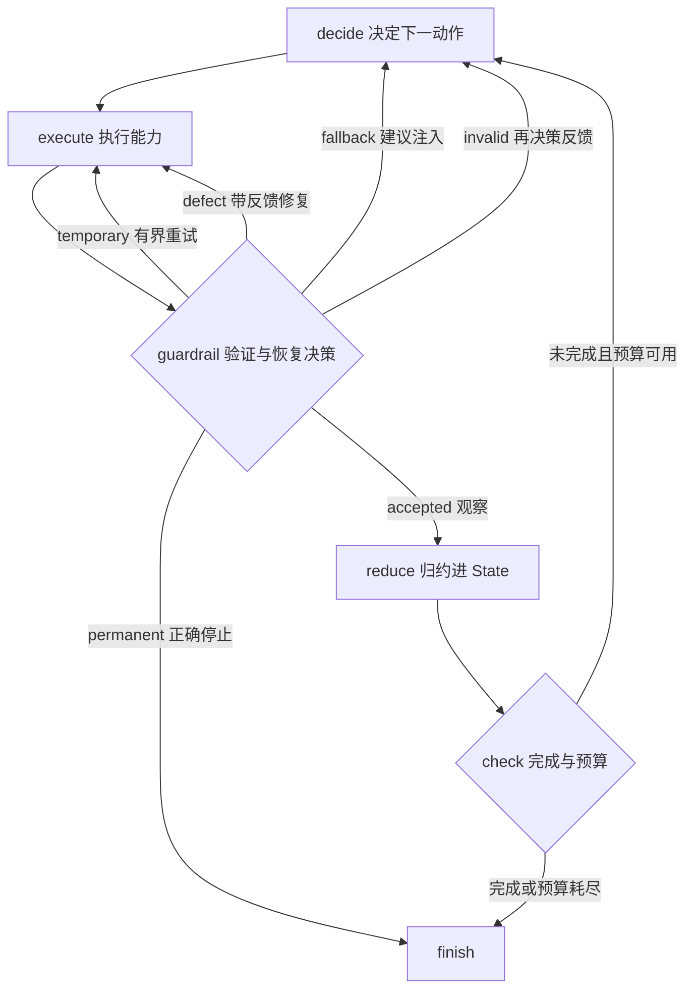

# Agent Runtime V2 — 可靠运行时设计

> 需求条目：AR2-1 至 AR2-7（见 backlog）。本文档只记录功能与架构决策，实施步骤与子任务拆分以 backlog 条目为准。
>
> 专题中枢：[Agent Runtime 专题中枢](2026-08-31-2-agent-runtime-hub.md)。理论框架：[architecture/04 可靠运行时](architecture/04-photo-agent-v2-reliable-runtime.md)。

## 1. 需求背景

V1 交付后，AR7 为止住无进展循环，把能力异常、无效决策、旅行未匹配全部收敛为确定性终态。这在当时是正确权衡，但代价是**一次失败即终局**：任何瞬时故障、可修复的模型输出缺陷、可替换的检索策略，都没有第二次机会。真实 trace 已积累证据：

- `select_photos` 挑选空结果或越界：10 次，是最高频失败。其提示文案写着「请重试或调整候选」，但机制上是终态，重试不可能发生
- `write_post` 因照片无 AI 描述失败：2 次，属永久性前置失败，停止文案可行动，行为方向正确但缺正式分类
- SQL 安全校验误杀 CTE：1 次，模型生成了合法的 `WITH ... SELECT` 只读查询，被「必须以 SELECT 开头」的校验拒绝（根因 bug）
- Go 后端连接失败：1 次，瞬时故障直接终态
- `invalid_decision`：trace 中 0 次，但结构上最脆，decide 的一次 JSON 格式失误即任务死亡

V2 把「失败也是状态」落地：观察带分类，恢复策略由程序执行且有界，语义质量进入检查环，歧义处理遵循 Ask vs Act 判据。用户选择全量 V2 范围（含语义 evaluator 实装与 Ask vs Act 扩展）。

## 2. 设计目标

- 失败可分类：每次观察携带状态，程序据此选择接受、重试、修复、换策略、再决策或正确停止
- 恢复策略程序化：策略由状态触发的明确规则执行，不依赖提示词里写「如果失败请重试」
- 重试有独立预算：单能力重试次数有界，重试不绕过时长与成本预算
- 无进展检测基于状态签名：连续多步状态不变时换策略或停止，即使每步都「成功」
- 语义质量进入检查环：选片代表性与文案事实依据由语义评估把关，不通过时带反馈修复（有界），修复耗尽以质量终态停止，不伪装完成
- 歧义处理有判据：系统能低成本自证的自行消除；猜错影响大且不可逆才询问用户
- 恢复过程用户可见：重试与策略调整作为执行过程步骤展示，正确停止的回复说明原因并给出可行动建议
- 已验证的终态语义不变：空范围、候选超限、日期澄清等 AR 系列成果不回退

## 3. 用户交互流程

1. 正常请求无新交互，入口路由与等待体验与 V1 一致
2. 执行期若发生恢复动作（重试、带反馈重挑、换检索策略），过程面板按步骤展示「重试查询」「调整挑选」类条目，默认收起，SQL 等受控细节二级展开，与 AR8 过程面板机制一致
3. 不可恢复失败：回复说明失败原因与可行动建议（如「所选照片还没有 AI 描述，请先在图片管理中生成描述」），不出现裸异常
4. 时间线多义（如两条同名旅行）：以澄清提问停止，用户短回复后原任务续跑，复用 AR11 的会话内澄清机制
5. 数量类可回退歧义（选 6 张还是 9 张）：采用默认值并在过程中记录假设，不提问，用户事后可要求调整
6. 预算耗尽语义不变：说明已完成里程碑、仍缺要件与停止原因

## 4. 概念级数据关系

### 4.1 循环与 Guardrail

guardrail 是纯程序节点：先确定性验证，再按能力声明决定是否语义评估，最后查状态到策略的映射表。恢复动作的触发条件全部是明确状态，不是提示词约定。

### 4.2 观察双维：kind 与 status

kind 保持归约分派键（观察对 State 意味着什么），新增 status 作为恢复决策输入（系统应如何反应）。六个状态与默认策略：

- `success`：接受，进入归约
- `empty`：区分语义。范围内的检索空结果是合法观察（AR9 已处理，候选兜底回范围）；无兜底路径的空结果给出换策略建议
- `invalid_input`：参数或输出不符合契约。决策侧问题反馈给 decide 重新决策（有界），能力侧问题带反馈修复
- `temporary_error`：瞬时故障（网络、超时、限流）。同能力同参数有界重试
- `permanent_error`：前置条件不满足或能力确定性失败。正确停止，文案可行动；存在等价能力时建议换策略
- `low_confidence`：有结果但证据不足（如挑选可信度低）。触发语义评估或补充检索

异常到状态的归类在能力执行护栏处完成，能力作者对语义性结果显式声明状态。

### 4.3 验证分层

确定性检查先行：输出结构合法、照片存在、范围归属、数量上下界，便宜稳定可复现。语义评估仅在确定性检查通过后、且能力声明需要时触发。V2 实装两个评估：

- **选片代表性**：入选是否覆盖候选的场景与时段，是否存在近重复（连拍折叠之外的）
- **文案事实依据**：文案中的事实性断言是否都有照片证据，不虚构照片中不存在的内容

评估输出「通过 / 不通过 + 具体反馈」，不通过时反馈进入带修复环的重执行；修复环有界，耗尽后以质量未达标终态停止，完成要件判定不受影响（evaluator 是接受前的质量门，不是新的完成要件）。

### 4.4 恢复策略与预算

四种策略与适用边界（04 文档定义，V2 实现前三种加再决策）：

- **重试**：目标、能力、参数不变。适用于瞬时故障，每能力独立计数，上限可配置
- **修复**：能力不变，携带失败反馈重新执行。适用于模型输出缺陷（挑选空结果、文案被评估拒绝）
- **换策略**：子目标不变，更换能力（SQL 被拒转语义检索）。以建议形式注入决策上下文，由 decide 采纳，不强制改写决策
- **再决策**：invalid 类错误的摘要进入决策摘要（现有「最近错误」通道扩展），decide 修正参数重新选择，有界

无进展检测：以已确认事实键、候选集合摘要、完成要件状态、最近错误类别组成状态签名，连续若干步签名不变时强制换策略或停止，防止恢复机制引入新的振荡。「签名」在此与「指纹」「哈希」同义，指选取若干语义维度组成的状态压缩摘要，用于逐步比较是否推进，与密码学的加密签名无关。

预算语义：guardrail 内重试与修复不消耗外层步数（一次决策仍算一步），但计入单能力重试计数、总时长与总成本，防重试绕过预算。

### 4.5 Ask vs Act 判据

歧义出现时依次判断：现有能力能否低成本自证（能则自证，如单匹配时间线直接确定）；不能则看猜错的影响是否大且不可逆（否则采用可回退假设并记录）；影响大才询问。落到本系统：

- 时间线名称多条匹配：当前静默选第一条。V2 改为自证失败即走澄清（复用 AR11 会话续跑），因为两次旅行会选出完全不同的照片，猜错影响大
- 选片数量、文案风格未指定：可回退默认值（现有提示词约定），记录假设，不询问
- 相对旅行日歧义：已有 AR11 澄清路径，不变

## 5. 关键设计决策

1. **status 与 kind 分离**：kind 回答「观察对任务状态意味着什么」，status 回答「系统应如何反应」。合并会让归约表同时承担状态更新与控制流，两类变更互相牵连
2. **策略程序化执行**：04 文档原则，每条恢复边由明确状态触发。提示词只描述能力与规则，不含恢复逻辑，保证恢复行为可单测、可注入验证
3. **AR7 终态模型降级为默认行**：空范围、超限、澄清、旅行未匹配等已验证终态进入策略表成为对应状态的默认策略，V1.5 的确定性保证不回退
4. **evaluator 在确定性检查之后**：概率判断按需触发，控制成本与定位难度；质量门不改变完成要件，避免「提前结束」问题以新形式回归
5. **SQL 校验器接受 WITH 开头的只读查询是根因修复**：模型生成的 CTE 是合法只读 SQL，误杀属校验器缺陷；聊天 SQL 管线同步受益。换策略检索只作纵深防御，不替代根因修复
6. **多匹配时间线复用 AR11 机制**：澄清与续跑管道已验证，新增歧义源只扩充触发条件，不新建询问通道
7. **恢复动作对过程面板透明**：重试与修复作为正常步骤事件输出，用户看到「系统在重试」而非无解释的变长等待

## 6. 验收标准

- 故障注入集覆盖 04 文档列举的七类（SQL 空结果、RAG 低置信、工具超时、重复旅行歧义、photo_id 失效、异常输出结构、连续无新信息），每类恢复路径有确定性单测（不依赖真实 LLM）
- 注入集上统计恢复成功率、正确停止率、无谓重试率，作为 V2 基线写入评估基线文档
- 真实失败映射验证：挑选空结果经修复环成功或正确停止；后端断连有界重试后以可行动文案停止；CTE 查询不再被安全校验误杀且危险关键字仍拦截；无描述照片的停止文案指引用户行动
- 无进展：构造签名不变的连续步骤，系统换策略或停止，不无限循环
- 语义评估：构造含虚构事实的文案被拒绝并重写通过；正常文案不误杀；修复环有界
- 现有全量单测与山西真实请求行为不回归
- （用户）真实环境发原始山西请求确认无回归；可选：暂停 Go 后端后发一次请求，确认回复为可行动的停止说明而非裸错误
