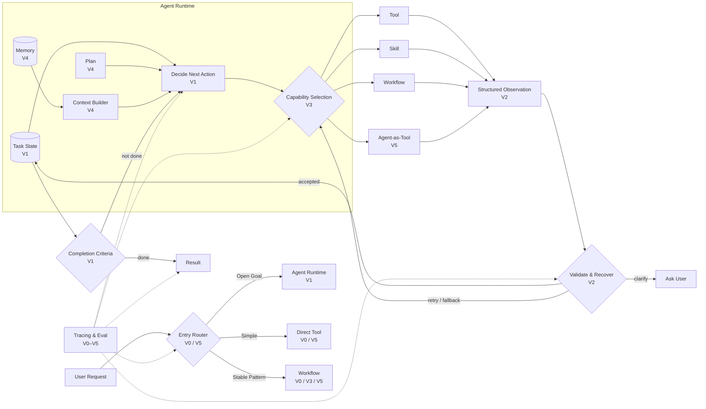

# Photo Agent：从 Router 到自适应 Agent

## 知识地图

1. [V0：Router + 专用 Pipeline](02-photo-agent-v0-router-baseline.md)：Intent Routing、Pipeline 与确定性基线。
2. [V1：Stateful Agent Runtime](03-photo-agent-v1-stateful-runtime.md)：Agent Loop、Structured State 与 Completion Criteria。
3. [V2：Reliable Agent Runtime](04-photo-agent-v2-reliable-runtime.md)：Observation、Validation、Recovery 与 Budget。
4. [V3：Capability-Oriented Agent](05-photo-agent-v3-capability-system.md)：Tool、Skill、Workflow 与 Capability Selection。
5. [V4：Planning + Context-Aware Agent](06-photo-agent-v4-planning-context.md)：Planning、Replanning、Context 与 Memory。
6. [V5：Adaptive Agent System](07-photo-agent-v5-adaptive-optimization.md)：Adaptive Routing 与复杂编排模式。
7. [贯穿版本的评估闭环](01-photo-agent-evaluation-loop.md)：Tracing、Trajectory Eval 与 Failure Mining。

## 核心案例

用山西旅行第一天的照片生成一篇社交媒体帖子。

> 规划这批框架演进时处于V0版本状态，遇到该问题无法处理，于是考虑升级迭代。

## 架构职责

Photo Agent 的稳定职责可以分成以下几层：

- **Entry Router**：选择请求进入哪种执行结构，涉及 Routing、Route Policy。
- **Agent Runtime**：保存任务状态并决定下一步，涉及 Agent Loop、State、Planning、Completion。
- **Capability Layer**：执行对外动作或稳定方法，包含 Tool、Skill、Workflow、Agent-as-Tool。
- **Observation**：把执行结果转换成 Runtime 可理解的事实，强调 Structured Result 与 Evidence。
- **Guardrail Layer**：判断结果是否可接受以及如何恢复，涉及 Validation、Retry、Fallback、Stop。
- **Tracing & Eval**：记录轨迹并判断版本是否值得发布，涉及 Trace、Trajectory Eval、Failure Mining。

## V0–V5 演进总览

演进按控制面逐层增加：

- **V0：Router + Pipelines**
  - 新增控制面：请求路由。
  - 核心知识：Intent Routing、Pipeline、基线评估。
  - 进入 V1 的条件：已量化固定路由的能力边界；复杂请求需要连续决策。
- **V1：Stateful Runtime**
  - 新增控制面：任务进度。
  - 核心知识：Agent Loop、Structured State、Tool Calling、Completion Criteria。
  - 进入 V2 的条件：多步任务能稳定走到完整目标；真实工具会失败、结果会含糊。
- **V2：Reliable Runtime**
  - 新增控制面：失败处理。
  - 核心知识：Validation、Error Taxonomy、Retry、Fallback、Ask vs Act、Budget。
  - 进入 V3 的条件：注入常见失败后仍能恢复或正确停止；逻辑开始散落且难复用。
- **V3：Capability System**
  - 新增控制面：能力边界。
  - 核心知识：Tool Design、Skill、Workflow、Capability Selection。
  - 进入 V4 的条件：新组合请求主要靠复用，而不是新增 Pipeline；任务变长、上下文开始过载。
- **V4：Planning & Context**
  - 新增控制面：计划与输入。
  - 核心知识：Task Decomposition、Planning、Replanning、Context Engineering、Memory。
  - 进入 V5 的条件：长任务与多轮修改不依赖完整历史堆叠；不同复杂度不应支付同样成本。
- **V5：Adaptive System**
  - 新增控制面：系统级调度。
  - 核心知识：Adaptive Routing、Parallelization、Evaluator–Optimizer、Agent-as-Tool。
  - 验收条件：质量、成本、延迟相对 V4 有可测净收益。

## 累积架构

## 三条贯穿原则

### 1. 确定性优先，概率性按需

类型、ID 存在性、日期范围、预算等可以由程序判断的事实，不交给模型猜。叙事连贯、选片多样性、文案风格等无法被硬规则完整表达的质量，再使用模型评估。

### 2. 通用能力先组合，高频路径后固化

新的组合请求先作为 General Agent 的压力测试。当 Trace 证明某条路径高频、稳定且固化后有明显成本或延迟收益，再沉淀为 Workflow。

### 3. 复杂度必须由证据购买

Planner、Memory、并行、Evaluator、Agent-as-Tool 都有成本。只有当前一版出现可重复的失败模式，并且新层在离线与线上指标上改善它，才升级。

## 演进原则

每一层都需要由测试集、Trace 和指标验证收益；不能产生净收益时保留较简单的架构。

## 落地原则

- 先包适配层，保留现有 SQL、RAG、Combined 和主题发现实现，不因架构升级大规模重写。
- 新旧路径可并存，按 Case 或流量逐步切换，并始终保留回退开关。
- `TaskState`、`Observation` 和 Capability Contract 先版本化，再让更多节点依赖它们。
- 每次只验证一个主要架构假设，避免无法判断收益来自哪里。
- 简单、稳定的请求不因引入 Agent Runtime 而被迫走更复杂的路径。
- 复杂层必须满足“非退化 + 针对性提升”；没有质量、成本或延迟净收益就撤回。
