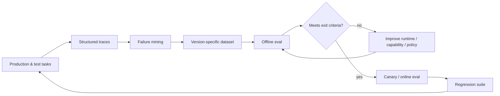
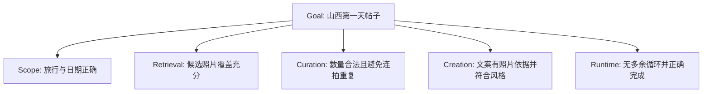

# 贯穿 V0–V5 的评估与可观测性

## 评估闭环

Tracing & Eval 连接每个架构节点，用于定位失败、验证修复效果并度量成本。只看最终答案，无法区分检索、选择、恢复、完成判断和生成的问题。



## Trace 事件模型

一次完整执行轨迹按以下顺序记录事件：

1. User Request。
2. Entry Router event。
3. Runtime decision event。
4. Capability call event。
5. Observation event。
6. Guardrail decision event。
7. State update event。
8. Completion / result event。

每类事件至少记录：`trace_id`、`task_id`、`step_id`、时间、版本、输入引用、结构化输出、延迟、成本和错误。模型的内部思维过程不是必要观测对象；应记录可审计的决策摘要、选中能力、证据与状态差异。

### State diff 比完整快照更有用

每步同时保存关键快照与 diff：增加了哪些事实、候选集如何变化、哪个 requirement 完成、错误计数如何更新。这样才能检测无进展并复盘错误覆盖。

## 三层评估

| 层级 | 评估对象 | 典型方法 | 例子 |
| --- | --- | --- | --- |
| Component | 单个 Router、Tool、Skill、Validator | 单元测试、契约测试、固定数据集 | `search_photos` 是否尊重日期过滤 |
| Trajectory | 决策与动作序列 | 路径规则、参考轨迹、Judge rubric | SQL 空结果后是否合理转语义搜索 |
| End-to-End | 用户完整目标与体验 | Task success、人工评审、线上行为 | 是否生成可直接使用的帖子 |

组件全对不代表任务完成；最终答案看似正确也不代表路径可靠。三层需要同时存在。

## 各版本的主评估问题

| 版本 | 主问题 | 核心指标 | 关键测试集 |
| --- | --- | --- | --- |
| V0 | 路由和单条 Pipeline 是否稳定 | Route Accuracy、Retrieval Quality、Latency | 单步明确请求 + 多步边界 Case |
| V1 | 是否持续到完整 Goal | Task Success、Completion Accuracy、Step Count | 多能力组合与提前结束 Case |
| V2 | 失败后是否正确恢复或停止 | Recovery Success、Correct Stop、Retry Waste | 故障注入与歧义 Case |
| V3 | 是否选对且复用正确能力 | Capability Selection、Reuse、Contract Failure | 未显式开发的新组合请求 |
| V4 | 计划与上下文是否有效 | Plan Executability、Replan Precision、Constraint Retention | 长任务、多轮修改、指代 Case |
| V5 | 是否选择最经济执行结构 | Route Quality、Cost per Success、p95 Latency | 简单/稳定/开放任务混合集 |

每版仍需回归前面所有指标。例如 V4 提升多轮成功率，却显著降低 V2 的 Correct Stop Rate，不能视为升级成功。

## Deterministic Eval 与 Model-based Eval

### 优先使用确定性断言

- 输出 Schema 是否合法。
- 选中 ID 是否来自候选集。
- Tool 参数与调用顺序是否违反规则。
- 是否超过预算或重复调用。
- Caption 提及的拍摄日期是否与 metadata 冲突。

### 语义质量才使用 Judge

- 选片是否重复、是否覆盖关键场景。
- 叙事是否连贯且有照片依据。
- 风格是否符合用户要求。
- 修改后的结果是否准确响应反馈。

Judge 应使用明确 rubric、结构化评分和证据字段，并用人工标注集校准一致性。不要让同一个 Judge 同时评价十个模糊维度，也不要把 Judge 分数当作客观真值。

## 山西案例的评估拆解



| Requirement | 首选检查 | 失败归属 |
| --- | --- | --- |
| 旅行和 Day 1 正确 | metadata 确定性比对 | scope capability / state update |
| 候选覆盖充分 | Recall + 人工抽样 | retrieval capability |
| 选片合法 | 集合、数量、近重复规则 | selection skill / validator |
| 文案 Grounding | 事实规则 + 语义 Judge | creation skill / context |
| 完整目标完成 | requirement checklist | completion policy |
| 路径合理 | 调用数、重试与状态 diff | runtime / recovery policy |

这种拆解让“最终帖子不好”不再是一个无法行动的结论。

## Failure Mining

失败应按架构责任节点与可修复机制分类，而不是按错误字符串聚类：

```text
entry_route
goal_or_state
capability_selection
capability_execution
observation_contract
validation_or_recovery
planning_or_context
completion
final_generation
```

每一类高频失败都转成 Golden Case，并指定预期状态变化或允许的轨迹，而不只保存一个参考答案。修复后加入回归集，避免同类问题再次出现。

## 发布门槛

版本比较应使用同一批分层数据和相同预算，至少报告：质量、成功率、成本、延迟以及失败分布。建议采用“非退化 + 针对性提升”原则：

- 前版本核心指标不得超过容忍阈值地退化。
- 新版本针对的失败类别必须显著改善。
- 新增复杂度带来的成本和延迟在预算内。
- 线上 Canary 没有出现离线集未覆盖的严重失败。

评估的最终作用不是给 Agent 一个总分，而是决定：继续用当前版本、升级一个节点，还是撤销没有净收益的复杂层。
