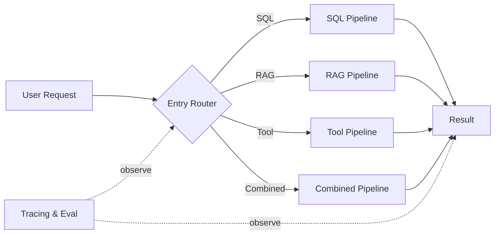
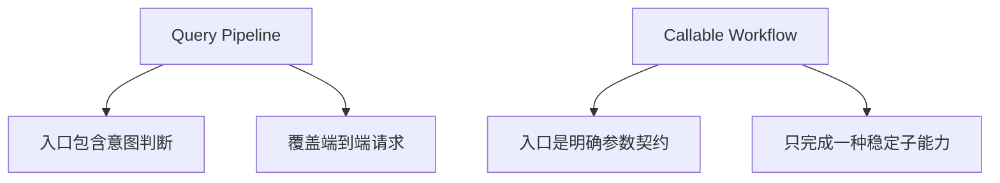

# V0：Router + 专用 Pipeline

## 适用范围

V0 是可工作的确定性基线：系统在入口识别意图，然后把整个请求交给一条预定义 Pipeline。它适合单步、边界明确、执行路径稳定的任务。后续版本不是为了消灭 V0，而是补上它无法处理的开放目标；到 V5，简单请求仍会回到 Direct Tool 或 Workflow。

## 架构

Entry Router 连接若干固定 Pipeline。Agent Runtime、Observation 契约与 Guardrail 隐含在 Pipeline 内部。

## 知识点 1：Intent Routing

Intent Router 解决的是“一次请求属于哪条已知路径”。它的决策单位是整个 Query，输出通常是离散类别：SQL、RAG、Tool 或 Combined。

这与后续 Agent 的 Capability Selection 不同：

| 对比 | Intent Routing | Capability Selection |
| --- | --- | --- |
| 决策频率 | 请求开始时一次 | 任务执行中每一步 |
| 输入 | 原始 Query | Goal + State + Observation |
| 输出 | 一条完整 Pipeline | 下一项能力 |
| 适合 | 已知、稳定的请求类型 | 中间结果未知的开放目标 |

Router 的问题不在于“只能分类”，而在于系统若把所有需求都建模为类别，类别数量会随组合需求膨胀。

## 知识点 2：Pipeline 与 Workflow

两者都预先定义执行路径。Pipeline 是按 Query 类型形成的端到端通道；Workflow 是能力库中边界清晰、可被 Agent 调用的稳定流程。

主题发现现有 Pipeline 可以继续存在。V3 要做的不是重写内部算法，而是去掉它对全局 Query 类型的依赖，把它封装为 `discover_topics(photo_scope)`。

## 为什么“山西第一天帖子”会暴露边界

1. 生成山西第一天帖子。
2. 确定对应的旅行。
3. 计算第一天日期。
4. 检索照片。
5. 根据数量压缩候选。
6. 选片。
7. 形成叙事。
8. 生成文案。

入口 Router 可以把它分类成 Combined，但无法预先知道：山西有几次旅行、第一天有多少张照片、是否存在大量连拍、候选是否足以形成叙事。真正的路径取决于每一步返回的事实。

如果继续沿 V0 扩展，通常会得到一个 CQ4 专用 Pipeline。再出现“对比两年春天”“同一地点不同年份”“雨天专题”时，又增加 CQ5、CQ6。重复的是组合逻辑，而不是底层能力。

## V0 应保留的资产

- SQL、RAG、Combined 的检索实现与已有 Retrieval Eval。
- 主题发现等已经稳定的 Pipeline。
- 请求样本、失败样本、延迟与成本基线。
- 能明确判定的简单路由规则。

升级不是推倒重来。V1 会把这些执行器作为最初的 Capability 接入 Runtime。

## 基线验收

| 观察对象 | 指标 | 用途 |
| --- | --- | --- |
| Router | Route Accuracy、误路由分布 | 确认入口分类是否可靠 |
| Retrieval | P@10、Recall、MRR | 保留已有检索质量基线 |
| End-to-End | Task Success Rate | 暴露组合任务不能完成的问题 |
| 系统 | p50/p95 Latency、单请求成本 | 给后续版本提供比较基准 |

V0 的退出条件不是所有任务都成功，而是已经用测试集证明：单步任务表现稳定，多步开放目标的失败来自缺少执行中决策，而不是单个检索器质量不足。

## 架构边界

- 不用更多 Intent 覆盖开放组合需求。
- 不引入 Planner、Memory 或 Multi-Agent。
- 不让 Router 猜完整执行计划。

下一步只增加最小 Agent Runtime，让系统能在一次动作之后读取结果并继续决定。
