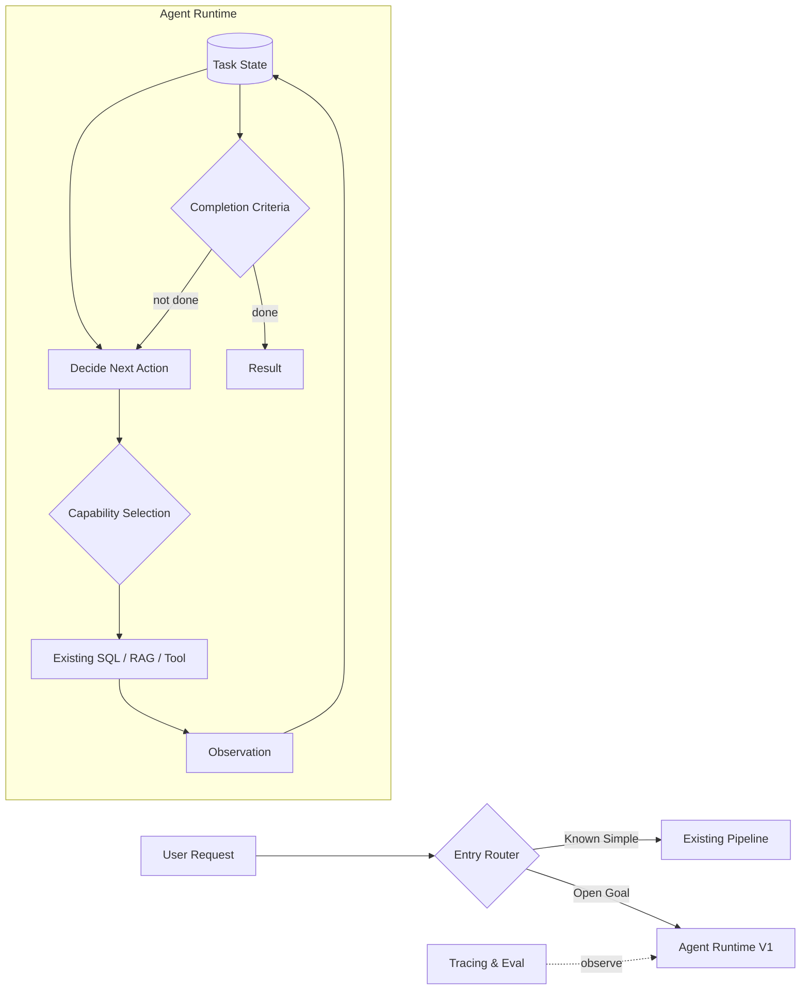
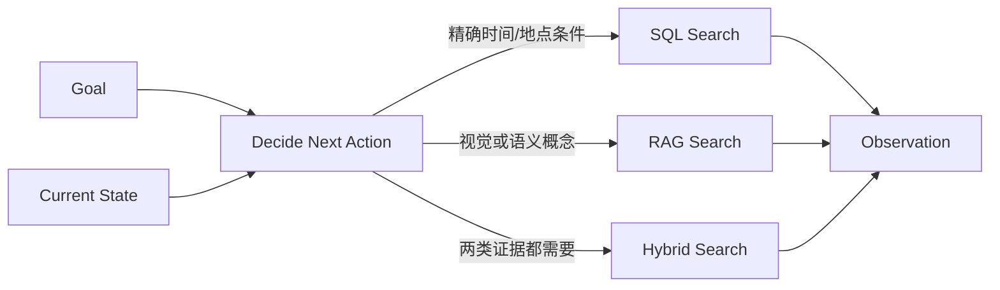
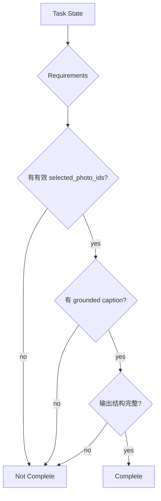

# V1：Stateful Agent Runtime

## 架构增量

V1 只解决一个问题：让一个 Goal 可以跨越多次能力调用持续执行，直到完整目标满足。新增的是 Agent Runtime，而不是复杂 Planner。

## 从 V0 到 V1



一次动作的结果写入 State，下一次决策基于更新后的事实进行。

## 知识点 1：Agent Loop

Agent Loop 的最小状态机只有四步：决定下一动作、执行能力、吸收观察、检查完成。Task Decomposition 在 V1 可以是渐进的，不必先生成完整计划。

```text
while budget_available:
    action = decide(goal, state, available_capabilities)
    observation = execute(action)
    state = reduce(state, observation)
    if completion_criteria(state):
        return result
```

这里必须分开模型与程序的责任：模型负责在语义不确定性中选择下一动作；程序负责执行工具、维护 State、计算预算和执行可确定的完成检查。

## 知识点 2：Structured State

State 是当前任务的事实源，不等于 `messages[]`。聊天记录是输入材料，State 是 Runtime 可以稳定读取和更新的任务模型。

```json
{
  "goal": {
    "type": "create_social_post",
    "completion_requirements": ["selected_photos", "grounded_caption"]
  },
  "constraints": {
    "location": "山西",
    "trip_day": 1,
    "photo_count": null,
    "style": null
  },
  "resolved_facts": {
    "trip_id": "trip_2026_shanxi",
    "date_range": ["2026-05-02", "2026-05-02"]
  },
  "artifacts": {
    "candidate_photo_ids": ["p1", "p2", "p3"],
    "selected_photo_ids": [],
    "caption_draft": null
  },
  "progress": {
    "completed": ["resolve_trip", "retrieve_photos"],
    "pending": ["select_photos", "compose_caption"],
    "step_count": 2
  }
}
```

### 字段设计原则

- 保存决策需要的事实，不复制所有原始 Tool Result。
- 保存 Artifact 的引用，照片二进制、完整描述等大对象按需读取。
- `resolved_facts` 与用户原始约束分开，避免把推断当成用户输入。
- State 更新通过明确 reducer 完成，避免任意节点覆盖整个对象。
- 每个字段应有生产者和消费者；没人读取的字段先不加。

## 知识点 3：Tool Calling 与 Capability Selection

V1 可直接把现有 SQL、RAG 和 Combined 暴露为初始能力。工具描述必须让 Runtime 能回答“何时使用”，参数必须让程序能校验“如何使用”。



V1 的 Tool Selection 只需要在少量已有能力中做选择。工具很多时的 Tool Retrieval 属于后续按需优化，不应提前引入。

## 知识点 4：Completion Criteria

“模型说完成了”不是可靠的完成条件。应把 Goal 转换成可检查的 requirements，并区分任务完成与循环停止。

| 概念 | 问题 | 山西案例 |
| --- | --- | --- |
| Completion | 用户目标是否满足 | 已选照片，文案有照片依据，输出格式完整 |
| Stop | 系统是否必须停止 | 超过步数、时间或成本预算 |



能由程序判断的 requirement 用确定性检查；“文案是否有叙事感”暂不作为硬性完成条件，否则 V1 会过早引入语义 Judge。

## 山西案例的完整轨迹

山西案例的一次完整执行轨迹可以按以下顺序理解：

1. Agent Runtime 调用 Capability Layer：`resolve_trip(location=山西)`。
2. Capability Layer 返回旅行日期 `5/2–5/7`。
3. Runtime 将 `date_range = 5/2` 写入 Task State。
4. Runtime 调用 `search_photos(date=5/2)`，得到 87 个 photo IDs。
5. Runtime 将 `candidate_photo_ids` 写入 Task State。
6. Runtime 调用 `select_representative_photos`，得到 8 个 selected IDs。
7. Runtime 将 `selected_photo_ids` 写入 Task State。
8. Runtime 调用 `compose_grounded_caption`，得到 caption draft。
9. Runtime 将 `caption_draft` 写入 Task State，并通过 completion check。

此处的“选片”和“写文案”可以先是已有 Tool 或临时能力；V3 才正式定义 Skill 边界。

## V1 验收与边界

| 测试 | 期望 |
| --- | --- |
| 单步照片查询 | 不因进入 Runtime 而显著退化 |
| SQL → RAG 两步任务 | 能基于第一次结果继续选择 |
| 山西第一天帖子 | 不在“找到照片”时提前结束 |
| 返回大量候选 | State 保存引用并继续压缩，而非把全部结果塞入消息 |
| 缺少完成要件 | Completion Check 返回未完成 |

重点指标是 Task Success Rate、Completion Precision/Recall、Tool Call Count 和平均步骤数。V1 暂不承诺优雅恢复；工具超时、返回空结果、歧义与死循环由 V2 系统解决。
