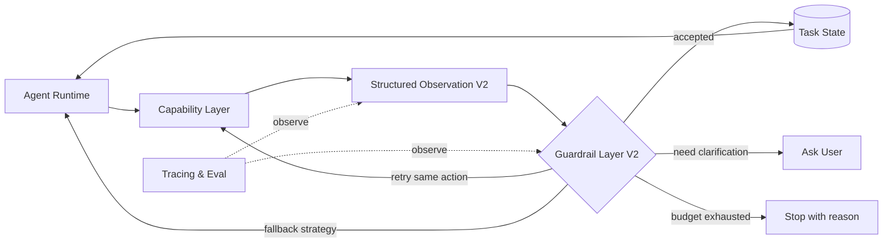
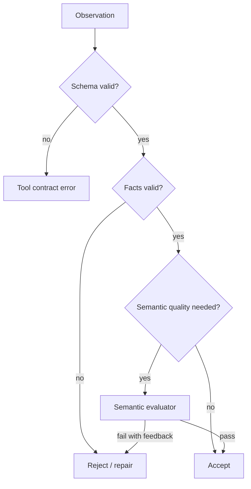
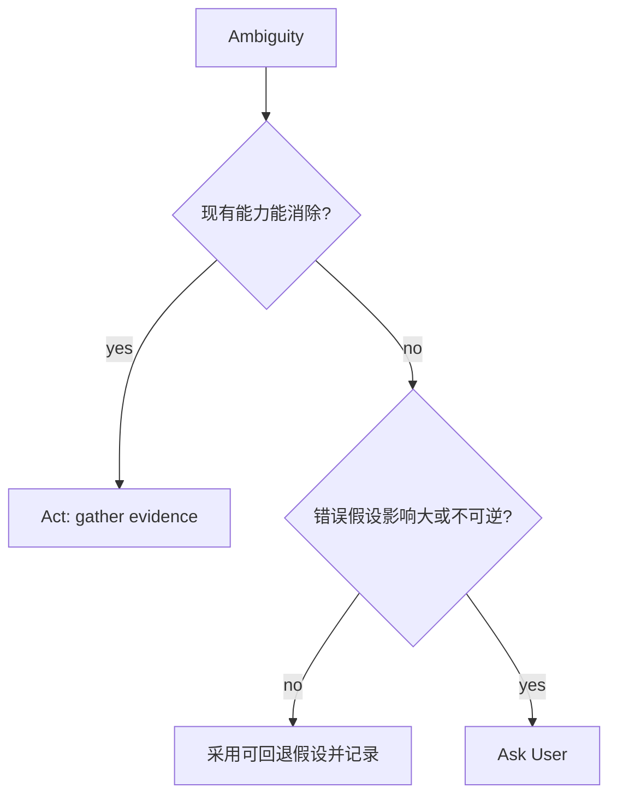
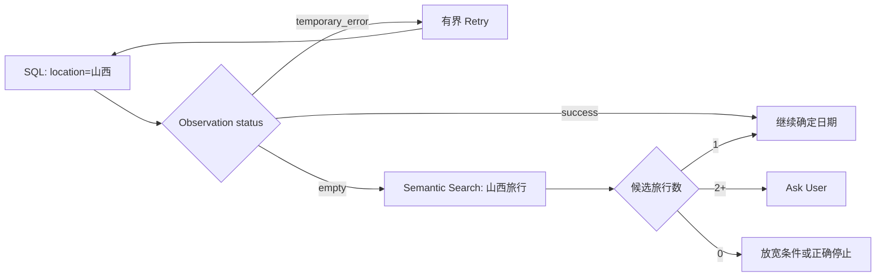

# V2：Reliable Agent Runtime

## 架构增量

V1 建立了成功路径，V2 把失败也变成 Runtime 可以理解和处理的状态。目标不是保证每次成功，而是面对失败时能够选择：接受、重试、换策略、询问或停止。

## Observation 与 Guardrail



## 知识点 1：Structured Observation

Tool Result 是某个工具的原始返回；Observation 是经过适配后供 Runtime 消费的统一事实。仅返回 `photos: []` 无法区分真实空集、过滤条件过严和工具故障。

```json
{
  "status": "empty",
  "data": {"photo_ids": []},
  "evidence": {"query": {"location": "山西"}},
  "error": null,
  "recoverability": "fallback",
  "suggested_actions": ["semantic_search", "broaden_location_filter"]
}
```

建议统一 `status`：

| 状态 | 含义 | 默认处理 |
| --- | --- | --- |
| `success` | 调用成功且结果可消费 | 校验后写入 State |
| `empty` | 调用成功但没有数据 | 判断是合理空集还是换策略 |
| `invalid_input` | 参数不满足契约 | 修正参数，不盲目重试 |
| `temporary_error` | 超时、限流、短暂依赖故障 | 有界 Retry |
| `permanent_error` | 权限、能力不存在等 | Fallback 或停止 |
| `low_confidence` | 有结果但证据不足 | 补充检索或询问 |

## 知识点 2：Validation 分层



### Deterministic Validation

程序可以确认的事实必须先用规则检查：Schema、photo_id 是否存在、日期范围是否合法、返回数量是否满足上限、选中照片是否来自候选集。这类检查便宜、稳定、可复现。

### Semantic Evaluator

只有选片多样性、叙事连贯性、图文 Grounding 等软质量才可能需要模型。V2 先定义接口和使用条件，不要求每一步都调用 Judge。否则一次执行会变成层层概率判断，成本上升且更难定位错误。

## 知识点 3：错误分类决定恢复策略

Retry、Fallback 和 Replan 不是同义词：

| 策略 | 什么保持不变 | 什么发生变化 | 示例 |
| --- | --- | --- | --- |
| Retry | 目标、工具和参数基本不变 | 再执行一次 | 网络超时后重试 SQL |
| Repair | 目标和工具不变 | 修正参数 | 日期格式错误后规范化 |
| Fallback | 子目标不变 | 更换能力或检索策略 | 精确 SQL 空结果后转语义搜索 |
| Replan | 总目标不变 | 后续子目标或顺序改变 | 发现两次山西旅行后先解决歧义 |

V2 实现前三种；系统化 Replanning 在 V4 引入。

## 知识点 4：Ask vs Act

询问用户不是所有不确定性的默认答案。先判断系统是否能以低成本自行消除歧义，再判断猜错的影响。



如果数据库只有一次山西旅行，系统可直接确定；如果有两次且会选出完全不同的照片，应询问。若用户未指定 6 张还是 9 张，可以使用可回退默认值并允许后续修改。

## 知识点 5：Budget、Stop 与 No-progress

Budget 是安全边界，不是 Completion。至少控制：总步骤数、单能力重试次数、总耗时、模型 Token 或费用。达到预算时应返回已完成部分、未完成要求和停止原因，而不是伪装成功。

No-progress Detection 需要比较状态变化，而不是只数循环次数：

```text
progress_signature = (
  resolved_fact_keys,
  candidate_photo_id_hash,
  completed_requirements,
  last_error_class
)
```

如果连续多步 signature 不变，就算每次工具都返回 `success`，任务也没有进展。此时应换策略、询问或停止。

## 山西案例的恢复路径



关键是每条边由明确状态触发，而不是在 Prompt 中写一句“如果失败请重试”。

## V2 验收

建立故障注入集：SQL 空结果、RAG 低置信度、工具超时、两次山西旅行、photo_id 失效、异常 Schema、连续搜索无新信息。

| 指标 | 判断什么 |
| --- | --- |
| Recovery Success Rate | 可恢复故障最终是否完成 |
| Correct Stop Rate | 不可恢复时是否停止且说明原因 |
| Unnecessary Retry Rate | 是否对永久错误或空集盲目重试 |
| Clarification Precision | 提问是否真的必要 |
| Budget Violation Rate | 是否越过硬性资源边界 |

只有失败分类稳定、恢复路径可追踪后，才进入 V3 整理能力边界。否则封装只会把混乱藏到 Skill 或 Workflow 内部。
