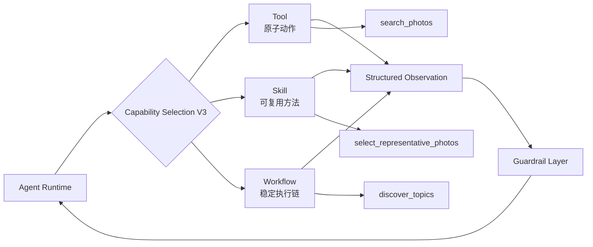
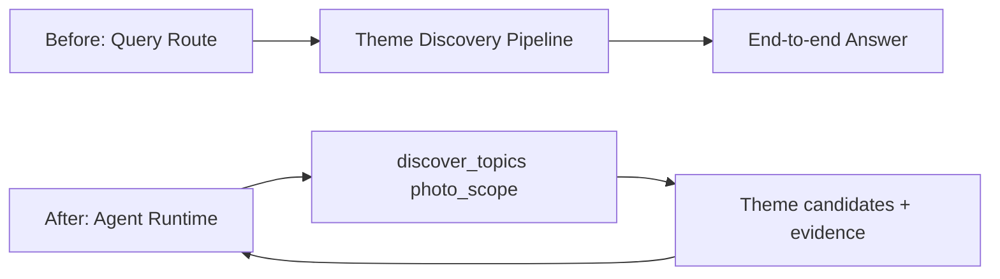
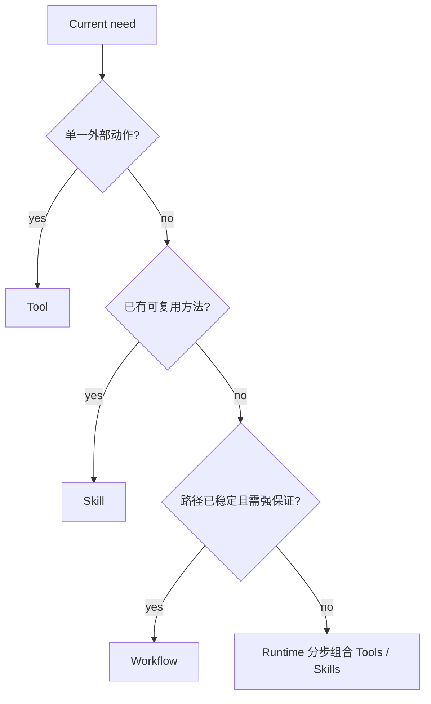

# V3：Capability-Oriented Agent

## 架构增量

选片规则、工具顺序和业务经验如果散落在主 Prompt 或不同 Pipeline 中，新需求会产生复制。Capability Layer 将这些逻辑整理为有边界、有契约、可组合的能力库。

## 展开 Capability Layer

V3 不是增加更多能力名称，而是建立抽象层级。Agent 只负责“当前需要哪项能力”，能力内部负责“如何可靠完成这一类子问题”。

## 知识点 1：Tool

Tool 是一个边界明确、可直接执行的外部动作，例如：

- `search_photos(filters, semantic_query, limit)`
- `get_photo_details(photo_ids)`
- `collapse_burst_groups(photo_ids)`
- `save_draft(content, photo_ids)`

好的 Tool 契约包含：使用时机、输入 Schema、输出 Schema、错误语义、副作用与幂等性。不要用 `photo_tool(action, mode, type, option...)` 把多个语义藏在参数中，因为模型难以选对，Guardrail 也难以按动作定义恢复策略。

### Tool 的粒度

粒度过粗会把决策藏在黑盒里；粒度过细会让 Agent 付出大量调用和选择成本。判断标准是：调用者是否能用一个清晰动词描述该动作，输入输出是否能形成稳定契约，失败是否能被单独处理。

## 知识点 2：Skill

Skill 是一套可复用的问题解决方法，通常组合多个 Tool、领域规则、Prompt 和输出 Schema，但不拥有开放式长期自治循环。

以 `select_representative_photos` 为例：

代表性选片可以按以下顺序执行：

1. 读取候选照片必要的 metadata / embedding。
2. 折叠连拍与近重复照片。
3. 按时间、场景、主体形成覆盖。
4. 语义选择代表照片。
5. 校验数量、来源与多样性。
6. 输出 `Selected ids + reasons`。

对主 Runtime 而言，Skill 是一项具有统一契约的能力；内部哪些步骤使用代码、Tool 或模型，由 Skill 自己管理。

首批可复用 Skill：

| Skill | 输入 | 输出 | 核心不变量 |
| --- | --- | --- | --- |
| `resolve_photo_scope` | 时间、地点、旅行等约束 | 明确的 photo scope | 推断事实与原约束可追溯 |
| `reduce_photo_candidates` | 大候选集、目标上限 | 缩小后的候选 IDs | 不引入集合外照片 |
| `select_representative_photos` | 候选 IDs、数量与风格 | 选中 IDs 与理由 | 数量合法、来源合法、避免近重复 |
| `build_story_angle` | 照片证据、用户目标 | 叙事主线 | 每个关键表述有照片依据 |
| `compose_social_post` | 选片、叙事、平台与风格 | 结构化草稿 | 不虚构照片中不存在的事实 |

## 知识点 3：Workflow

Workflow 是路径预先确定、值得稳定执行的复杂能力。它与 Skill 的关键区别不是步骤数量，而是控制流是否已经固化并需要工程级可靠性保证。

| 维度 | Skill | Workflow |
| --- | --- | --- |
| 本质 | 可复用方法与领域策略 | 确定执行图 |
| 内部路径 | 可包含少量条件与模型决策 | 主要由代码预定义 |
| 优势 | 快速复用经验 | 稳定、易测、易优化 |
| Photo Agent 示例 | 代表性选片 | 三阶段主题发现 |

现有主题发现 Pipeline 的迁移方式：

内部候选生成、主题分析、评分和结果生成可以保留；只需建立明确输入输出，让它从“整条 Query 路径”变成 Capability。

## 知识点 4：Capability Selection

选择依据是 Goal + State + 最近 Observation，而不是仅看原始 Query。能力描述应包含正向适用条件和不适用条件，否则相似能力会争抢同一个请求。

Tool Retrieval 只有在能力数量已经明显影响选择准确率或上下文成本时才加入。它类似 RAG：根据当前 need 检索少量相关能力描述，而不是每次把全部工具交给模型。

## 山西案例变成能力组合

从 Goal 到 Result 的典型能力调用顺序是：

1. `resolve_photo_scope`
2. `search_photos`
3. `reduce_photo_candidates`
4. `select_representative_photos`
5. `build_story_angle`
6. `compose_social_post`
7. 输出 Result。

这不是新的固定 Pipeline。箭头表示该 Case 的一次实际轨迹；换成“对比两年春天”时，Runtime 可以复用检索与选片能力，但形成不同组合。

## V3 验收

用系统此前没有专门设计过的组合请求测试：同地跨年对比、雨天专题、旅行九宫格、按主题选片并存草稿。

| 指标 | 目标 |
| --- | --- |
| Capability Selection Accuracy | 当前子目标选到正确抽象层 |
| Capability Reuse Rate | 新 Case 使用已有能力的比例上升 |
| New-Pipeline Rate | 新需求新增端到端 Pipeline 的比例下降 |
| Contract Failure Rate | 参数、结果 Schema 与错误语义稳定 |
| Task Success / Cost | 抽象后不以明显质量或成本退化换复用 |

V3 的退出条件是能力边界稳定且可观察。此时 Planner 才知道系统真正“会什么”，V4 的计划才可能可执行。
