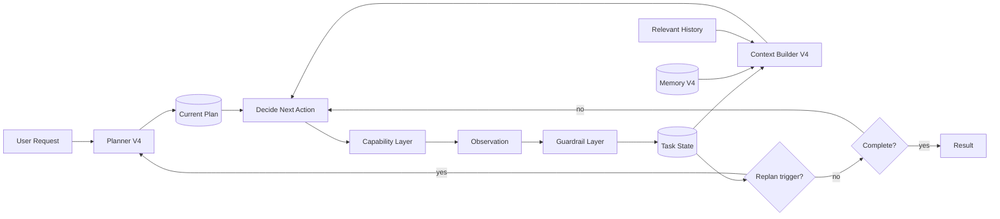
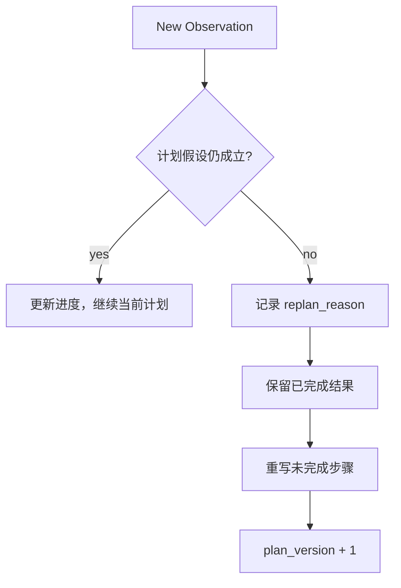
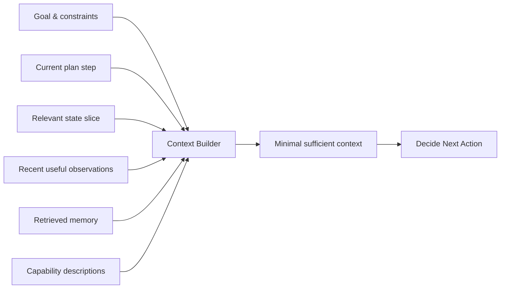
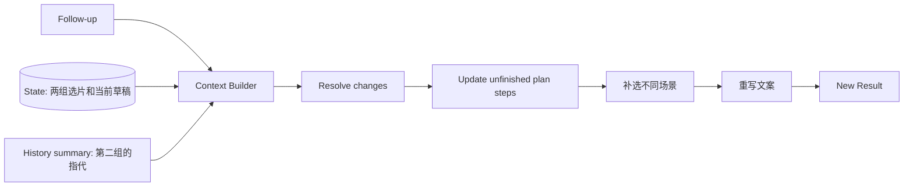

# V4：Planning + Context-Aware Agent

## 架构增量

V3 以后，系统有稳定 Runtime、恢复语义和能力库。V4 才为更长任务增加高层计划，并用 Context Builder 控制每一步模型真正看到的内容。Planning 解决“接下来分几个阶段”，Context Engineering 解决“当前一步需要哪些证据”。

## 展开 Agent Runtime



计划、State 和 Context 是三个不同对象：计划表达预期路径，State 表达已经确认的任务事实，Context 是某次模型调用从二者及其他来源组装出的有限视图。

## 知识点 1：Task Decomposition 与 Planning

Task Decomposition 把 Goal 分成可交付的子目标；Planning 再组织依赖、顺序和当前优先级。计划项应描述结果，不应伪造不存在的工具调用。

```json
{
  "plan_version": 1,
  "steps": [
    {"id": "scope", "outcome": "确定山西旅行第一天的照片范围", "status": "done"},
    {"id": "curate", "outcome": "得到有代表性的发布候选", "status": "in_progress"},
    {"id": "create", "outcome": "生成有照片依据的社交帖子", "status": "pending"}
  ],
  "replan_reason": null
}
```

推荐“高层计划 + 增量执行”，而不是一开始生成十几步具体 Tool Call。Observation 尚未出现时，精细计划大多是猜测。

## 知识点 2：Replanning

Replanning 不是每执行一步都重写计划，只在原计划关键假设失效时触发：出现新的硬约束、关键能力不可用、候选规模改变策略、用户修改目标、连续无进展。



已完成且仍有效的 Artifact 不应因 Replan 丢失。计划版本和原因进入 Trace，才能区分合理适应与摇摆不定。

## 知识点 3：Context Engineering

Context 不是数据库，也不是对话日志；它是一次决策所需的最小充分输入。



Context Builder 应执行选择、压缩和引用：

- 选择：只取当前 plan step 需要的 State 字段和工具描述。
- 压缩：长对话保存语义摘要，但关键用户约束保留原文或结构化字段。
- 引用：照片、完整 Tool Result 和 Trace 放在外部存储，通过 ID 按需加载。
- 优先级：系统约束与用户最新明确要求高于历史摘要和推断偏好。

“全部 Conversation + 全部 Tool Results + 全部照片描述”并不是更完整的 Context，而是让相关信号被噪声稀释。

## 知识点 4：State、Context 与 Memory

| 对象 | 回答的问题 | 生命周期 | 写入条件 | 山西案例 |
| --- | --- | --- | --- | --- |
| State | 任务现在知道什么、做到哪里 | 当前任务 | Observation 经校验后 | 已选 8 张照片 |
| Context | 本次模型调用能看到什么 | 单次调用 | 每步动态组装 | 当前选片步骤所需候选摘要 |
| Memory | 未来任务值得记住什么 | 跨任务 | 稳定、可复用且允许保存 | 用户长期偏好纪实风 |

Memory 不是保存所有 Conversation。适合写入的是多次确认的稳定偏好、用户明确要求记住的规则，以及具有来源和更新时间的长期事实。一次性的“这次想要文艺一点”留在 State，不应污染长期偏好。

### Memory 读取与冲突

Memory 通过检索进入 Context，而不是永久塞入 Prompt。若当前用户要求与历史偏好冲突，以当前要求为准；若两条 Memory 冲突，优先更明确、更新、更可信的一条，并允许用户修正。

## 多轮修改如何运行

用户在初稿后说：“还是用刚才第二组，但不要那么文艺，再补两个不同场景。”



系统不需要重放整个任务：保留有效的照片范围和第二组选片，只让受影响的“补选”和“文案”步骤失效。

## V4 验收

| 指标 | 判断什么 |
| --- | --- |
| Plan Executability | 计划步骤是否能映射到现有 Capability |
| Replan Precision | 是否只在关键假设失效时重规划 |
| Context Sufficiency | 当前决策所需信息是否缺失 |
| Context Utilization | 提供的信息是否真正被当前决策使用 |
| Constraint Retention | 长任务中是否丢失用户硬约束 |
| Multi-turn Task Success | 修改、指代和局部重做后是否完成目标 |

Planning 与 Context Builder 只在长任务、上下文过载或多轮修改出现真实瓶颈时引入。
