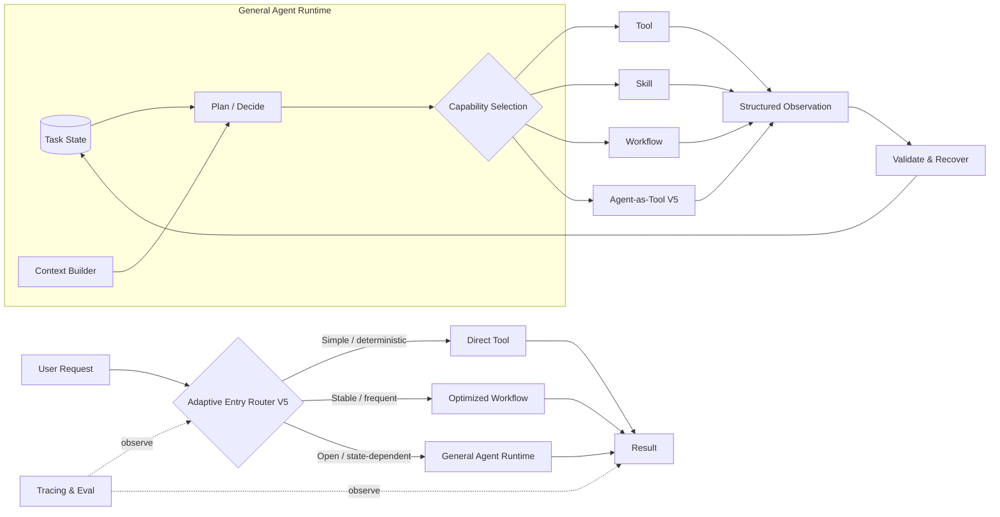
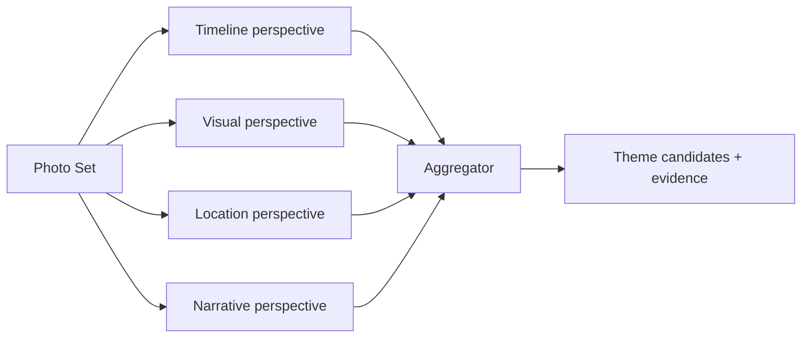
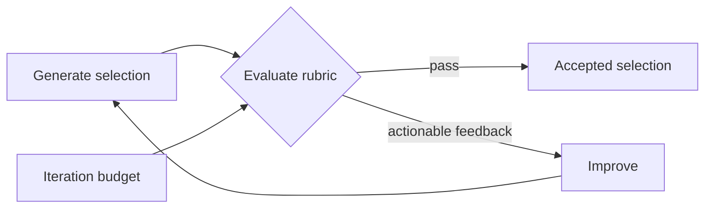
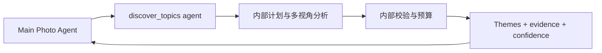
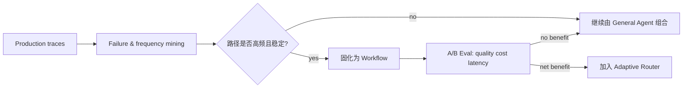

# V5：Adaptive Agent System

## 架构增量

V5 的目标不是让所有请求进入最强 Agent，而是让不同复杂度支付不同成本：简单任务直接执行，成熟模式走 Workflow，开放目标进入 General Agent，专门且复杂的子问题才交给 Agent-as-Tool。

## 自适应架构

## 知识点 1：Adaptive Routing

V0 Router 预测内容类别，V5 Router 选择执行结构。路由依据应包含可观察特征：是否单步、是否需要中间状态、是否已有成熟 Workflow、风险、预计成本以及用户对延迟的要求。

| 请求 | 推荐路径 | 原因 |
| --- | --- | --- |
| “昨天拍了多少张？” | Direct SQL | 单步、确定性 |
| “看看海边照片” | Direct Search | 单次语义检索足够 |
| “重新生成主题发现” | Workflow | 已有稳定执行图 |
| “从去年旅行找一组孤独感照片做帖子” | General Agent | 路径依赖候选与中间判断 |

错误路由必须允许升级：Direct Tool 发现任务实际需要多步时，可把已有 Observation 交给 Runtime，而不是从头开始。开放任务也可在 Trace 证明路径稳定后降级为 Workflow。

## 知识点 2：Parallelization

并行只适合互不依赖且聚合规则明确的子任务。它可以降低 wall-clock latency，或提供互补视角，但会增加总成本。

该并行结构位于 Workflow 或 Agent-as-Tool 内部，不要求把主 Runtime 拆成四个 Agent。只有各分支不依赖彼此、结果确实互补、聚合器能处理冲突时才使用。

## 知识点 3：Evaluator–Optimizer

Evaluator–Optimizer 适合“好坏标准能够表达，但一次生成不稳定”的结果，例如选片多样性和图文 Grounding。

Evaluator 必须输出可操作的差距，如“8 张中有 4 张属于同一连拍，至少替换 2 张”，而不是只给抽象分数。循环要有最大次数，并比较优化前后的真实接受率；如果 Judge 噪声大于收益，应移除。

## 知识点 4：Agent-as-Tool

某个子问题只有在以下条件同时出现时才值得自治：内部路径需要根据中间结果多次变化；需要与主 Agent 不同的 Context 或能力集合；能定义稳定输入、输出和预算；独立 Trace 后更易调试。

Main Agent 不应接收子 Agent 的完整聊天历史，只接收结构化 Observation。否则只是把上下文复杂度换了位置。

## Multi-Agent 不是必经终点

Multi-Agent / Handoff 适合明确的责任隔离、权限隔离、长期独立运行或真实并行。若一个 General Agent + Skills 能稳定完成，拆分只会增加 Context 传递、成本、延迟和 Eval 难度。

采用前至少回答：

- 单 Agent 的哪种可重复失败由职责拆分解决？
- 子 Agent 的输入输出契约是什么？
- 谁拥有共享 State，冲突如何合并？
- Handoff 失败或超时如何恢复？
- 相比同模型的 Workflow 或并行调用，净收益是什么？

## 从通用轨迹沉淀 Workflow

“山西第一天帖子”最初是 General Agent 压力测试。只有生产数据证明大量用户反复走近似路径，且中间分支已经稳定，才将可确定的部分固化；这避免凭想象制造专用 Pipeline。

## V5 验收

| 指标 | 判断什么 |
| --- | --- |
| Route Quality | 是否选择满足质量目标的最低复杂度路径 |
| Route Escalation Success | 初始低估复杂度后能否携带状态升级 |
| End-to-End Task Success | 自适应结构是否提升完整目标成功率 |
| p50/p95 Latency | 简单任务是否足够快，复杂任务尾延迟是否可控 |
| Cost per Successful Task | 额外编排是否产生净收益 |
| User Acceptance / Edit Rate | 创作结果是否更少被大幅重做 |

V5 没有“功能全部实现”的终点。它是持续优化阶段：每一种高级模式都作为可撤销实验，由 Trace、离线 Eval 和线上结果决定保留、调整或移除。
