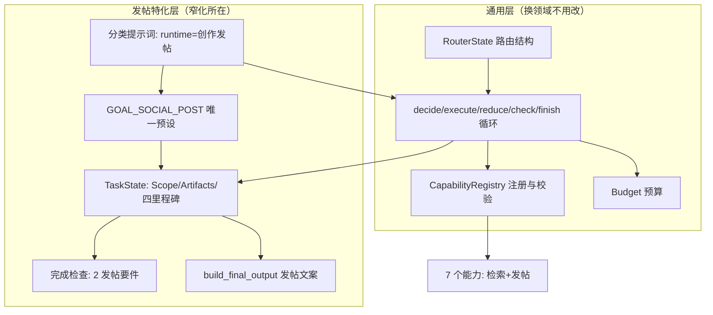

# Runtime 通用性专项评估

> 评估对象：Agent Runtime V1 的框架形态（入口路由 + graph/state/completion/registry + capabilities）。
> 触发问题：V1 解决了「山西第一天推文」，但用户感觉这套方案窄，不确定是「能力还不够多」还是「框架本身窄」。
> 参照系：[architecture/00-07 演进线](../../design/architecture/00-photo-agent-architecture.md)、[Agent Runtime 专题中枢](../../design/2026-08-31-2-agent-runtime-hub.md)。
> 本次为代码与文档走查型评估，未起服务做运行时验证；Runtime 相关单测 98/98 通过作为基线证据。

## 结论

**框架窄，不是能力数量问题。** 两者可以用一个判别实验区分：假设新增 10 个能力（对比分析、相册整理、废片标记等），它们能否被现有框架承载并正确执行？走查结论是不能，卡点全部在语义层：

- 任务空间只有一个维度。`run_runtime` 硬编码 `GOAL_SOCIAL_POST`（graph.py:440），`_GOAL_PRESETS` 仅一条预设（state.py:24），入口分类器把 runtime 类别定义为「挑选照片并生成标题、发布文案等创作内容」（photo_agent.py:77）。
- TaskState 不是中性的任务事实容器，而是发帖管线的字段化：`Scope` 是照片硬约束概念，`Artifacts` 的 candidate_ids/selected_ids/copy_draft 是发帖产物，`Progress.todo` 的四个里程碑 locate→candidates→select→copy 是预装的固定计划（state.py:76-121）。
- 9 种观察归约、2 个完成要件检查、`build_final_output` 的输出格式，全部只认识发帖一种形状（state.py:44-52、completion.py:34、state.py:423）。

换句话说：**能力挂在 registry 上，任务空间闭合在 state 层**。加能力改变不了第二种开放目标的执行路径，这是「框架窄」的直接判据。

需要同时说明的两点定性：

- 这个窄符合 V1 的设计目标。03 文档原话「V1 只解决一个问题：让一个 Goal 可以跨越多次能力调用持续执行」，V1 的验收用例就是山西帖子。用户期待的「通用」在演进线上是 V3（能力系统）+ V4（计划与上下文）的职责，目前尚未开始。
- 窄化在持续加深。AR9/AR11/AR12/AR14 每次修复都把照片领域语义往「框架无关核心」沉淀（范围物化、范围交集、交付模式关键词匹配、NEF 排除）。这是「根因优先」修复策略的自然结果，可靠性收益真实，但使 state.py 越来越像发帖专用引擎。

## 维度评分

总分 **4.9/10（作为通用 Agent 框架的当前形态）**。与历史 8.2 分（[2026-08-31 复评](2026-08-31-agent-runtime-and-done-reassessment.md)）不冲突：8.2 评的是「V1 交付质量」，本报告评的是「作为通用框架的形态」，参照系不同。

### 编排外壳通用性：8.5/10

- **得分点**：
  - decide→execute→reduce→check→finish 循环与业务语义完全分离，换目标类型不需要动图结构（graph.py:398-413）。
  - `CapabilityRegistry` 是全仓最干净的无业务抽象：能力注册、参数类型校验、spec 输出、decide_hint 聚合均领域无关（registry.py:70-129）。
  - 模型与程序的责任划分清晰：decide 是唯一 LLM 决策点，完成检查与预算停止全部程序化。
  - 预算三维度（步数/时长/成本）与成本回调挂接方式可复用（graph.py:367-388）。

### 任务空间通用性：3.5/10（核心失分）

- **失分点**（按数据流顺序）：
  - `new_goal` 用关键词匹配 description（「尽可能多」「二次挑选」）决定交付模式（state.py:143），目标语义与用户措辞形状直接耦合，是最典型的窄化证据。
  - `_GOAL_PRESETS` 单条目、`_REQUIREMENT_CHECKS` 两要件、`_MILESTONE_LABELS` 四里程碑，三张表都只有发帖一行（state.py:24-41、completion.py:34）。
  - `summarize_state` 的每一行都是发帖字段（候选照片/已选照片/文案草稿），给 decide 的状态视图天然排除其他任务形态（state.py:376-404）。
  - `build_final_output` 硬编码发帖/候选交付/深链兜底的回答文案（state.py:423-487）。
- **得分点**：归约按 obs.kind 显式分派、未知 kind 报错、有界集合上限，这套纪律本身是可扩展的好底子。

### 入口开放性：4.0/10

- **失分点**：分类器提示词把 runtime 描述为「需要挑选照片并生成标题、发布文案等创作内容的多步任务」（photo_agent.py:77-78）。「对比两年春天的洱海照片并总结进步」「把上个月的照片按主题整理」这类开放目标会被分进 rag/combined/tool 固定管线，只得到检索结果而非任务执行。
- **得分点**：分类→五路的路由结构与 V0-V5 累积架构图一致，固定管线对简单请求的保护（不被迫走 Runtime）符合「简单请求不退化」原则。

### 能力层丰富度与抽象层级：5.0/10

- **失分点**：7 个能力（resolve_trip/sql/rag/hybrid/fetch_details/select_photos/write_post）全部服务「检索+发帖」一条链，没有第二类任务的能力样本；检索类三个能力本质是同一个「query→ids」契约的三种实现，抽象层级未拉开（V3 的 Tool/Skill/Workflow 分层不存在）。
- **得分点**：单个能力的契约质量高（使用时机、参数声明、错误语义、progress_details 聚合在定义处），`capability_run` 护栏与结构化 LLM 入口规范。这一层「少而精」符合 V1 定位，扣分主要在「没有为泛化预留第二个压力测试形态」。

### 可靠性纵深：6.5/10

- **得分点**：超出 V1 设计的部分：确定性终态模型（empty_scope/candidate_overflow/needs_clarification 等）、会话内澄清续跑、权威范围物化与双层范围归属校验、能力异常不炸循环。这些实际是 V2「失败也是状态」的部分落地。
- **失分点**：错误一律收敛为 terminal（capability_failed 等），没有 V2 设计的 status 分层（empty/invalid_input/temporary_error/permanent_error/low_confidence）与对应恢复策略（有界 retry/fallback），一次瞬时故障即终局。

## 分层定位图

通用层与特化层的边界在 `reduce_observation` 入口处断裂：循环外壳把观察交给归约层时，语义世界就只剩发帖一种。

## 判别实验：第二个目标类型的实际路径

以「对比 2025 和 2026 春天的洱海照片，总结我的拍摄进步」为例走查：

1. 分类器读提示词示例（全部是检索/发帖形状），大概率分到 combined 或 rag，得到照片列表和一段泛泛回答，任务目标（对比与总结）不进入任何执行结构。
2. 即使人工把它送进 Runtime，`new_task` 会给它发帖的四里程碑，`resolve_trip` 会尝试把「春天」解析成硬约束范围，`write_post` 会给它写发布文案而非对比结论，完成检查要求它先「选照片」再「有文案」。
3. 全程没有任何一层会问「这个目标需要什么要件」，因为要件表里只有发帖两件。

结论：第二种开放目标当前无法经系统完成，阻断点不在能力数量，在 state 层语义闭合。

## 里程碑的定性：预装计划而非渐进分解

03 文档写「Task Decomposition 在 V1 可以是渐进的，不必先生成完整计划」，实现里则预装了完整的四阶段计划（locate/candidates/select/copy），decide 提示词还要求「优先选择能推进待办里程碑的能力」（graph.py:121-125）。实际形态是**固定管线 + LLM 在检索段选工具**，不是 LLM 组合任务。这个定性解释了一个同源现象：对山西 case 的可靠性（管线确定所以可验证）与对其他任务的排他性（管线唯一所以无入口）是同一枚硬币的两面。AR9 的修复方式（程序物化范围、禁止软提示越权）也顺着管线思维加深了这一面。

## 对照演进线的定位

- 当前坐标：V1 完整 + V2 部分（终态/澄清/范围校验），V3/V4 未开始。
- 00 文档给 V3 的进入条件是「逻辑开始散落且难复用」，V4 是「任务变长、上下文开始过载」；hub 下一轮建议是「再次出现新的开放目标类型时，先为其定义完成要件、失败终态和可重复用户用例，再接入 Runtime」。
- 结构性风险：按现状，「接入第二个目标类型」不是往 `_GOAL_PRESETS` 加一行，而是重写 state.py 的 schema、归约表、摘要与输出组装。这与 V3 目标「新组合请求主要靠复用，而不是新增 Pipeline」在核心层已经冲突，属于应在升级前显式面对的债务。

## findings_for_backlog

- **AR15 Runtime 任务空间一维化**：入口分类把 runtime 限定为创作发帖类，run_runtime 硬编码唯一 goal，TaskState/归约/完成检查/输出组装为发帖特化，新增能力无法让第二种开放目标经 Runtime 执行。严重程度 P1（阻塞演进线上 V3/V4 的复用目标）。详见 backlog 条目。

## 执行证据

- Runtime 定向单测 98/98 通过（`tests/test_runtime_{core,graph,state,progress,capabilities}.py`）。
- 代码走查清单：`agent/internal/runtime/{graph,state,completion,registry,budget,progress}.py`、`capabilities/{__init__,retrieval,creation,resolve_trip,common,photo_tools}.py`、`agent/cli/photo_agent.py`（分类与路由）、`docs/design/architecture/00-07`、Runtime 专题中枢与 v1.0.16 归档。
- 未做运行时验证：本评估回答的是结构问题，行为表现已有 AR6/AR9/AR11 真实验收记录支撑，无需重复起服务。
