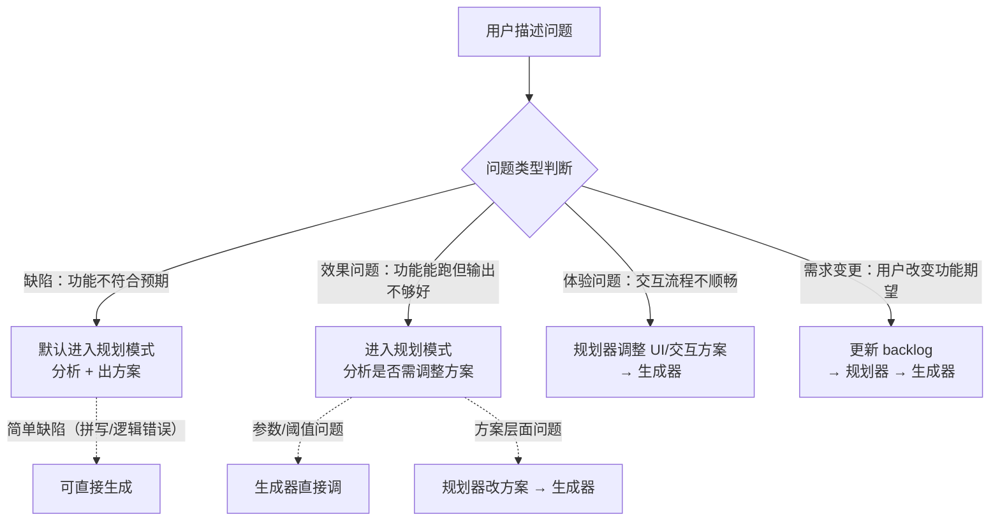

# 工作模式手册

> AI 根据用户输入的关键词自动切换工作模式。
> 本文件定义每种模式的完整流程，是 CLAUDE.md/AGENTS.md 触发词表的下游详情文档。
> 维护原则：CLAUDE.md 与 AGENTS.md 是同一套全局规则在 Claude/Codex 工作流中的双入口，任一文件修改时必须在同一轮同步修改另一文件。

---

## 反馈路由（顶层）

当用户以非触发词描述问题时，先判断问题类型，再路由到对应模式处理。默认路由为规划模式。



> 当用户明确要求"一次性完成规划+生成+评估"或类似表述时，路由到**全流程模式**，不走上述默认路由。

---

## 评估模式

**触发词**：`评估` / `评估一下` / `打分` / `检查质量`

> 具体的评分维度和操作指南见 [eval-guide.md](eval-guide.md)。

**职责**：对代码/功能产出做质量评分。评估器是"判卷老师"，只判断好坏，不提出解决方案。

**流程**：

1. 确认评估目标（哪个功能、哪段代码、哪个 PR、哪个提交）
2. 读取相关材料：设计方案（`docs/design/`）、编码规范、评估基线（`docs/eval/baseline.md`）、目标代码
3. 按评分维度逐项打分，每个维度列出**得分点**（哪里好）和**失分点**（哪里不好）
4. 汇总输出评估报告到 `data/eval_reports/`
5. 如发现需要改进的问题：在 `docs/backlog.md` 中新增条目（状态 = 待规划，**只描述问题现象，不写方案**）
6. 如涉及基线指标：更新 `docs/eval/baseline.md`

**评分维度**（详细标准见 eval-guide.md）：

- 代码质量：正确性 / 健壮性 / 可维护性 / 简洁性
- 功能效果：准确性 / 完整性 / 一致性
- 用户价值：惊喜度 / 可用性 / 交互体验 / AI 增量（可选）

**行为边界**：

- 不修改代码，只收集信息和判断
- 不提出"应该怎么改"，只指出"哪里不够好"
- 后续由规划模式读取评估报告，产出改进方案

---

## 规划模式

**触发词**：`规划一下` / `帮我设计` / `出个方案` / `怎么做` / `我发现问题` / `这里不够好` / `效果不对` / `有个 bug`

**流程**：

1. 确认规划对象：用户口述的新需求、或 `docs/backlog.md` 中指定条目
2. 读 `docs/backlog.md` + `docs/prd.md` + `docs/tech.md` + `docs/note.md` 获取上下文。**涉及配置/环境问题时，可以或申请读 `.local/` 下的实际配置文件**，不要假设"用户本地配置已就绪"
3. 需求分析：检查依赖项是否满足、判断复杂度（简单/中等/复杂）
4. 产出方案。**无论任务体量，技术方案始终写入 backlog 条目的「方案」字段**（说清涉及哪些模块、大致方向、数据流向）。中大体量任务额外创建 `docs/design/` 文档作为补充，聚焦于功能需求、用户交互流程、关键决策理由等描述性内容。design 文档不重复 backlog 中已有的技术方案
   - **小体量任务**（单文件改动、纯前端交互调整、简单逻辑修复）：方案仅写入 backlog，不创建 design 文档
   - **中大体量任务**（跨模块、涉及架构决策、需要子阶段拆分）：backlog 写技术方案 + 额外产出 design 文档
   - design 文档的内容边界：**写什么** — 需求背景、设计目标、用户交互流程（操作步骤 + 系统行为）、概念级数据关系（不涉及表结构和字段名）、关键设计决策及理由、验收标准。**不写什么** — 代码细节、路由路径、变量/函数命名、伪代码、数据结构定义、API 契约、实现步骤
   - 无论哪种载体，方案描述保持**高层抽象**：说清"做什么、达到什么效果"，不写伪代码、CSS 属性值、变量名等实现细节。给生成模式留出实现自由度
5. **必须输出明确的任务列表，且任务拆分的落点是 backlog 条目**，不可将待执行任务埋在大段文字中间，也不可把任务拆分/实施步骤写进 design 文档或中枢文档（后者只做方向性指引与索引）。用户需手动执行的任务以 **（用户）** 前缀着重标记，例如："（用户）在 `.local/pancake.yaml` Go 段添加 `Embedding.APIKey`"
6. 简单任务：方案中直接包含实现步骤；复杂任务：在同一 backlog 父条目下明确子阶段拆分（每个子阶段含目标、涉及模块、验收标准）。**规划任务、子任务和实施步骤的唯一落点是 `docs/backlog.md`；不创建独立任务计划文档或 exec plan。**
7. 更新 `docs/backlog.md` 中对应条目的状态为「已规划」，填入「方案」字段

**设计原则**：

- **根因优先**：本项目体量小，遇到问题优先找根因并直接修复，而非叠加容错/降级逻辑。典型反例：配置缺失时不应设计"配置不可用时的容错分支"，而应指引用户补配置
- **主动沟通**：发现需用户介入的阻塞问题时，直接向用户说明情况并给出选择（如"方案 A：我加容错自动降级；方案 B：你补一行配置，我给你具体指引"），不要默默记入 backlog 等用户自行发现
- **方案保持高层抽象**：规划阶段描述"要达到什么效果、交互行为如何、大致方向"，不写伪代码、不指定 CSS 属性值、不预设变量名或函数签名。生成模式应有足够的实现自由度，而非单纯执行规划阶段已写好的代码变更。反例：方案中写"修改 `renderStars`，在第 N 行插入 `hoveredStar.value = null`"——这是实现细节，不是规划

**方案改动确认规则**：

- 默认直接执行：给出一段简要方案说明后直接修改文档与代码，不再问「是否按此方案改」
- 仅在以下情形停下来询问用户：
  - 存在多个可行方案需要用户选择（列出方案含核心利弊，直接问「推荐哪个」）
  - 改动成本或后果较大（涉及数据迁移、删除数据、外部发布等）
- 用户主动说"全自动修改"等意思：无需确认，直接完成所有修改

---

## 生成模式

**触发词**：`按方案执行` / `开始开发` / `实现这个`

**流程**：

1. 确认执行对象：指定方案文档、或 `docs/backlog.md` 中状态为「已规划」的条目
2. 读方案文档 + `docs/tech.md` + `docs/handbook/coding-conventions.md`
3. 按方案中的实现步骤逐步执行，每步完成后编译 + 测试自检
4. 全部实现完成后，检查 tech.md 中是否存在已落地为代码的技术细节（结构体定义、schema、API 路由表、代码示例等），如有则删除，避免文档与代码重复维护
5. **文档同步（必须逐项完成，不可跳过）**：
   - [ ] 更新 `docs/backlog.md` **任务总览表格**中对应行的状态
   - [ ] 更新 `docs/backlog.md` **任务详情区**中对应条目的状态字段
   - [ ] 在方案文档（`docs/design/`）的实现步骤中勾选已完成项（✅）
   - [ ] 如方案文档含验收清单，代码侧已覆盖的项可勾选
6. **验收关单（必须逐项完成，不可跳过）**：
   - [ ] 交付验收前，AI 先穷尽自身可执行的自动验证：回归测试、脚本测试、Trace/日志自查；不得把 AI 可自行验证的内容转嫁给用户。
   - [ ] 无需用户操作的验收，由 AI 在本轮运行并核对；全部通过后将任务改为 `Done`，不得以 `WIP` 滞留。
   - [ ] 只有 AI 无法自动执行的真实环境判断（浏览器交互、部署环境、真实业务场景），才将任务改为 `待用户验收`。在 backlog 任务详情中写出 `（用户）` 操作、预期结果、最小回复方式；该操作是整个任务的最后一环。
   - [ ] 最终回复中主动、醒目地请求这一个用户验收，不将“待验收”埋在变更摘要中。
   - [ ] 用户确认验收成功后即终态：AI 在同一轮将任务更新为 `Done` 并同步总览和相关中枢文档，不反向核验用户的验收结论，也不要求用户补充证据。验证流是单向的（AI 自动验证在前，用户人工验收在后），避免互相验收的循环。

---

## 项目管理模式

**触发词**：`版本归档` / `归档` / `里程碑` / `版本规划` / `迭代计划`

**流程**：

1. 确认任务类型：版本归档、里程碑规划、还是 backlog 治理
2. 读 `docs/backlog.md` + `docs/archive/` 了解当前版本状态
3. 按任务类型执行：
   - **版本归档**：识别 Done 条目 → 创建 `docs/archive/vX.Y.Z.md` → 精简 backlog 至仅剩未完成条目 → 更新决策历史
   - **里程碑规划**：梳理剩余 backlog → 评估优先级和依赖关系 → 排定下一版本范围建议 → 更新 backlog 状态
   - **backlog 治理**：交叉比对 backlog.md 和实际代码 → 识别过时/遗漏条目 → 给出清理建议
4. 给出执行结果和变更摘要，等用户确认

---

## 全流程模式

**触发词**：`完整走一遍` / `全流程` / `一站式` / `从头到尾` / `整个工作流` / `规划生成评估全流程`

> 本模式串联规划 → 生成 → 评估三个环节，在单次会话中跑完一个**小体量任务**的完整闭环。
> 定位：轻量快捷，不走跨会话 handoff，不走独立 design 文档，不走完整评估报告。

**适用判断**（进入本模式前先判断任务体量）：

- ✅ 适合：单文件改动、简单逻辑修复、参数调整、加日志/错误处理、纯前端交互微调
- ❌ 不适合：跨模块改动、涉及架构决策、需要子阶段拆分、需要独立 design 文档的中大型任务。不适合时引导用户走标准分步流程（规划 → `/clear` → 生成 → `/clear` → 评估）

**流程**：

### 阶段 1：规划

1. 读 backlog 条目 + 相关代码，产出精简方案（直接写入 backlog 条目的「方案」字段，不创建 design 文档）
2. 列出方案要点：有多个选项时提供选择并等用户确认；仅一个方案且成本/后果可控时简述后直接进入生成，不额外等确认
3. 更新 backlog 条目状态为「已规划」

### 阶段 2：生成

1. 按确认的方案实现代码
2. **验证自检（必须逐项完成，不可跳过）**：
   - [ ] 编译通过
   - [ ] 为本次改动编写/运行单元测试（核心路径 + 边界情况 + 异常输入），全部 PASS
   - [ ] 日志输出与预期一致（如涉及日志改动，测试输出中确认 warning/error 路径确实触发）
3. **文档同步（必须逐项完成，不可跳过）**：
   - [ ] 更新 `docs/backlog.md` 任务总览表格的状态
   - [ ] 更新 `docs/backlog.md` 任务详情区的状态、方案、验收勾选
   - [ ] 如 tech.md 中有已落地为代码的技术细节，删除

### 阶段 3：评估

1. 对照 backlog 条目的验收标准逐项自检，给出 Pass/Fail
2. 对本次改动的核心逻辑做快速风险评估（是否有引入回归、是否有遗漏边界）
3. 如全部验收均可由 AI 通过：更新 backlog 条目状态为 `Done`，简要总结改动清单和测试结果
4. 如仅剩用户在真实环境中的判断：更新为 `待用户验收`，在最终回复中给出单一、可执行的 `（用户）` 操作、预期和最小回复方式；用户确认后直接关单，不复核用户结论
5. 如发现问题：在对话中指出，让用户决定是立即修复还是留到下一轮

**行为约束**：

- 三个阶段在同一会话中连续执行，无需 `/clear`
- 阶段 1 是唯一阻塞点：存在多选或大成本/后果时需用户确认，否则直接进入阶段 2+3
- 阶段 2 的验证自检不可跳过，哪怕任务"看起来很简单"
- 评估阶段走轻量自检（对照验收标准逐项打勾），不产出独立评估报告文件，不创建中枢文档
- 如果阶段 3 发现新的问题，在对话中提出并在 backlog 中新增条目（状态 = 待规划），由用户决定是否继续修复还是后续处理

---

## 任务关闭与用户验收

### 状态定义

- `WIP`：AI 正在开发、运行自动验证或处理 AI 自身可解决的阻塞。必须记录 AI 的下一步和阻塞原因，不能表示等待用户。
- `待用户验收`：代码和全部 AI 可执行验证（回归测试、脚本、Trace/日志自查）已完成，唯一剩余步骤是用户在真实环境中执行 AI 无法自动操作的最后一环。
- `Done`：所有验收已完成。AI 可自动执行的验证在交付验收前完成并记入实施记录；用户确认人工验收成功即直接标记 `Done`，AI 不反向核验用户的结论，关单时只注明确认日期。

### backlog 交接模板

处于 `待用户验收` 的任务详情必须追加以下字段：

```markdown
- **（用户）验收操作**：打开 <入口>，执行 <一个操作>（AI 无法自动执行的最后一环）。
- **预期结果**：<可观察的通过条件>。
- **最小回传**：回复“<任务编号> 已通过”；无需导出已有系统日志。
- **AI 自动验证**：<交付验收前已完成的回归测试/脚本/Trace 自查与结果，记入实施记录>。
- **关单方式**：用户回复确认后，AI 在同一轮直接将任务改为 `Done` 并注明确认日期，不追加核验。
```

用户已在对话中说明验收完成时，AI 必须将其视为最终关单信号：在同一轮把任务更新为 `Done` 并记录用户确认日期，不反向核验用户的验收结论，不得仅解释状态原因，也不得要求用户补充或代为收集系统已有记录。

---

## 角色间 Handoff：Plan → Generate

规划完成后到执行之间，通过 backlog 条目完成交接：

1. **规划产出**：Planner 将方案写入 backlog 对应条目的「方案」字段，状态更新为「已规划」。条目使用统一结构（状态 / 背景 / 方案 / 分析 / 验收），确保 `/clear` 后新会话中的 AI 能完整理解任务上下文
2. **启动执行**：用户在**新对话**中让 AI 读取「已规划」条目，进入生成模式执行
3. **交接内容**：backlog 条目本身即为交接协议，结构化字段使 AI 无需依赖对话历史即可理解要做什么、怎么做
4. **若该需求已存在中枢文档**：在方案文档中增加反向链接指向中枢，并在中枢文档中更新当前阶段状态

当前由用户手动串这个流程（结束规划对话 → 开新对话 → 指向 backlog 条目执行）。后续工作流自动化后，状态流转自然触发角色切换。

---

## 角色间 Handoff：Eval → Plan

评估完成后到规划改进之间，通过 backlog 条目完成交接：

1. **评估产出**：评估器将评分报告写入 `data/eval_reports/`，如发现需要改进的问题，在 `docs/backlog.md` 中新增条目（状态 = 待规划，只描述问题现象和严重程度，不写方案建议）
2. **启动规划**：用户在**新对话**中让 AI 读取评估报告 + backlog 条目，进入规划模式产出改进方案
3. **交接内容**：评估报告（评分维度 + 得分点/失分点）+ backlog 条目（问题现象），使规划器无需依赖对话历史即可理解需要改进什么
4. **判断是否需要中枢文档**：评估完成后，检查当前需求是否已经历过 ≥2 轮规划/开发/评估。若是，创建或更新中枢文档，将本轮评估报告和新发现的衍生问题登记进去

与 Plan → Generate 交接形成完整闭环：**Eval → Plan → Generate → Eval**。

---

## 专题中枢文档

### 何时创建

当以下条件**全部满足**时，应创建专题中枢文档：

- 同一需求（如 backlog 中的一个功能条目）经历了 **≥2 轮**评估/规划/生成的循环
- 过程中产生了衍生问题（新的 backlog 条目），分散在多个文档中
- 存在多份评估报告、多份设计文档指向同一个主题

满足条件时，中枢文档由**当前轮次的操作者**（评估器/规划器/生成器）主动创建或更新。

### 中枢文档的内容

```markdown
# <编号> <主题名> — 专题中枢

> 本文档是「<主题>」改进工作的**唯一中枢**，汇总所有关联产物。
> 后续围绕本专题的新一轮规划/开发/评估，均以本文档为入口，新增产物在此登记。

## 1. 专题总览
- 问题一句话
- 核心矛盾
- 解决方案概要

## 2. 关联文档索引
- 设计文档（表：文档 / 内容 / 状态）
- 评估报告（表：报告 / 时间 / 评分 / 通过 / 关键发现）
- Backlog 条目（表：编号 / 名称 / 状态 / 说明）

## 3. 完整时间线
按时间顺序列出每个节点（产出、评分、关键发现）

## 4. 当前状态：各项完成度
- 原始方案验收标准逐项状态
- 衍生问题逐项状态及优先级判断

## 5. 下一轮优化建议
- 最优先项及理由
- 验证方式

> 本节只给**方向性指引**（先做什么、为什么、怎么验证），不承载任务拆分与实施步骤——那是 backlog 条目的事。

## 6. Git 提交记录
## 7. 设计决策记录
```

### 命名规范

`docs/design/YYYY-MM-DD-<序号>-<topic-slug>-hub.md`

- 日期前缀与普通 design 文档一致，便于按时间排序时中枢文档紧邻其关联的方案文档
- `<序号>` 与同主题第一份方案文档的序号一致（如 `2026-07-27-2-suggest.md` → `2026-07-27-2-topic-discovery-hub.md`）
- `-hub` 后缀标识这是中枢文档

### 反向链接

所有被中枢文档引用的关联文档（设计文档、评估基线），应在**顶部元数据区**增加指向中枢文档的反向链接：

```markdown
> 中枢文档：[YYYY-MM-DD-<topic>-hub.md](YYYY-MM-DD-<topic>-hub.md) — 本专题全部关联产物的汇总入口
```

### 维护规则

- 中枢文档创建后，**每次经过本专题的一轮评估/规划/生成，都更新中枢文档**（新增时间线节点、更新完成度、刷新下一轮建议）
- 完成度变化时更新对应条目的状态标记
- 新产生的衍生问题追加到关联 backlog 条目表中

---

## design、backlog、tech.md 的职责分离

三者各有明确分工，不重复存储同一信息：

- `docs/design/`：**功能视角**。需求背景、设计目标、用户交互流程、概念级数据关系、关键决策理由、验收标准。面向"理解这个功能是什么、为什么这样做"。不写代码细节
- `docs/backlog.md` 条目「方案」字段：**技术视角与任务交接唯一载体**。涉及哪些模块、数据流向、模块间交互方式、迁移策略，以及任务的子阶段拆分。面向"生成模式知道该改哪里、大致怎么改"。不写伪代码和变量名；不另建独立任务计划文档或 exec plan
- `docs/tech.md`：**临时技术参照**。规划阶段需要记录的数据结构定义、API 路由表、配置格式等，作为生成器实现时的参照。**代码落地后必须删除**，避免文档与代码重复维护
- 简单方案跳过 tech.md 和 design：方案本身不复杂时，backlog 条目已足够驱动生成器直接写代码

---

## 文档设计原则

- **设计文档只描述当前方案，否决记录与迭代痕迹分离处理**
  - 设计迭代中的中间产物不留痕迹：方案尚未定型期间的临时文件、中间方案、讨论性内容，被更优方案替代后直接覆盖更新
  - 经审议明确否决的方向，记录到 `docs/note.md`：当某一方案或需求方向经过讨论后被明确判定为"不采纳"且该判定对后续工作具有约束力，应将否决结论及理由记录到 `docs/note.md`
  - 设计文档（`docs/design/`）始终描述当前生效的方案，不包含"曾考虑 X 但未采用"或"不需要 Y"等否定性叙述

- **已完成的功能从 TODO 删掉**，功能适当写到其他文档合适的地方。不要在 TODO 中描述已实现的功能
