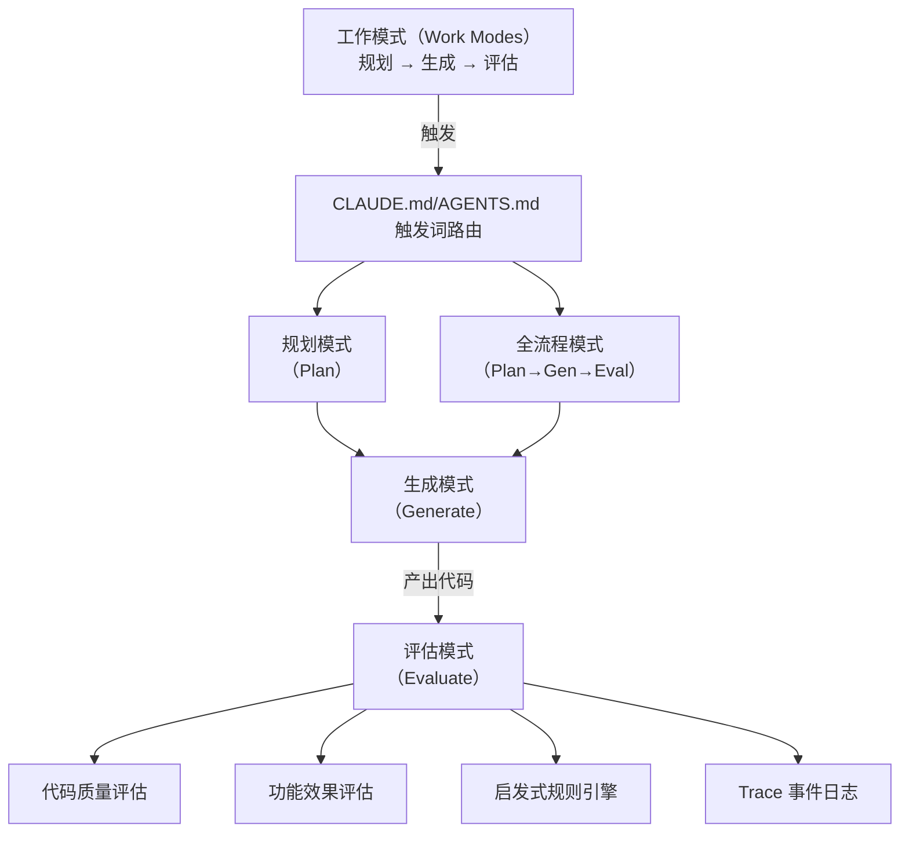

# Harness Engineering — 架构概览

> Harness 是 Photo Agent 项目的 AI 辅助开发工作流体系，包含工作模式、评估系统、Trace 日志三个子系统。
> 本文档是 Harness 的**高层架构索引**，只描述模块职责和关联关系，不展开实现细节。

---

## 1. 整体架构

## 2. 子系统

### 2.1 工作模式（Work Modes）

AI 根据用户在对话中使用的触发词自动切换工作模式。四种模式形成 `评估 → 规划 → 生成 → 评估` 闭环。

- **评估模式**：对代码/功能产出做质量评分，产出评估报告 + backlog 条目（只描述问题，不写方案）
- **规划模式**：分析需求并产出方案文档，更新 backlog
- **生成模式**：按方案实现代码，同步更新文档
- **全流程模式**：规划→生成→评估串联，适合小体量任务的单会话闭环
- **项目管理模式**：版本归档、里程碑规划、backlog 治理

### 2.2 评估系统（Eval System）

对聚类标题、选题质量等模块做多维度质量评分。

- **评分维度**：代码质量（正确性/健壮性/可维护性/简洁性）+ 功能效果（准确性/完整性/一致性）+ 用户价值（惊喜度/可用性/交互体验）
- **启发式规则引擎**：`agent/data/eval_rules.yaml` 配置规则，`agent/chain/eval_engine.py` 执行，支持跨簇规则
- **评估报告**：JSONL 格式追加到 `data/traces/YYYY-MM-DD.jsonl`，通过 API 查询历史报告
- **LLM-judge**：暂缓，prompt 已设计完成

### 2.3 Trace 结构化日志

Go（plogger）和 Python（自建）统一输出结构化 JSON 日志，`trace_id` 全链路透传（Go ↔ Python 通过 `X-Trace-Id` header）。大体积 payload（LLM prompt/response 全文）写入独立文件，日志行只记路径引用。

## 3. 文档索引

### 流程与规范

- [docs/handbook/work-modes.md](handbook/work-modes.md) — 四种工作模式完整流程 + handoff 协议
- [docs/handbook/eval-guide.md](handbook/eval-guide.md) — AI 评估模式操作指南（工具使用、检查流程）
- [docs/handbook/coding-conventions.md](handbook/coding-conventions.md) — 各语言编码规范
- [docs/handbook/doc-review.md](handbook/doc-review.md) — 文档审阅规范
- [CLAUDE.md](../CLAUDE.md) — 全局协作规则 + 触发词路由
- [AGENTS.md](../AGENTS.md) — 全局协作规则 + 触发词路由

### 设计与方案

- [docs/design/2026-07-26-1-harness-design.md](design/2026-07-26-1-harness-design.md) — Harness 整体设计（思路 + 发展过程）
- [docs/design/2026-07-26-2-eval-system-design.md](design/2026-07-26-2-eval-system-design.md) — 评估系统方案设计
- [docs/design/2026-07-27-3-eval-user-value-dimension.md](design/2026-07-27-3-eval-user-value-dimension.md) — 用户价值维度扩展方案

### 评估数据

- [docs/eval/baseline.md](eval/baseline.md) — 评估基线记录（RAG 检索 + 模块质量 + 管道正确性）
- `data/eval_reports/` — 评估报告 JSON 文件
- `data/traces/` — Trace 结构化日志（JSONL）

### 专题中枢

- [docs/design/2026-08-01-topic-discovery-design.md](design/2026-08-01-topic-discovery-design.md) — 主题发现统合设计文档（当前功能架构 + 主要设计变更记录）
- [docs/archive/topic-discovery/2026-07-27-5-topic-discovery-hub.md](archive/topic-discovery/2026-07-27-5-topic-discovery-hub.md) — 3.4 主题发现完整改进链中枢（时间线 + 10 轮评估 + 全部提交记录，已归档）

## 4. 关键设计决策

- **评估不修改代码**：评估器只判断好坏，不提出方案。改进方案由规划器读取评估报告后产出
- **角色间 Handoff**：通过 backlog 条目结构化字段传递上下文，无需依赖对话历史。规划产出写入「方案」字段，评估发现写入新条目
- **中枢文档**：同一需求经历 ≥2 轮循环后创建中枢文档，串联所有关联产物
- **全流程模式定位**：轻量快捷，适合单文件改动。跨模块任务走标准分步流程
