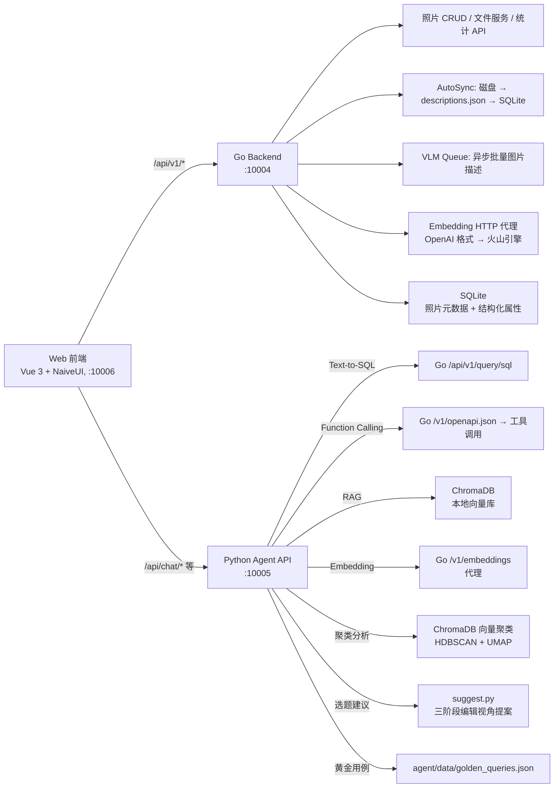
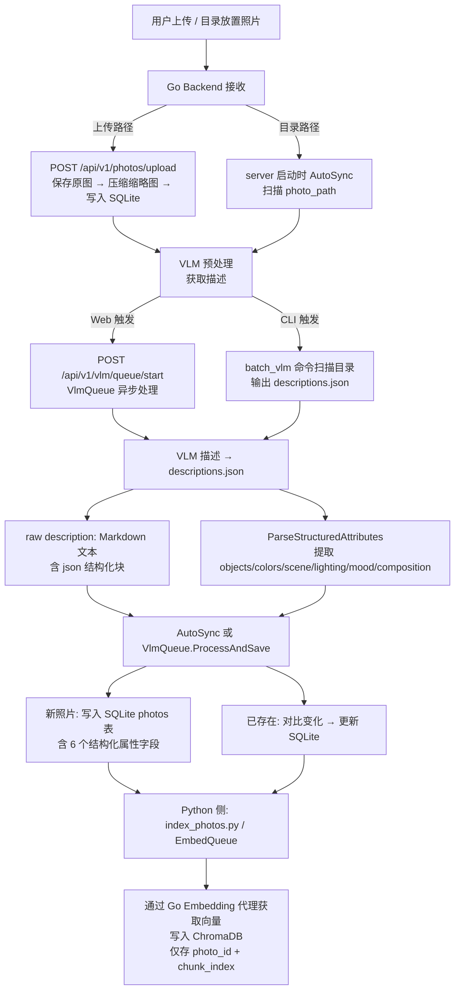
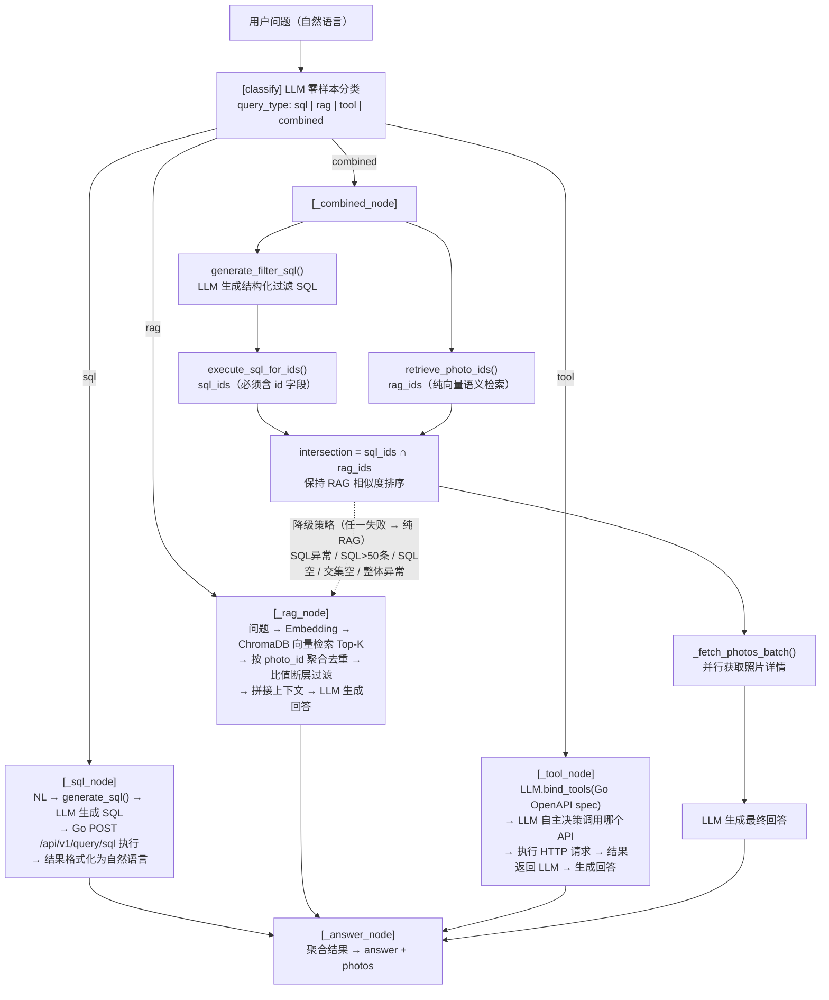
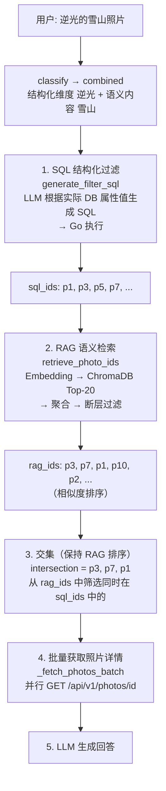
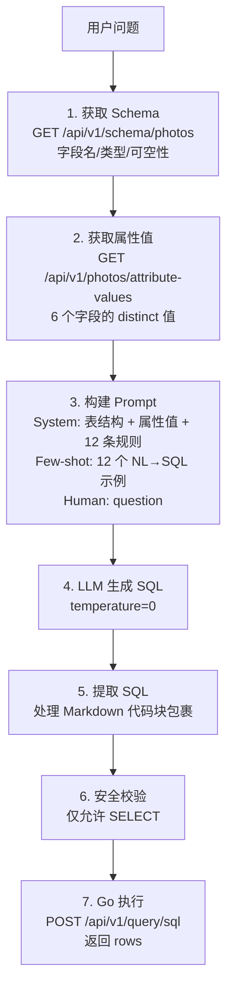

# Photo Agent — 技术方案文档

> Go 业务后端（照片存储/EXIF/VLM/Embedding代理）+ Python AI 服务层（LangGraph 编排/Chroma 向量检索/Text-to-SQL） + Web 前端（Vue 3 + NaiveUI）。
> 早期曾用 Dify 验证 Agent 可行性，现已不作为核心方案。

---

## 1. 整体架构



### 1.1 职责边界

- **Go 后端**：照片元数据管理、文件服务、导入流水线、VLM 预处理、Embedding 代理、SQL 查询执行、OpenAPI 自描述。**不负责**：Agent 编排、向量检索、对话管理。
- **Python AI 服务层**：LangGraph Agent 编排、Chroma 向量检索、Text-to-SQL（NL→LLM→SQL→Go执行）、Function Calling 工具调用、FastAPI 对话服务。**不负责**：直接访问数据库或文件系统（所有数据操作通过 Go API）。
- **Web 前端**：照片管理（上传/浏览/筛选/删除）、AI 对话界面、VLM/Embedding 队列可视化。**不负责**：AI 推理、文件存储。

---

## 2. 技术栈

- **Web 前端**：Vue 3 (Composition API + TypeScript) + NaiveUI + Vite
- **Python Agent**：FastAPI + LangChain + LangGraph + ChromaDB + httpx
- **Go 后端**：Gin + GORM + SQLite + ImageMagick
- **AI 模型**：GPT-4o-mini / Qwen / 火山引擎 Doubao（LLM + VLM + Embedding）

---

## 3. 核心数据流

### 3.1 照片导入流程



### 3.2 Agent 查询路由（LangGraph）



### 3.3 Combined 组合查询详解

这是 `"蓝调时刻的街拍"` 一类复合查询的核心流程：



**SQL 值动态获取**：每次 `generate_sql()` / `generate_filter_sql()` 调用前，先从 Go `GET /api/v1/photos/attribute-values` 获取数据库中实际存在的属性值，拼入 System Prompt。LLM 只能使用实际值构造 LIKE 模式，避免生成 `backlight` 而 DB 存的是 `backlit` 这类不匹配。

### 3.4 Text-to-SQL 链路细节



### 3.5 VLM 预处理

- **批量 CLI**：`backend/cmd/batch_vlm/main.go` — 独立于 server，扫描目录 → VLM API → descriptions.json，中间每 10 张保存一次防止数据丢失，默认 3 并发
- **Web 队列**：Go 后端 VlmQueue — 通过 API 启停，单张/批量入队，异步调用 VLM → 写 descriptions.json → 更新 SQLite description 字段
- **图片压缩**：上传时直接用 ImageMagick 压缩（`convert -resize 512x512> -quality 85`），保留完整 EXIF
- **结构化提取**：`ParseStructuredAttributes()` 从 VLM 输出的 ```json 块中解析 6 个维度，通过映射函数（mapScene/mapLighting/mapMood）将中文描述归一化为英文标签

### 3.6 ChromaDB 向量库设计

**存储策略（Route B）**：ChromaDB 仅存最小元数据（`photo_id` + `chunk_index`），结构化属性全部在 Go SQLite 中。

**索引流程**：

```
descriptions.json → 分块器(RecursiveCharacterTextSplitter) → Embedding(Go代理) → ChromaDB
```

**检索流程**：

```
问题 → Embedding → ChromaDB.query(Top-K chunks) → _aggregate_by_photo()
→ _filter_by_ratio_gap() → 构建上下文 → LLM 回答
```

- 分块策略：RecursiveCharacterTextSplitter，chunk_size=500，chunk_overlap=100
- 聚合：同一照片多 chunk 只保留距离最小的一条
- 自动截断：相邻距离比值 ≥1.8 时截断（Max Ratio Gap），保留相关性高的结果

---

## 4. API 设计

### 4.1 Go Backend API(`/api/v1`)

**照片管理**：

- `GET /photos` — 照片列表（分页、timeline/tag/keyword/brand/lens/focal/iso 筛选、排序）
- `GET /photos/stats` — 综合统计（total/brands/lens/focal/gps/monthly/hourly）
- `GET /photos/:id` — 单张详情（含 6 个结构化属性）
- `GET /photos/:id/image` — 图片文件（?size=thumb 缩略图）
- `PUT /photos/:id/tags` — 更新标签
- `DELETE /photos/:id` — 删除照片（DB + 文件）
- `POST /photos/upload` — 上传照片（冲突检测：overwrite/skip/keep_both）

**VLM 队列**：

- `POST /vlm/queue/start` — 启动批量 VLM（支持 force 重新处理）
- `POST /vlm/queue/stop` — 停止队列
- `GET /vlm/queue/status` — 队列进度（total/completed/failed/current）
- `POST /photos/:id/describe` — 单张入队

**查询 & Schema**：

- `POST /query/sql` — 执行 SELECT SQL（双重安全校验）
- `GET /schema/photos` — 表结构（反射自 model.Photo）
- `GET /photos/attribute-values` — 6 个结构化字段的 distinct 值

**其他**：

- `GET /timelines` — 时间线列表
- `GET /timelines/:name/photos` — 某时间线下照片
- `GET /tags` — 标签列表
- `GET /tags/:name/photos` — 某标签下照片
- `POST /import/jobs` — 创建导入任务
- `GET /import/jobs/:id` — 导入进度
- `GET /health` — 健康检查

**独立路由**（非 `/api/v1` 前缀）：

- `POST /v1/embeddings` — Embedding 代理（OpenAI 格式 → 火山引擎）
- `GET /v1/openapi.json` — OpenAPI 3.0 自描述（Python Agent 工具解析）

### 4.2 Python Agent API（FastAPI, :10005）

**对话**：

- `GET /api/chat/health` — 健康检查
- `POST /api/chat/sessions` — 创建会话
- `GET /api/chat/sessions` — 会话列表
- `GET /api/chat/sessions/:id` — 会话详情 + 消息
- `PATCH /api/chat/sessions/:id` — 更新标题
- `DELETE /api/chat/sessions/:id` — 删除会话
- `POST /api/chat/sessions/:id/messages` — 发送消息 → AI 回复

**Embedding 管理**：

- `GET /api/embed/stats` — 嵌入统计（对比 Go DB 照片数）
- `POST /api/embed/cleanup` — 清理孤儿文档
- `POST /api/embed/photos/status` — 批量查询嵌入状态
- `POST /api/embed/queue/start` — 启动批量嵌入
- `POST /api/embed/queue/stop` — 停止队列
- `GET /api/embed/queue/status` — 嵌入进度
- `POST /api/embed/photos/:id` — 单张嵌入
- `GET /api/embed/photos/:id` — 嵌入详情

**黄金查询用例**：

- `GET /api/golden-queries` — 用例列表
- `POST /api/golden-queries` — 创建用例
- `POST /api/golden-queries/import` — 批量导入
- `DELETE /api/golden-queries/:id` — 删除用例
- `POST /api/golden-queries/evaluate` — 运行评估，返回 P@10/R@10/MRR

**选题建议（主题发现）**：

- `POST /api/suggest/run` — 生成选题建议（三阶段编辑视角提案管道），结果自动保存
- `GET /api/suggest/history` — 历史选题列表（时间倒序）
- `GET /api/suggest/history/:id` — 单条选题详情
- `DELETE /api/suggest/history/:id` — 删除选题记录
- `PATCH /api/suggest/history/:id/rating` — 更新评分（1-5 星）

**聚类分析**：

- `POST /api/cluster/run` — 执行聚类（参数：min_cluster_size 等）
- `GET /api/cluster/results` — 历史聚类结果列表
- `GET /api/cluster/results/:id` — 聚类结果详情（含每个 cluster 的照片列表）
- `DELETE /api/cluster/results/:id` — 删除聚类结果
- `POST /api/cluster/results/:id/clusters/:cid/generate-theme` — 为指定聚类生成主题标签
- `POST /api/cluster/results/:id/generate-all-themes` — 批量生成所有（或指定）簇的主题
- `POST /api/cluster/results/:id/evaluate-themes` — 批量评估簇标题（支持 cluster_ids 筛选）
- `POST /api/cluster/results/:id/clusters/:cid/evaluate-theme` — 单簇标题评估（不含跨簇规则）
- `GET /api/eval/reports` — 历史评估报告列表
- `GET /api/eval/reports/:id` — 单份评估报告详情 |

### 4.3 Web 前端路由

- `#/photos` (PhotoManagement) — 照片管理主页（浏览/筛选/上传/删除）
- `#/chat/:sessionId?` (ChatView) — AI 对话界面
- `#/golden-queries` (GoldenQueryManagement) — 黄金查询用例管理
- `#/cluster` (ClusterView) — 聚类分析与组图发现

Vite 开发代理：

- `/api/v1/*` → Go Backend (:10004)
- `/api/chat/*`, `/api/embed/*` → Python Agent (:10005)

---

## 5. 数据模型

### 5.1 Go SQLite — Photo 表

```go
type Photo struct {
    // 标识
    ID          string    `gorm:"primaryKey" json:"id"`
    Filename    string    `json:"filename"`
    FilePath    string    `json:"file_path"`
    // 组织
    Timeline    string    `json:"timeline"`       // e.g. "2024-02-云南"
    Tags        string    `json:"tags"`           // JSON array string
    // AI 描述
    Description string    `json:"description"`    // VLM 原始输出（含 ```json 结构化块）
    // 结构化属性（VLM 提取，逗号分隔多值）
    Objects     string    `json:"objects" gorm:"type:text"`     // 主体类型
    Colors      string    `json:"colors" gorm:"type:text"`      // 主色调
    Scene       string    `json:"scene"`                        // 场景类型
    Lighting    string    `json:"lighting"`                     // 光线特征
    Mood        string    `json:"mood"`                         // 情绪氛围
    Composition string    `json:"composition" gorm:"type:text"` // 构图特点
    // EXIF
    ShotAt       *time.Time `json:"shot_at"`
    Width        int        `json:"width"`
    Height       int        `json:"height"`
    Brand        string     `json:"brand"`
    Model        string     `json:"model"`
    Lens         string     `json:"lens"`
    FocalLength  string     `json:"focal_length"`   // "35mm" 文本格式
    Aperture     string     `json:"aperture"`
    ISO          int        `json:"iso"`
    ExposureTime string     `json:"exposure_time"`
    // GPS
    Latitude     *float64   `json:"latitude"`
    Longitude    *float64   `json:"longitude"`
    Altitude     *float64   `json:"altitude"`
    // 时间戳
    ImportedAt   time.Time  `json:"imported_at"`
}
```

**结构化属性值域（Go mapping 函数产出）**：

- **objects**：VLM `main_objects` 直出 — 原始值，逗号分隔
- **colors**：VLM `dominant_colors` 直出 — 原始值，逗号分隔
- **scene**：`mapScene()` 中文→英文 — indoor, night, street, mountain, water, nature, urban, outdoor
- **lighting**：`mapLighting()` 中文→英文 — dim, harsh, artificial, backlit, soft, bright
- **mood**：`mapMood()` 中文→英文 — warm, calm, dramatic, melancholy, joyful, serious, mysterious
- **composition**：VLM 直出（focus/depth/symmetry）— 原始值，逗号分隔

### 5.2 ChromaDB 文档

```python
# 仅存最小元数据
metadata = {
    "photo_id": "uuid-string",
    "chunk_index": 0,
}
# document = 分块后的描述文本片段
# embedding = Go 代理返回的向量
```

### 5.3 descriptions.json

```json
{
  "相对路径/photo.jpg": {
    "description": "VLM 输出的 Markdown 文本（含 ```json 结构化块）",
    "model": "doubao-vision-pro",
    "processed_at": "2026-01-01T00:00:00Z",
    "shot_at": "2025-12-31T10:30:00Z"
  }
}
```

---

## 6. 项目结构

```
photo-agent/
├── backend/                      # Go 业务后端
│   ├── cmd/
│   │   ├── server/main.go        # HTTP 服务入口
│   │   └── batch_vlm/main.go     # VLM 批量预处理 CLI
│   ├── internal/
│   │   ├── api/                  # Gin handlers（routes/schema/photo/upload/vlm/query/...）
│   │   ├── model/                # GORM 模型（photo.go）
│   │   ├── service/              # 业务逻辑（sync/photo/processor/vlm_queue/descriptions/...）
│   │   ├── config/               # YAML 配置加载
│   │   └── vlm/                  # VLM HTTP 客户端 + 图片压缩
│   └── go.mod
├── agent/                        # Python AI 服务层
│   ├── chain/
│   │   ├── photo_agent.py        # LangGraph 主图（7 节点 + 路由）
│   │   ├── text_to_sql.py        # Text-to-SQL（Schema + Few-shot + 动态属性值）
│   │   ├── photo_rag.py          # RAG 检索（ChromaDB 向量检索 + 聚合 + 断层过滤）
│   │   ├── server.py             # FastAPI 对话 API（含会话管理）
│   │   ├── suggest.py            # 选题建议（三阶段编辑视角提案）
│   │   ├── session_store.py      # 会话持久化（SQLite）
│   │   └── embed_queue.py        # 批量 Embedding 队列
│   ├── embedding/                # 分块策略 + Embedding 客户端
│   ├── vectorstore/              # ChromaDB 封装
│   ├── db/                       # Go 后端 HTTP 客户端（schema/sql）
│   ├── tools/                    # OpenAPI 工具解析（Go 自描述 → LLM Function）
│   ├── scripts/                  # 索引脚本（index_photos.py → ChromaDB）
│   └── demo/                     # 独立演示入口（text_to_sql / query_router）
├── web/                          # Web 前端
│   ├── src/
│   │   ├── views/                # PhotoManagement.vue + ChatView.vue
│   │   ├── components/           # PhotoGrid/Card/Detail + Upload + Chat
│   │   ├── composables/          # 状态管理（usePhotos/useUpload/useChat/useVlmQueue/...）
│   │   ├── types/                # TypeScript 类型定义
│   │   └── router/               # Vue Router 配置
│   └── vite.config.ts            # 开发代理配置
├── configs/                      # 公共配置模板
├── data/                         # 运行时数据
│   ├── photos/                   # 照片文件
│   ├── sqlite/                   # SQLite 数据库
│   ├── chroma/                   # ChromaDB 向量库
│   ├── suggest_history.json      # 选题建议历史（持久化存储）
│   └── descriptions.json         # VLM 描述中间文件
└── docs/                         # 项目文档
    ├── tech.md                   # 本文档
    ├── prd.md                    # 产品需求
    ├── backlog.md                # 演进路线图
    ├── note.md                   # 决策历史/踩坑记录
    └── design/                   # 设计决策文档
```

---

## 7. 关键设计决策

- **Agent 编排** → LangGraph StateGraph：4 类查询灵活路由，节点可独立测试，支持条件边
- **向量检索 vs 结构化过滤** → ChromaDB 仅做语义，结构化走 Text-to-SQL：职责边界清晰，避免 Chroma metadata 与 SQLite 冗余同步
- **属性值提示词** → 动态从 DB 获取 distinct 值拼入：避免 LLM 生成不存在的值（backlight/baklit 不匹配）
- **Combined 降级** → SQL 失败/过宽/交集空 → 纯 RAG：保证任何情况下都有结果返回
- **Embedding 代理** → Go `/v1/embeddings` 转发至火山引擎：屏蔽火山多模态 URL 与 OpenAI 格式差异
- **图片 URL 拼接** → Agent prompt 硬编码 URL 模板：确定性 URL，减少一次工具调用
- **前端状态管理** → composables 内 module-level ref：规模小无需 Pinia/Vuex
- **会话持久化** → Python SQLite（session_store）：轻量，无需额外服务
- **ChromaDB 元数据** → 仅存 photo_id + chunk_index：Route B 决策，Go SQLite 是唯一数据源
- **图片压缩** → ImageMagick convert：保留完整 EXIF，统一 JPG 输出

### 已明确拒绝的技术方向

- **混合检索/重排序**：个人照片库检索精度够用，额外复杂度无收益
- **本地 Embedding 模型**：300 张照片 Embedding 费用极低
- **以图搜图/多模态检索**：选题场景不需要
- **Dify 作为核心方案**：早期验证使用，现已切至 LangGraph + FastAPI + Web 前端

---

## 8. 部署

详细部署步骤见 [docs/deploy.md](deploy.md)。三层共用 YAML 配置，主要段：`server`, `db`, `storage`, `llm`, `vlm`, `embedding`。模板位于 `configs/config.yaml`，个人配置放在 `.local/my-config.yaml`（gitignore）。

---

## 9. 次要模块速览

- **Go**：
  - `cmd/batch_vlm`：独立于 server 的批量 VLM CLI，不再维护 Dify 知识库写入功能
  - `internal/service/processor.go`：EXIF 提取 + 图片尺寸读取，早期导入流程，现在主要逻辑在 sync.go
  - `internal/service/timeline.go`：从用户提供的 Markdown 表格解析时间线事件
  - `internal/vlm/dify.go`：Dify 知识库写入（已废弃，保留兼容）
- **Python**：
  - `chain/evaluation.py`：RAG 检索评估（黄金查询 + MRR/P@10 指标）
  - `chain/function_agent.py` / `chain/react_agent.py`：早期 Agent 实验代码，已被 photo_agent.py 取代
  - `demo/`：多个独立演示脚本（text_to_sql/query_router/photo_rag），用于单独测试各模块
  - `scripts/index_photos.py`：批量将 descriptions.json 分块嵌入 ChromaDB
- **Dify**：`dify/` 目录保留 Docker 部署配置和 DSL 文件，作为可选验证路径，不作为核心方案维护
