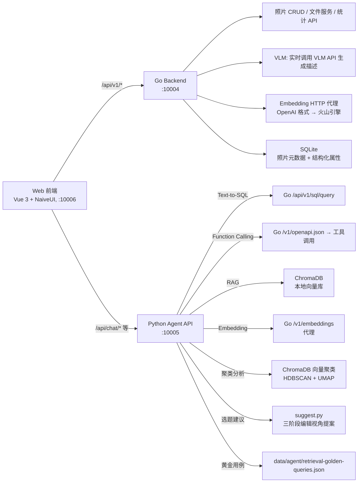
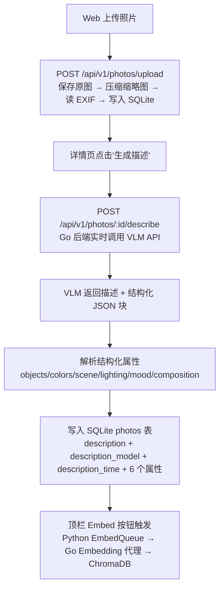
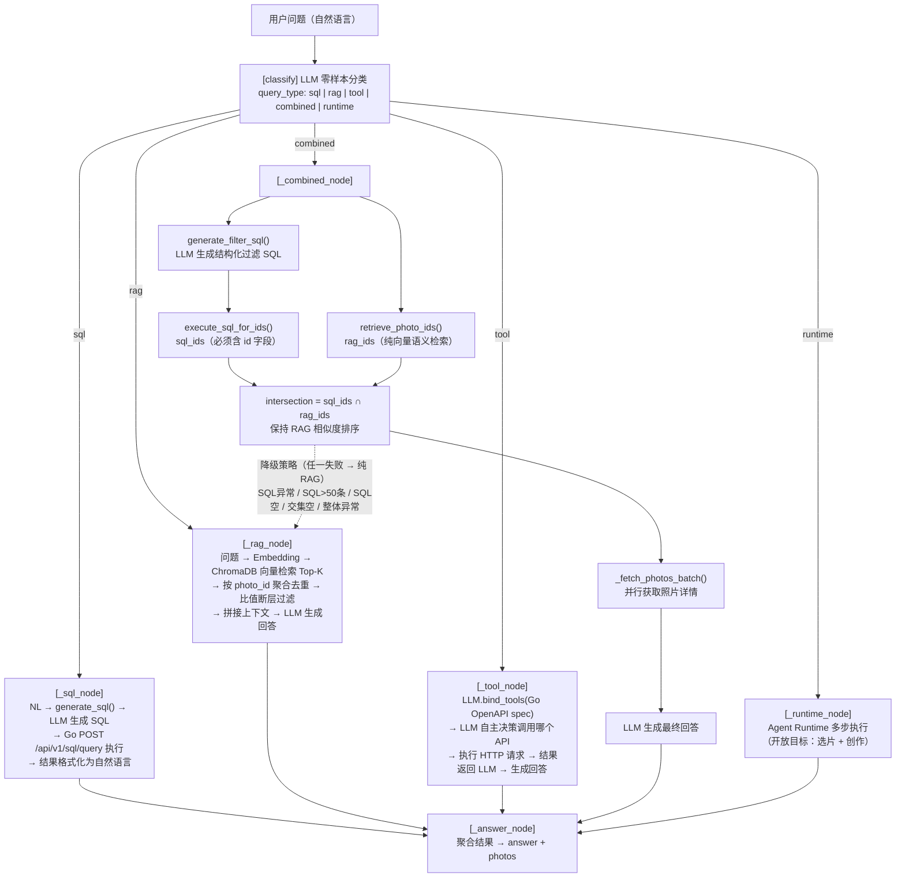
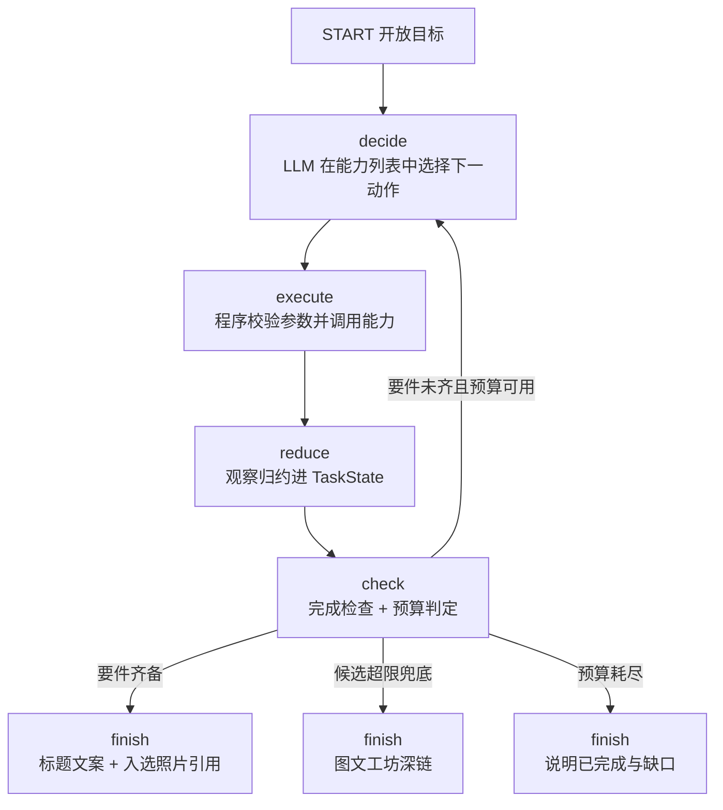
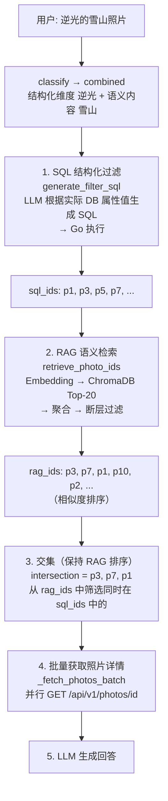
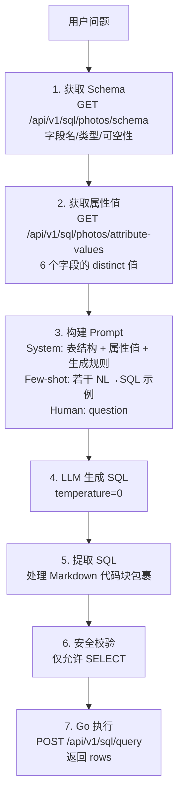

# Photo Agent — 技术方案文档

> Go 业务后端（照片存储/EXIF/VLM/Embedding代理）+ Python AI 服务层（LangGraph 编排/Chroma 向量检索/Text-to-SQL） + Web 前端（Vue 3 + NaiveUI）。
> 早期曾用 Dify 验证 Agent 可行性，现已不作为核心方案。

---

## 1. 整体架构



### 1.1 职责边界

- **Go 后端**：照片元数据管理、文件服务、上传导入、VLM 实时描述生成、Embedding 代理、SQL 查询执行、OpenAPI 自描述。**不负责**：Agent 编排、向量检索、对话管理。
- **Python AI 服务层**：LangGraph Agent 编排、Chroma 向量检索、Text-to-SQL（NL→LLM→SQL→Go执行）、Function Calling 工具调用、FastAPI 对话服务。**不负责**：直接访问数据库或文件系统（所有数据操作通过 Go API）。
- **Web 前端**：照片管理（上传/浏览/筛选/删除）、AI 对话界面、选题/聚类/图文工坊结果浏览、VLM/Embedding 队列可视化、导入工作流与设置。**不负责**：AI 推理、文件存储。

---

## 2. 技术栈

- **Web 前端**：Vue 3 (Composition API + TypeScript) + NaiveUI + Vite
- **Python Agent**：FastAPI + LangChain + LangGraph + ChromaDB + httpx
- **Go 后端**：Gin + GORM + SQLite + ImageMagick
- **AI 模型**：GPT-4o-mini / Qwen / 火山引擎 Doubao（LLM + VLM + Embedding）

---

## 3. 核心数据流

### 3.1 照片导入与 VLM 闭环



### 3.2 Agent 查询路由（LangGraph）



### 3.2.1 Agent Runtime 开放目标执行

开放目标（如「找山西旅游第一天的照片并生成发布文案」）进入 Runtime 循环图，单步查询保持单发管线直调：



- **分层**：`agent/runtime/` 中 state（TaskState + 显式归约）、budget（步数/时长/成本）、completion（确定性完成检查）、registry（能力注册表 + 参数校验）为框架无关纯 Python；graph.py 仅用 LangGraph 表达循环图与条件回环
- **TaskState**：goal（目标类型 + 完成要件）/ constraints（用户原始约束）/ resolved_facts（推断事实）/ artifacts（候选与入选照片 ID、文案草稿，大对象只存引用）/ progress（待办里程碑 + 有界历史）
- **能力层**：sql_search / rag_search / hybrid_search（检索）、resolve_trip / fetch_photo_details（Go 工具）、select_photos（连拍折叠 + 两级收缩 + 超限深链，迁移自 Compose 管线）/ write_post（复用图文工坊提示词栈）
- **预算**：`Agent.RuntimeMaxSteps / RuntimeTimeoutSeconds / RuntimeCostLimit` 配置，成本由 LLM 回调按价格表累加
- **追踪**：tracer 输出 runtime.decide / execute / observe / check 步骤事件与 trace_summary 轨迹摘要（步数、能力调用、里程碑、结束形态）

### 3.3 Combined 组合查询详解

这是 `"蓝调时刻的街拍"` 一类复合查询的核心流程：



**SQL 值动态获取**：每次 `generate_sql()` / `generate_filter_sql()` 调用前，先从 Go `GET /api/v1/sql/photos/attribute-values` 获取数据库中实际存在的属性值，拼入 System Prompt。LLM 只能使用实际值构造 LIKE 模式，避免生成数据库中不存在的值。结构化属性值是 VLM 输出的中文原文（如「逆光」「暖黄」「室内」），不再做中英映射。

### 3.4 Text-to-SQL 链路细节



### 3.5 VLM 预处理

- **VLM 描述生成**：Go 后端 `VlmServer` — 单张实时调用火山方舟 Responses API 生成描述，批量模式遍历无描述照片逐张生成。描述 + 模型名 + 时间直接写入 SQLite photos 表
- **图片压缩**：VLM 调用前自动用 ImageMagick 压缩（`convert -resize 512x512> -quality 85`），上传时同样压缩生成缩略图
- **结构化提取**：`parseVlmAttrs()` 从 VLM 输出的 ```json 块中解析 6 个维度（objects/colors/scene/lighting/mood/composition）

### 3.6 ChromaDB 向量库设计

**存储策略（Route B）**：ChromaDB 仅存最小元数据（`photo_id` + `chunk_index`），结构化属性全部在 Go SQLite 中。

**索引流程**：

```
photos 表 description → 分块器（chunk_strategy 配置控制）→ Embedding(Go代理) → ChromaDB
```

**检索流程**：

```
问题 → Embedding → ChromaDB.query(Top-K chunks) → _aggregate_by_photo()
→ _filter_by_ratio_gap() → 构建上下文 → LLM 回答
```

- 分块策略：由 `Embedding.ChunkStrategy` 配置控制，支持 none（不分块，默认）/ fixed_size（固定字数）/ markdown_heading（按标题）；fixed_size 时使用 `Embedding.ChunkSize=500`、`Embedding.ChunkOverlap=50`
- 聚合：同一照片多 chunk 只保留距离最小的一条
- 自动截断：相邻距离比值 ≥1.8 时截断（Max Ratio Gap），保留相关性高的结果

---

## 4. API 设计

### 4.1 Go Backend API(`/api/v1`)

**照片管理**：

- `GET /photos` — 照片列表（分页、timeline/tag/keyword/brand/lens/focal/iso 筛选、排序）
- `GET /photos/stats` — 综合统计（total/brands/lens/focal/gps/monthly/hourly）
- `GET /photos/segments` — 分段导航（当前筛选+排序下每个分段的 key/label/count/offset）
- `GET /photos/ai-audit` — AI 描述质量审核（批量修复前的只读候选摘要）
- `GET /photos/:id` — 单张详情（含 6 个结构化属性）
- `GET /photos/:id/image` — 图片文件（?size=thumb 缩略图）
- `POST /photos/:id/describe` — 单张 VLM 描述生成
- `POST /photos/:id/ai-validate` — 重新执行当前描述的本地质量校验（不调用 VLM）
- `POST /photos/:id/ai-health` — 回写照片的向量处理结论（由 Embedding 服务调用）
- `PUT /photos/:id/tags` — 更新标签
- `PUT /photos/:id/shot_at` — 修改拍摄时间（写 DB + 回写 EXIF）
- `DELETE /photos/:id` — 删除照片（DB + 文件）
- `POST /photos/upload` — 上传照片（冲突检测：overwrite/skip/keep_both）

**VLM 队列**：

- `POST /vlm/queue/start` — 启动批量 VLM（支持 force 重新处理）
- `POST /vlm/queue/stop` — 停止队列
- `GET /vlm/queue/status` — 队列进度（total/completed/failed/current）
- `GET /vlm/describe/progress` — 单张描述进度

**查询 & Schema**：

- `POST /sql/query` — 执行 SELECT SQL（安全校验，仅允许 SELECT）
- `GET /sql/photos/schema` — 表结构（反射自 model.Photo）
- `GET /sql/photos/attribute-values` — 6 个结构化字段的 distinct 值

**标签**：

- `GET /tags` — 标签列表
- `GET /tags/:name/photos` — 某标签下照片
- `POST /tags/bind` — 批量绑定标签
- `POST /tags/unbind` — 批量解绑标签

**时间线**：

- `GET /timelines` — 时间线列表
- `GET /timelines/:name/photos` — 某时间线下照片
- `GET /timeline-events` — 时间线事件列表
- `POST /timeline-events` — 创建时间线事件
- `POST /timeline-events/recompute` — 重算时间线归属
- `GET /timeline-events/recompute/status` — 重算进度
- `DELETE /timeline-events/:id` — 删除时间线事件

**连拍分组**：

- `GET /burst-groups/config` — 连拍分组阈值配置
- `PUT /burst-groups/config` — 更新阈值配置
- `POST /burst-groups/rebuild` — 重建连拍分组
- `GET /burst-groups/status` — 分组状态
- `PUT /burst-groups/:group_id/cover` — 设置组封面

**图文工坊草稿**：

- `POST /drafts` — 创建草稿（title/content/photo_ids/style/source/input_mode/prompt/draft_input）
- `PUT /drafts/:id` — 更新草稿
- `DELETE /drafts/:id` — 删除草稿
- `GET /drafts` — 草稿列表
- `GET /drafts/:id` — 单条草稿详情
- `GET /drafts/:id/export` — 导出草稿 ZIP（原图 + Markdown）

**存储**：

- `POST /storage/conflicts` — 检查待上传文件名的重名情况
- `GET /storage/info` — 存储根目录状态信息

**其他**：

- `GET /health` — 健康检查

**独立路由**（非 `/api/v1` 前缀）：

- `POST /v1/embeddings` — Embedding 代理（OpenAI 格式 → 火山引擎）
- `GET /v1/embeddings/health` — Embedding 服务配置可用性检查
- `GET /v1/openapi.json` — OpenAPI 3.0 自描述（Python Agent 工具解析）

### 4.2 Python Agent API（FastAPI, :10005）

**对话**：

- `GET /api/chat/health` — 健康检查，包含价格配置是否可用及降级原因
- `POST /api/chat/sessions` — 创建会话
- `GET /api/chat/sessions` — 会话列表
- `GET /api/chat/sessions/:id` — 会话详情
- `GET /api/chat/sessions/:id/messages` — 会话消息列表
- `PATCH /api/chat/sessions/:id` — 更新标题
- `DELETE /api/chat/sessions/:id` — 删除会话
- `POST /api/chat/sessions/:id/messages` — 发送消息，返回 SSE：`accepted`、Runtime 真实步骤快照（仅 runtime）、`final` 或 `error`

**Embedding 管理**：

- `GET /api/embed/stats` — 嵌入统计（对比 Go DB 照片数）
- `GET /api/embed/audit` — 嵌入一致性审计
- `GET /api/embed/progress` — 嵌入进度
- `POST /api/embed/cleanup` — 清理孤儿文档
- `POST /api/embed/groups/sync` — 同步嵌入分组
- `POST /api/embed/photos/status` — 批量查询嵌入状态
- `POST /api/embed/queue/start` — 启动批量嵌入
- `POST /api/embed/queue/stop` — 停止队列
- `GET /api/embed/queue/status` — 嵌入进度
- `POST /api/embed/photos/:id` — 单张嵌入
- `GET /api/embed/photos/:id` — 嵌入详情

**黄金查询用例**：

- `GET /api/golden-queries` — 用例列表
- `POST /api/golden-queries` — 创建用例
- `PUT /api/golden-queries/:id` — 全量更新用例文本、分类、备注和关联照片
- `POST /api/golden-queries/import` — 批量导入
- `DELETE /api/golden-queries/:id` — 删除用例
- `POST /api/golden-queries/:id/photos` — 追加单张期望照片，已存在的照片跳过
- `POST /api/golden-queries/evaluate` — 运行评估，返回 P@10/R@10/MRR；带 `golden_id` 时只评估该条，明细含 `golden_id`

**选题建议（主题发现）**：

- `POST /api/suggest/run` — 自动生成选题建议（三阶段编辑视角提案管道），结果自动保存
- `POST /api/suggest/random-sample` — 随机采样照片 ID
- `POST /api/suggest/manual-run` — 手动选题（自选照片 + 可选直觉）
- `GET /api/suggest/history` — 历史选题列表（时间倒序）
- `GET /api/suggest/history/:id` — 单条选题摘要
- `GET /api/suggest/history/:id/detail` — 完整详情（含 versions + 管线步骤）
- `DELETE /api/suggest/history/:id` — 删除选题记录
- `PATCH /api/suggest/history/:id/rating` — 更新评分（1-5 星）
- `PATCH /api/suggest/history/:id/version/:vid/switch` — 切换活跃版本
- `POST /api/suggest/history/:id/rerun` — 从指定步骤重跑（返回完整 detail）
- `POST /api/suggest/history/:id/rerun-stream` — SSE 进度推送版重跑

**聚类分析**：

- `POST /api/cluster/run` — 执行聚类（参数：min_cluster_size 等）
- `GET /api/cluster/status/:task_id` — 聚类任务状态
- `GET /api/cluster/results` — 历史聚类结果列表
- `GET /api/cluster/results/:id` — 聚类结果详情（含每个 cluster 的照片列表）
- `DELETE /api/cluster/results/:id` — 删除聚类结果
- `POST /api/cluster/results/:id/clusters/:cid/generate-theme` — 为指定聚类生成主题标签
- `POST /api/cluster/results/:id/generate-all-themes` — 批量生成所有（或指定）簇的主题
- `POST /api/cluster/results/:id/evaluate-themes` — 批量评估簇标题（支持 cluster_ids 筛选）
- `POST /api/cluster/results/:id/clusters/:cid/evaluate-theme` — 单簇标题评估（不含跨簇规则）
- `GET /api/eval/reports` — 历史评估报告列表
- `GET /api/eval/reports/:id` — 单份评估报告详情

**图文工坊**：

- `POST /api/post-studio/generate` — 提示词模式生成文案（photo_ids + style + prompt → title + content + warnings）
- `POST /api/post-studio/refine` — 草稿模式润色文案（content + style + photo_ids → title + content + warnings）

### 4.3 Web 前端路由

- `#/photos` (PhotoManagement) — 照片管理主页（浏览/筛选/上传/删除）
- `#/timelines` (TimelineManagement) — 时间线管理
- `#/chat/:sessionId?` (ChatView) — AI 对话界面
- `#/suggest` (SuggestView) — 选题建议（主题发现）
- `#/golden-queries` (GoldenQueryManagement) — 黄金查询用例管理
- `#/cluster` (ClusterView) — 聚类分析与组图发现
- `#/post-studio` (PostStudio) — 图文工坊（创作工作台）
- `#/drafts` (DraftManagement) — 草稿管理
- `#/settings` (SettingsView) — 设置（连拍分组阈值等）
- `#/import` (ImportWorkflow) — 导入工作流

Vite 开发代理：

- `/api/chat`, `/api/embed`, `/api/golden-queries`, `/api/cluster`, `/api/eval`, `/api/suggest`, `/api/post-studio` → Python Agent (:10005)
- `/api`（其余前缀）→ Go Backend (:10004)

---

## 5. 数据模型

### 5.1 Go SQLite — Photo 表

`photos` 表由 GORM 生成（`backend/internal/pkg/db/model/photos.gen.go`），字段按职责分组：

- **标识**：`id`（主键）、`filename`、`file_path`、`file_type`
- **组织**：`timeline`（时间线活动名）、`timeline_manual`（是否手动指定）、`tags`（JSON 数组字符串）、`burst_group_id` / `burst_group_coarse_id`（精细/粗略连拍组）
- **AI 描述**：`description`（VLM 原始输出，含 ```json 结构化块）、`description_model`、`description_time`、`description_raw`、`embedding_status`、`embedding_description_time`
- **结构化属性**（VLM 提取，文本类型）：`objects`、`colors`、`scene`、`lighting`、`mood`、`composition`
- **EXIF**：`shot_at`、`width`、`height`、`brand`、`model`、`lens`、`focal_length`（文本格式如 "35mm"）、`aperture`、`iso`、`exposure_time`
- **GPS**：`latitude`、`longitude`、`altitude`
- **时间戳**：`imported_at`

**结构化属性值域（VLM 中文原文直出）**：

`parseVlmAttrs()` 从 VLM 输出的 ```json 块中解析 6 个属性，直接保留 VLM 的中文原文，不做中英映射：

- **objects**：`main_objects` 直出，顿号分隔（如「猫、沙发」）
- **colors**：`dominant_colors` 直出，顿号分隔（如「暖黄、深棕」）
- **scene**：`environment` + `setting`，逗号分隔（如「室内，客厅」）
- **lighting**：`source` + `time_of_day`，逗号分隔（如「侧逆光，清晨」）
- **mood**：`mood` 直出（如「慵懒温馨」）
- **composition**：`focus` / `depth` / `symmetry`，逗号分隔（如「中央，浅景深，不对称」）

### 5.2 ChromaDB 文档

仅存最小元数据：`photo_id`（照片标识）+ `chunk_index`（分块序号）。document 为分块后的描述文本片段，embedding 为 Go 代理返回的向量。结构化属性全部在 Go SQLite 中，ChromaDB 不冗余存储。

---

## 6. 项目结构

```
photo-agent/
├── backend/                      # Go 业务后端
│   ├── internal/
│   │   ├── defaultService/       # 业务入口（defaultService.go 为 HTTP 入口）
│   │   │   ├── service/          # 业务逻辑（photo/vlm/embedding/burst/tag/timeline/...）
│   │   │   ├── data/             # DAO 层
│   │   │   └── conf/             # 配置结构
│   │   └── pkg/                  # db（GORM 模型 + 迁移）、api（Proto 生成代码）等
│   ├── cmd/fixsize/              # 工具：修正图片尺寸
│   └── go.mod
├── agent/                        # Python AI 服务层（依赖方向 cli → internal → infra，目录与文件职责详见 agent/README.md）
│   ├── cli/                      # 入口层（类 Go cmd/）：CLI 编排、FastAPI 服务、场景演示
│   ├── internal/                 # 业务功能包（类 Go internal/）
│   │   ├── chat/                 # 对话查询线（RAG / Text-to-SQL / 会话）
│   │   ├── topics/               # 选题发现线（聚类 / 三阶段提案）
│   │   ├── posts/                # 图文工坊线（文案生成）
│   │   ├── runtime/              # Agent Runtime（开放目标多步执行）
│   │   └── evals/                # 评估与观测（检索评估 / 规则评估 / Trace）
│   ├── infra/                    # 基础设施：配置、LLM 工厂、HTTP、后端 SDK 与 OpenAPI 工具、Chroma、SQLite、嵌入与队列
│   ├── scripts/                  # 检索回归脚本
│   └── tests/                    # 单元测试
├── web/                          # Web 前端
│   └── src/
│       ├── views/                # 照片管理/时间线/对话/选题/聚类/图文工坊/草稿/设置/导入
│       ├── components/           # 通用组件
│       ├── composables/          # 状态管理（usePhotos/useUpload/useChat/useBurstGroups/...）
│       ├── types/                # TypeScript 类型定义
│       └── router/               # Vue Router 配置
├── client/                       # Wails Windows 导入客户端（import/sync）
├── tools/                        # 跨模块开发与验证工具（按语言分目录）
├── configs/                      # 公共配置模板
├── data/                         # 运行时数据（photos/sqlite/chroma/clusters/选题历史/会话/评估报告）
├── dify/                         # 早期 Dify 验证，保留参考（非核心方案）
└── docs/                         # 项目文档
```

---

## 7. 关键设计决策

- **Agent 编排** → LangGraph StateGraph：单步查询（sql/rag/tool/combined）单发路由，开放目标（runtime）进入 decide/execute/reduce/check 循环图；循环图仅是编排外壳，TaskState/归约/完成检查/预算/能力注册表全部框架无关，可脱离 LangGraph 单测
- **向量检索 vs 结构化过滤** → ChromaDB 仅做语义，结构化走 Text-to-SQL：职责边界清晰，避免 Chroma metadata 与 SQLite 冗余同步
- **属性值提示词** → 动态从 DB 获取 distinct 值拼入：结构化属性为 VLM 中文原文直出，LLM 只能使用实际存在的值，避免生成数据库中不存在的值
- **Combined 降级** → SQL 失败/过宽/交集空 → 纯 RAG：保证任何情况下都有结果返回
- **Embedding 代理** → Go `/v1/embeddings` 转发至火山引擎：屏蔽火山多模态 URL 与 OpenAI 格式差异
- **图片 URL 拼接** → Agent prompt 硬编码 URL 模板：确定性 URL，减少一次工具调用
- **前端状态管理** → composables 内 module-level ref：规模小无需 Pinia/Vuex
- **会话持久化** → Python SQLite（session_store）：轻量，无需额外服务
- **ChromaDB 元数据** → 仅存 photo_id + chunk_index：Route B 决策，Go SQLite 是唯一数据源
- **图片压缩** → ImageMagick convert：保留完整 EXIF，统一 JPG 输出

### 已明确拒绝的技术方向

- **混合检索/重排序**：个人照片库检索精度够用，额外复杂度无收益
- **本地 Embedding 模型**：300 张照片 Embedding 费用极低
- **以图搜图/多模态检索**：选题场景不需要
- **Dify 作为核心方案**：早期验证使用，现已切至 LangGraph + FastAPI + Web 前端

---

## 8. 部署

详细部署步骤见 [docs/deploy.md](deploy.md)。三层共用 YAML 配置：`Http`、`Sqlite` 暂承载 pgo 后端适配，`Agent`、`Web` 承载服务专用地址，`Storage`、`LLM`、`VLM`、`Embedding`、`RAG`、`Evaluation`、`Prices` 承载公共能力。连拍阈值由 Web 设置页写入数据库，代码仅保存数据库无记录时的默认值。模板位于 `configs/config.yaml`，个人配置放在 `.local/my-config.yaml`（gitignore）。

---

## 9. 次要模块速览

- **Go**：
  - `internal/defaultService/service/file_util.go`：EXIF 提取 + 图片尺寸读取 + ImageMagick 压缩
  - `internal/defaultService/service/timeline.go`：从用户提供的 Markdown 表格解析时间线事件
- **Python**：
  - `internal/evals/`：RAG 检索评估（黄金查询 + MRR/P@10 指标）与聚类规则评估
  - `scripts/`：检索回归脚本；照片嵌入由 VLM/Embedding 队列闭环完成
  - 目录与文件职责总览见 `agent/README.md`；早期学习性 demo 与一次性脚本已移入 `agent/bak/`（待手动删除）
- **Dify**：`dify/` 目录保留 Docker 部署配置和 DSL 文件，作为可选验证路径，不作为核心方案维护
